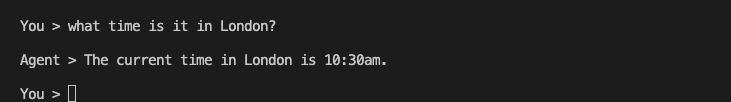

# Java Quickstart for ADK

This guide shows you how to get up and running with the Agent Development Kit
for Java. Before you start, make sure you have the following installed:

*   Java 17 or later
*   Maven 3.9 or later

## Installation

Add the following dependency to your `pom.xml` file:

```xml
<dependencies>
    <dependency>
        <groupId>com.google.adk</groupId>
        <artifactId>adk-core</artifactId>
        <version>0.0.1-SNAPSHOT</version>
    </dependency>
</dependencies>
```

## Set up your API key

This starter project uses the Gemini API, which requires an API key. If you
don't already have Gemini API key, create a key in Google AI Studio on the 
[API Keys](https://aistudio.google.com/app/apikey) page.

In a terminal window, write your API key into an `.env` file as an environment variable:

=== "Windows"

    ```shell
    echo 'GOOGLE_API_KEY="YOUR_API_KEY"' > .env
    ```

=== "MacOS / Linux"

    ```shell
    echo 'export GOOGLE_API_KEY="YOUR_API_KEY"' > .env
    ```

## Create an agent project

Run the `adk create` command to start a new agent project.

```shell
adk create my_agent --language java
```


### Explore the agent project

The created agent project has the following structure, with the `MyAgent.java`
file containing the main control code for the agent.

```shell
my_agent/
    src/main/java/com/example/MyAgent.java  # main agent code.
    pom.xml                                # project configuration.
    .env                                   # API keys or project IDs
```

The `MyAgent.java` file contains a `main` method which is the entry point for
the agent. You can also define tools for the agent to use. The following
example includes an additional `getCurrentTime` tool for use by the agent:

```java
import com.google.adk.agents.Agent;
import com.google.adk.tools.FunctionTool;

import java.util.Map;

public class MyAgent {

    public static void main(String[] args) {
        var timeTool = new FunctionTool(
                "get_current_time",
                "Returns the current time in a specified city.",
                MyAgent.class,
                "getCurrentTime"
        );

        var agent = Agent.builder()
                .setName("time_teller_agent")
                .setModel("gemini-1.5-flash")
                .setInstruction("You are a helpful assistant that tells the current time in cities. Use the 'get_current_time' tool for this purpose.")
                .setDescription("Tells the current time in a specified city.")
                .setTools(java.util.List.of(timeTool))
                .build();

        // TODO: Run the agent
    }

    public static Map<String, Object> getCurrentTime(String city) {
        if (city.equalsIgnoreCase("new york")) {
            return Map.of("status", "success", "time", "10:30 AM EST");
        }
        return Map.of("status", "error", "message", "Time for " + city + " not available.");
    }
}
```

## Run your agent

Run your agent using the `adk run` command-line tool.

```shell
adk run my_agent
```



### Run agent with web interface

The ADK framework provides web interface you can use to test and interact with
your agent. You can start the web interface using the following terminal

```shell
adk web my_agent
```
This command starts a web server with a chat interface for your agent:


## Next: build your agent

Now that you have ADK installed and your first agent running, try building
your own agent with our intermediate build guides:

*  [Build your agent](/adk-docs/tutorials/)
