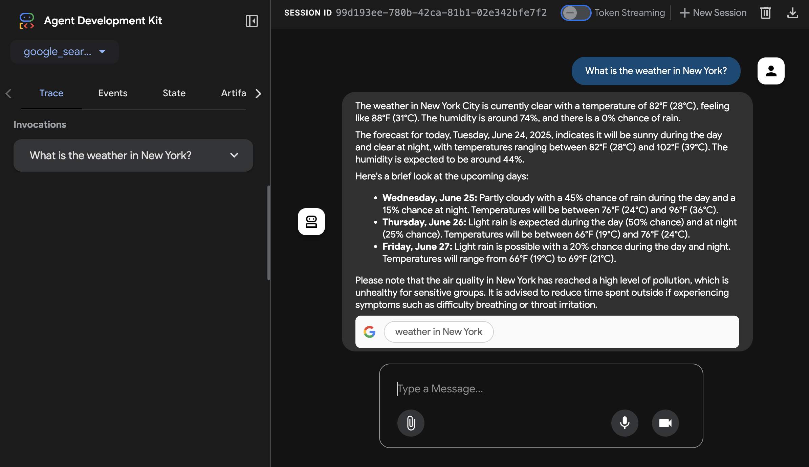
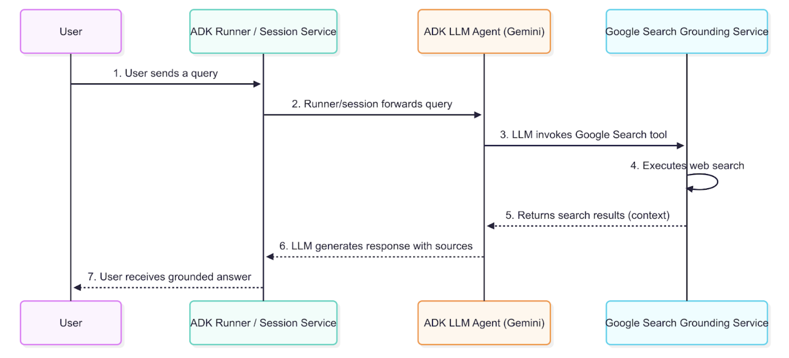

# Understanding Google Search Grounding

[Google Search Grounding tool](../tools/built-in-tools.md#google-search) is a powerful feature in the Agent Development Kit (ADK) that enables AI agents to access real-time, authoritative information from the web. By connecting your agents to Google Search, you can provide users with up-to-date answers backed by reliable sources.

This feature is particularly valuable for queries requiring current information like weather updates, news events, stock prices, or any facts that may have changed since the model's training data cutoff. When your agent determines that external information is needed, it automatically performs web searches and incorporates the results into its response with proper attribution.

## What You'll Learn

In this guide, you'll discover:

- **Quick Setup**: How to create and run a Google Search-enabled agent from scratch
- **Grounding Architecture**: The data flow and technical process behind web grounding
- **Response Structure**: How to interpret grounded responses and their metadata
- **Best Practices**: Guidelines for displaying search results and citations to users

### Additional resource

As an additional resource, [Gemini Fullstack Agent Development Kit (ADK) Quickstart](https://github.com/google/adk-samples/tree/main/python/agents/gemini-fullstack) has [a great practical use of the Google Search grounding](https://github.com/google/adk-samples/blob/main/python/agents/gemini-fullstack/app/agent.py) as a full stack application example.

## Google Search Grounding Quickstart

This quickstart guides you through creating an ADK agent with Google Search grounding feature. This quickstart assumes a local IDE (VS Code or PyCharm, etc.) with Python 3.9+ and terminal access.

### 1. Set up Environment & Install ADK { #set-up-environment-install-adk }

Create & Activate Virtual Environment:

```bash
# Create
python -m venv .venv

# Activate (each new terminal)
# macOS/Linux: source .venv/bin/activate
# Windows CMD: .venv\Scripts\activate.bat
# Windows PowerShell: .venv\Scripts\Activate.ps1
```

Install ADK:

```bash
pip install google-adk==1.4.2
```

### 2. Create Agent Project { #create-agent-project }

Under a project directory, run the following commands:

=== "OS X &amp; Linux"
    ```bash
    # Step 1: Create a new directory for your agent
    mkdir google_search_agent

    # Step 2: Create __init__.py for the agent
    echo "from . import agent" > google_search_agent/__init__.py

    # Step 3: Create an agent.py (the agent definition) and .env (Gemini authentication config)
    touch google_search_agent/agent.py .env
    ```

=== "Windows"
    ```shell
    # Step 1: Create a new directory for your agent
    mkdir google_search_agent

    # Step 2: Create __init__.py for the agent
    echo "from . import agent" > google_search_agent/__init__.py

    # Step 3: Create an agent.py (the agent definition) and .env (Gemini authentication config)
    type nul > google_search_agent\agent.py 
    type nul > google_search_agent\.env
    ```


#### Edit `agent.py` or `agent.ts`

Copy and paste the following code into `agent.py` or `agent.ts`:

=== "Python"

    ```python title="google_search_agent/agent.py"
    from google.adk.agents import Agent
    from google.adk.tools import google_search

    root_agent = Agent(
        name="google_search_agent",
        model="gemini-2.5-flash",
        instruction="Answer questions using Google Search when needed. Always cite sources.",
        description="Professional search assistant with Google Search capabilities",
        tools=[google_search]
    )
    ```

=== "TypeScript"

    ```typescript title="google_search_agent/agent.ts"
    import { LlmAgent, GoogleSearchTool } from '@google/adk';

    const rootAgent = new LlmAgent({
        name: "google_search_agent",
        model: "gemini-2.5-flash",
        instruction: "Answer questions using Google Search when needed. Always cite sources.",
        description: "Professional search assistant with Google Search capabilities",
        tools: [GoogleSearchTool],
    });
    ```

Now you would have the following directory structure:

=== "Python"

    ```console
    my_project/
        google_search_agent/
            __init__.py
            agent.py
        .env
    ```

=== "TypeScript"

    ```console
    my_project/
        google_search_agent/
            agent.ts
        package.json
        tsconfig.json
        .env
    ```

### 3. Choose a platform { #choose-a-platform }

To run the agent, you need to select a platform that the agent will use for calling the Gemini model. Choose one from Google AI Studio or Vertex AI:

=== "Gemini - Google AI Studio"
    1. Get an API key from [Google AI Studio](https://aistudio.google.com/apikey).
    2. When using Python, open the **`.env`** file and copy-paste the following code.

        ```env title=".env"
        GOOGLE_GENAI_USE_VERTEXAI=FALSE
        GOOGLE_API_KEY=PASTE_YOUR_ACTUAL_API_KEY_HERE
        ```

    3. Replace `PASTE_YOUR_ACTUAL_API_KEY_HERE` with your actual `API KEY`.

=== "Gemini - Google Cloud Vertex AI"
    1. You need an existing
    [Google Cloud](https://cloud.google.com/?e=48754805&hl=en) account and a
    project.
        * Set up a
          [Google Cloud project](https://cloud.google.com/vertex-ai/generative-ai/docs/start/quickstarts/quickstart-multimodal#setup-gcp)
        * Set up the
          [gcloud CLI](https://cloud.google.com/vertex-ai/generative-ai/docs/start/quickstarts/quickstart-multimodal#setup-local)
        * Authenticate to Google Cloud, from the terminal by running
          `gcloud auth login`.
        * [Enable the Vertex AI API](https://console.cloud.google.com/flows/enableapi?apiid=aiplatform.googleapis.com).
    2. When using Python, open the **`.env`** file and copy-paste the following code and update the project ID and location.

        ```env title=".env"
        GOOGLE_GENAI_USE_VERTEXAI=TRUE
        GOOGLE_CLOUD_PROJECT=YOUR_PROJECT_ID
        GOOGLE_CLOUD_LOCATION=LOCATION
        ```

### 4. Run Your Agent { #run-your-agent }

There are multiple ways to interact with your agent:

=== "Dev UI (adk web)"
    Run the following command to launch the **dev UI**.

    ```shell
    adk web
    ```
    
    !!!info "Note for Windows users"

        When hitting the `_make_subprocess_transport NotImplementedError`, consider using `adk web --no-reload` instead.


    **Step 1:** Open the URL provided (usually `http://localhost:8000` or
    `http://127.0.0.1:8000`) directly in your browser.

    **Step 2.** In the top-left corner of the UI, you can select your agent in
    the dropdown. Select "google_search_agent".

    !!!note "Troubleshooting"

        If you do not see "google_search_agent" in the dropdown menu, make sure you
        are running `adk web` in the **parent folder** of your agent folder
        (i.e. the parent folder of google_search_agent).

    **Step 3.** Now you can chat with your agent using the textbox.

=== "Terminal (adk run)"

    Run the following command, to chat with your Weather agent.

    ```
    adk run google_search_agent
    ```
    To exit, use Cmd/Ctrl+C.

### 📝 Example prompts to try

With those questions, you can confirm that the agent is actually calling Google Search
to get the latest weather and time.

* What is the weather in New York?
* What is the time in New York?
* What is the weather in Paris?
* What is the time in Paris?



You've successfully created and interacted with your Google Search agent using ADK!

## How grounding with Google Search works

Grounding is the process that connects your agent to real-time information from the web, allowing it to generate more accurate and current responses. When a user's prompt requires information that the model was not trained on, or that is time-sensitive, the agent's underlying Large Language Model intelligently decides to invoke the google\_search tool to find the relevant facts

### **Data Flow Diagram**

This diagram illustrates the step-by-step process of how a user query results in a grounded response.



### **Detailed Description**

The grounding agent uses the data flow described in the diagram to retrieve, process, and incorporate external information into the final answer presented to the user.

1. **User Query**: An end-user interacts with your agent by asking a question or giving a command.  
2. **ADK Orchestration** : The Agent Development Kit orchestrates the agent's behavior and passes the user's message to the core of your agent.  
3. **LLM Analysis and Tool-Calling** : The agent's LLM (e.g., a Gemini model) analyzes the prompt. If it determines that external, up-to-date information is required, it triggers the grounding mechanism by calling the  
    google\_search tool. This is ideal for answering queries about recent news, weather, or facts not present in the model's training data.  
4. **Grounding Service Interaction** : The google\_search tool interacts with an internal grounding service that formulates and sends one or more queries to the Google Search Index.  
5. **Context Injection**: The grounding service retrieves the relevant web pages and snippets. It then integrates these search results into the model's context  
    before the final response is generated. This crucial step allows the model to "reason" over factual, real-time data.  
6. **Grounded Response Generation**: The LLM, now informed by the fresh search results, generates a response that incorporates the retrieved information.  
7. **Response Presentation with Sources** : The ADK receives the final grounded response, which includes the necessary source URLs and   
   groundingMetadata, and presents it to the user with attribution. This allows end-users to verify the information and builds trust in the agent's answers.

### Understanding grounding with Google Search response 

When the agent uses Google Search to ground a response, it returns a detailed set of information that includes not only the final text answer but also the sources it used to generate that answer. This metadata is crucial for verifying the response and for providing attribution to the original sources.

#### **Example of a Grounded Response**

The following is an example of the content object returned by the model after a grounded query.

**Final Answer Text:**

```
"Yes, Inter Miami won their last game in the FIFA Club World Cup. They defeated FC Porto 2-1 in their second group stage match. Their first game in the tournament was a 0-0 draw against Al Ahly FC. Inter Miami is scheduled to play their third group stage match against Palmeiras on Monday, June 23, 2025."
```

**Grounding Metadata Snippet:**

```json
"groundingMetadata": {
  "groundingChunks": [
    { "web": { "title": "mlssoccer.com", "uri": "..." } },
    { "web": { "title": "intermiamicf.com", "uri": "..." } },
    { "web": { "title": "mlssoccer.com", "uri": "..." } }
  ],
  "groundingSupports": [
    {
      "groundingChunkIndices": [0, 1],
      "segment": {
        "startIndex": 65,
        "endIndex": 126,
        "text": "They defeated FC Porto 2-1 in their second group stage match."
      }
    },
    {
      "groundingChunkIndices": [1],
      "segment": {
        "startIndex": 127,
        "endIndex": 196,
        "text": "Their first game in the tournament was a 0-0 draw against Al Ahly FC."
      }
    },
    {
      "groundingChunkIndices": [0, 2],
      "segment": {
        "startIndex": 197,
        "endIndex": 303,
        "text": "Inter Miami is scheduled to play their third group stage match against Palmeiras on Monday, June 23, 2025."
      }
    }
  ],
  "searchEntryPoint": { ... }
}

```

#### **How to Interpret the Response**

The metadata provides a link between the text generated by the model and the sources that support it. Here is a step-by-step breakdown:

1. **groundingChunks**: This is a list of the web pages the model consulted. Each chunk contains the title of the webpage and a uri that links to the source.  
2. **groundingSupports**: This list connects specific sentences in the final answer back to the groundingChunks.  
   * **segment**: This object identifies a specific portion of the final text answer, defined by its startIndex, endIndex, and the text itself.  
   * **groundingChunkIndices**: This array contains the index numbers that correspond to the sources listed in the groundingChunks. For example, the sentence "They defeated FC Porto 2-1..." is supported by information from groundingChunks at index 0 and 1 (both from mlssoccer.com and intermiamicf.com).

### How to display grounding responses with Google Search

A critical part of using grounding is to correctly display the information, including citations and search suggestions, to the end-user. This builds trust and allows users to verify the information.


#### **Displaying Search Suggestions**

The `searchEntryPoint` object in the `groundingMetadata` contains pre-formatted HTML for displaying search query suggestions. As seen in the example image, these are typically rendered as clickable chips that allow the user to explore related topics.

**Rendered HTML from searchEntryPoint:** The metadata provides the necessary HTML and CSS to render the search suggestions bar, which includes the Google logo and chips for related queries like "When is the next FIFA Club World Cup" and "Inter Miami FIFA Club World Cup history". Integrating this HTML directly into your application's front end will display the suggestions as intended.

For more information, consult [using Google Search Suggestions](https://cloud.google.com/vertex-ai/generative-ai/docs/grounding/grounding-search-suggestions) in Vertex AI documentation.

## Summary

Google Search Grounding transforms AI agents from static knowledge repositories into dynamic, web-connected assistants capable of providing real-time, accurate information. By integrating this feature into your ADK agents, you enable them to:

- Access current information beyond their training data
- Provide source attribution for transparency and trust
- Deliver comprehensive answers with verifiable facts
- Enhance user experience with relevant search suggestions

The grounding process seamlessly connects user queries to Google's vast search index, enriching responses with up-to-date context while maintaining the conversational flow. With proper implementation and display of grounded responses, your agents become powerful tools for information discovery and decision-making.
