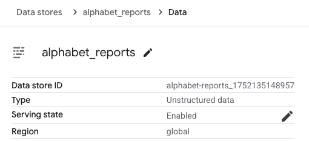
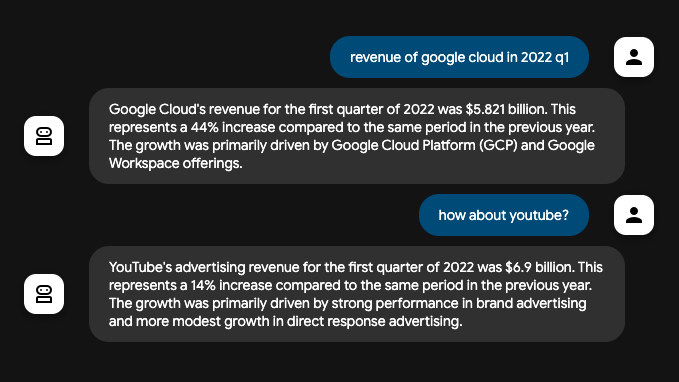
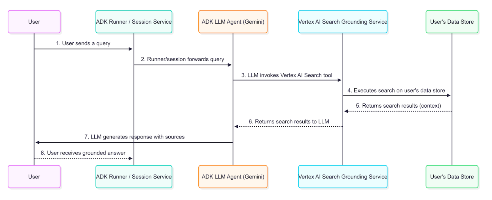

# Understanding Vertex AI Search Grounding

[Vertex AI Search Grounding tool](../tools/built-in-tools.md#vertex-ai-search) is a powerful feature in the Agent Development Kit (ADK) that enables AI agents to access information from your private enterprise documents and data repositories. By connecting your agents to indexed enterprise content, you can provide users with answers grounded in your organization's knowledge base.

This feature is particularly valuable for enterprise-specific queries requiring information from internal documentation, policies, research papers, or any proprietary content that has been indexed in your [Vertex AI Search](https://cloud.google.com/enterprise-search) datastore. When your agent determines that information from your knowledge base is needed, it automatically searches your indexed documents and incorporates the results into its response with proper attribution.

## What You'll Learn

In this guide, you'll discover:

- **Quick Setup**: How to create and run a Vertex AI Search-enabled agent from scratch
- **Grounding Architecture**: The data flow and technical process behind enterprise document grounding
- **Response Structure**: How to interpret grounded responses and their metadata
- **Best Practices**: Guidelines for displaying citations and document references to users

## Vertex AI Search Grounding Quickstart

This quickstart guides you through creating an ADK agent with Vertex AI Search grounding feature. This quickstart assumes a local IDE (VS Code or PyCharm, etc.) with Python 3.9+ and terminal access.

### 1. Prepare Vertex AI Search { #prepare-vertex-ai-search }

If you already have a Vertex AI Search Data Store and its Data Store ID, you can skip this section. If not, follow the instruction in the [Get started with custom search](https://cloud.google.com/generative-ai-app-builder/docs/try-enterprise-search#unstructured-data) until the end of [Create a data store](https://cloud.google.com/generative-ai-app-builder/docs/try-enterprise-search#create_a_data_store), with selecting the `Unstructured data` tab. With this instruction, you will build a sample Data Store with earning report PDFs from the [Alphabet investor site](https://abc.xyz/).

After finishing the Create a data store section, open the [Data Stores](https://console.cloud.google.com/gen-app-builder/data-stores/) and select the data store you created, and find the `Data store ID`:



Note this `Data store ID` as we will use this later.

### 2. Set up Environment & Install ADK { #set-up-environment-install-adk }

Create & Activate Virtual Environment:

```bash
# Create
python -m venv .venv

# Activate (each new terminal)
# macOS/Linux: source .venv/bin/activate
# Windows CMD: .venv\Scripts\activate.bat
# Windows PowerShell: .venv\Scripts\Activate.ps1
```

Install ADK:

```bash
pip install google-adk==1.5.0
```

### 3. Create Agent Project { #create-agent-project }

Under a project directory, run the following commands:

```bash
# Step 1: Create a new directory for your agent
mkdir vertex_search_agent

# Step 2: Create __init__.py for the agent
echo "from . import agent" > vertex_search_agent/__init__.py

# Step 3: Create an agent.py (the agent definition) and .env (authentication config)
touch vertex_search_agent/agent.py .env
```

#### Edit `agent.py`

Copy and paste the following code into `agent.py`, and replace `YOUR_PROJECT_ID` and `YOUR_DATASTORE_ID` at the `Configuration` part with your project ID and Data Store ID accordingly:

```python title="vertex_search_agent/agent.py"
from google.adk.agents import Agent
from google.adk.tools import VertexAiSearchTool

# Configuration
DATASTORE_ID = "projects/YOUR_PROJECT_ID/locations/global/collections/default_collection/dataStores/YOUR_DATASTORE_ID"

root_agent = Agent(
    name="vertex_search_agent",
    model="gemini-2.5-flash",
    instruction="Answer questions using Vertex AI Search to find information from internal documents. Always cite sources when available.",
    description="Enterprise document search assistant with Vertex AI Search capabilities",
    tools=[VertexAiSearchTool(data_store_id=DATASTORE_ID)]
)
```

Now you would have the following directory structure:

```console
my_project/
    vertex_search_agent/
        __init__.py
        agent.py
    .env
```

### 4. Authentication Setup { #authentication-setup }

**Note: Vertex AI Search requires Google Cloud Platform (Vertex AI) authentication. Google AI Studio is not supported for this tool.**

  * Set up the [gcloud CLI](https://cloud.google.com/vertex-ai/generative-ai/docs/start/quickstarts/quickstart-multimodal#setup-local)
  * Authenticate to Google Cloud, from the terminal by running `gcloud auth login`.
  * Open the **`.env`** file and copy-paste the following code and update the project ID and location.

    ```env title=".env"
    GOOGLE_GENAI_USE_VERTEXAI=TRUE
    GOOGLE_CLOUD_PROJECT=YOUR_PROJECT_ID
    GOOGLE_CLOUD_LOCATION=LOCATION
    ```


### 5. Run Your Agent { #run-your-agent }

There are multiple ways to interact with your agent:

=== "Dev UI (adk web)"
    Run the following command to launch the **dev UI**.

    ```shell
    adk web
    ```
    
    !!!info "Note for Windows users"

        When hitting the `_make_subprocess_transport NotImplementedError`, consider using `adk web --no-reload` instead.


    **Step 1:** Open the URL provided (usually `http://localhost:8000` or
    `http://127.0.0.1:8000`) directly in your browser.

    **Step 2.** In the top-left corner of the UI, you can select your agent in
    the dropdown. Select "vertex_search_agent".

    !!!note "Troubleshooting"

        If you do not see "vertex_search_agent" in the dropdown menu, make sure you
        are running `adk web` in the **parent folder** of your agent folder
        (i.e. the parent folder of vertex_search_agent).

    **Step 3.** Now you can chat with your agent using the textbox.

=== "Terminal (adk run)"

    Run the following command, to chat with your Vertex AI Search agent.

    ```
    adk run vertex_search_agent
    ```
    To exit, use Cmd/Ctrl+C.

### 📝 Example prompts to try

With those questions, you can confirm that the agent is actually calling Vertex AI Search
to get information from the Alphabet reports:

* What is the revenue of Google Cloud in 2022 Q1?
* What about YouTube?



You've successfully created and interacted with your Vertex AI Search agent using ADK!

## How grounding with Vertex AI Search works

Grounding with Vertex AI Search is the process that connects your agent to your organization's indexed documents and data, allowing it to generate accurate responses based on private enterprise content. When a user's prompt requires information from your internal knowledge base, the agent's underlying LLM intelligently decides to invoke the `VertexAiSearchTool` to find relevant facts from your indexed documents.

### **Data Flow Diagram**

This diagram illustrates the step-by-step process of how a user query results in a grounded response.



### **Detailed Description**

The grounding agent uses the data flow described in the diagram to retrieve, process, and incorporate enterprise information into the final answer presented to the user.

1. **User Query**: An end-user interacts with your agent by asking a question about internal documents or enterprise data.

2. **ADK Orchestration**: The Agent Development Kit orchestrates the agent's behavior and passes the user's message to the core of your agent.

3. **LLM Analysis and Tool-Calling**: The agent's LLM (e.g., a Gemini model) analyzes the prompt. If it determines that information from your indexed documents is required, it triggers the grounding mechanism by calling the VertexAiSearchTool. This is ideal for answering queries about company policies, technical documentation, or proprietary research.

4. **Vertex AI Search Service Interaction**: The VertexAiSearchTool interacts with your configured Vertex AI Search datastore, which contains your indexed enterprise documents. The service formulates and executes search queries against your private content.

5. **Document Retrieval & Ranking**: Vertex AI Search retrieves and ranks the most relevant document chunks from your datastore based on semantic similarity and relevance scoring.

6. **Context Injection**: The search service integrates the retrieved document snippets into the model's context before the final response is generated. This crucial step allows the model to "reason" over your organization's factual data.

7. **Grounded Response Generation**: The LLM, now informed by relevant enterprise content, generates a response that incorporates the retrieved information from your documents.

8. **Response Presentation with Sources**: The ADK receives the final grounded response, which includes the necessary source document references and groundingMetadata, and presents it to the user with attribution. This allows end-users to verify the information against your enterprise sources.

## Understanding grounding with Vertex AI Search response

When the agent uses Vertex AI Search to ground a response, it returns detailed information that includes the final text answer and metadata about the documents used to generate that answer. This metadata is crucial for verifying the response and providing attribution to your enterprise sources.

### Example of a Grounded Response

The following is an example of the content object returned by the model after a grounded query against enterprise documents.

**Final Answer Text:**

```
"Developing models for a medical scribe presents several significant challenges, primarily due to the complex nature of medical documentation, the sensitive data involved, and the demanding requirements of clinical workflows. Key challenges include: **Accuracy and Reliability:** Medical documentation requires extremely high levels of accuracy, as errors can lead to misdiagnoses, incorrect treatments, and legal repercussions. Ensuring that AI models can reliably capture nuanced medical language, distinguish between subjective and objective information, and accurately transcribe physician-patient interactions is a major hurdle. **Natural Language Understanding (NLU) and Speech Recognition:** Medical conversations are often rapid, involve highly specialized jargon, acronyms, and abbreviations, and can be spoken by individuals with diverse accents or speech patterns... [response continues with detailed analysis of privacy, integration, and technical challenges]"
```

**Grounding Metadata Snippet:**

This is the grounding metadata you will receive. On `adk web`, you can find this on the `Response` tab:

```json
{
  "groundingMetadata": {
    "groundingChunks": [
      {
        "document": {
          "title": "AI in Medical Scribing: Technical Challenges",
          "uri": "projects/your-project/locations/global/dataStores/your-datastore-id/documents/doc-medical-scribe-ai-tech-challenges",
          "id": "doc-medical-scribe-ai-tech-challenges"
        }
      },
      {
        "document": {
          "title": "Regulatory and Ethical Hurdles for AI in Healthcare",
          "uri": "projects/your-project/locations/global/dataStores/your-datastore-id/documents/doc-ai-healthcare-ethics",
          "id": "doc-ai-healthcare-ethics"
        }
      }
      // ... additional documents
    ],
    "groundingSupports": [
      {
        "groundingChunkIndices": [0, 1],
        "segment": {
          "endIndex": 637,
          "startIndex": 433,
          "text": "Ensuring that AI models can reliably capture nuanced medical language..."
        }
      }
      // ... additional supports linking text segments to source documents
    ],
    "retrievalQueries": [
      "challenges in natural language processing medical domain",
      "AI medical scribe challenges",
      "difficulties in developing AI for medical scribes"
      // ... additional search queries executed
    ]
  }
}
```

### How to Interpret the Response

The metadata provides a link between the text generated by the model and the enterprise documents that support it. Here is a step-by-step breakdown:

- **groundingChunks**: This is a list of the enterprise documents the model consulted. Each chunk contains the document title, uri (document path), and id.

- **groundingSupports**: This list connects specific sentences in the final answer back to the `groundingChunks`.

- **segment**: This object identifies a specific portion of the final text answer, defined by its `startIndex`, `endIndex`, and the `text` itself.

- **groundingChunkIndices**: This array contains the index numbers that correspond to the sources listed in the `groundingChunks`. For example, the text about "HIPAA compliance" is supported by information from `groundingChunks` at index 1 (the "Regulatory and Ethical Hurdles" document).

- **retrievalQueries**: This array shows the specific search queries that were executed against your datastore to find relevant information.

## How to display grounding responses with Vertex AI Search

Unlike Google Search grounding, Vertex AI Search grounding does not require specific display components. However, displaying citations and document references builds trust and allows users to verify information against your organization's authoritative sources.

### Optional Citation Display

Since grounding metadata is provided, you can choose to implement citation displays based on your application needs:

**Simple Text Display (Minimal Implementation):**

```python
for event in events:
    if event.is_final_response():
        print(event.content.parts[0].text)
        
        # Optional: Show source count
        if event.grounding_metadata:
            print(f"\nBased on {len(event.grounding_metadata.grounding_chunks)} documents")
```

**Enhanced Citation Display (Optional):** You can implement interactive citations that show which documents support each statement. The grounding metadata provides all necessary information to map text segments to source documents.

### Implementation Considerations

When implementing Vertex AI Search grounding displays:

1. **Document Access**: Verify user permissions for referenced documents
2. **Simple Integration**: Basic text output requires no additional display logic
3. **Optional Enhancements**: Add citations only if your use case benefits from source attribution
4. **Document Links**: Convert document URIs to accessible internal links when needed
5. **Search Queries**: The retrievalQueries array shows what searches were performed against your datastore

## Summary

Vertex AI Search Grounding transforms AI agents from general-purpose assistants into enterprise-specific knowledge systems capable of providing accurate, source-attributed information from your organization's private documents. By integrating this feature into your ADK agents, you enable them to:

- Access proprietary information from your indexed document repositories
- Provide source attribution for transparency and trust
- Deliver comprehensive answers with verifiable enterprise facts
- Maintain data privacy within your Google Cloud environment

The grounding process seamlessly connects user queries to your organization's knowledge base, enriching responses with relevant context from your private documents while maintaining the conversational flow. With proper implementation, your agents become powerful tools for enterprise information discovery and decision-making.
