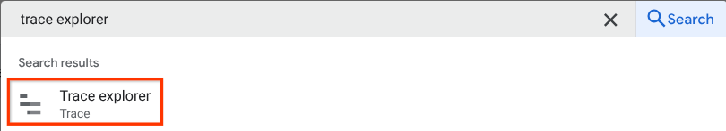
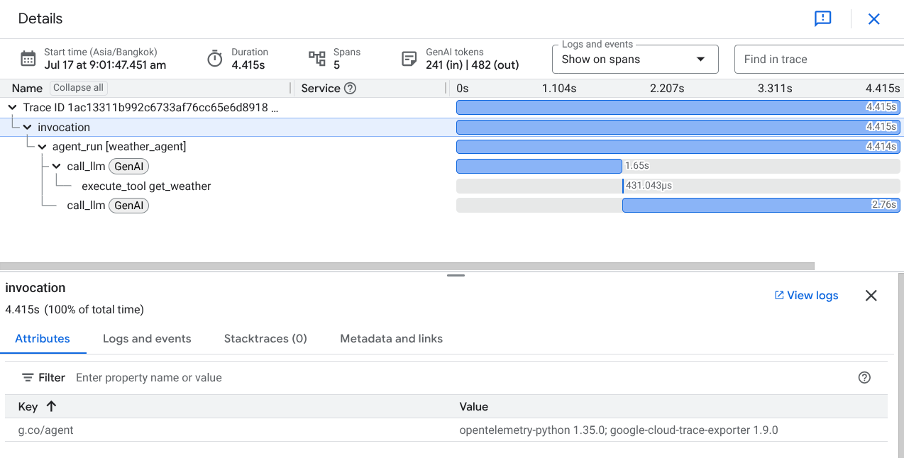

# Google Cloud Trace observability for ADK

<div class="language-support-tag">
  <span class="lst-supported">Supported in ADK</span><span class="lst-python">Python</span><span class="lst-go">Go</span><span class="lst-typescript">TypeScript</span>
</div>

With ADK, you can already inspect and observe your agent interaction locally utilizing the powerful web development UI discussed in [here](https://google.github.io/adk-docs/evaluate/#debugging-with-the-trace-view). However, for cloud deployment, you will need a centralized dashboard to observe real traffic.

Cloud Trace is a component of Google Cloud Observability. It is a powerful tool for monitoring, debugging, and improving the performance of your applications by focusing specifically on tracing capabilities. For Agent Development Kit (ADK) applications, Cloud Trace enables comprehensive tracing, helping you understand how requests flow through your agent's interactions and identify performance bottlenecks or errors within your AI agents.

## Overview

Cloud Trace is built on [OpenTelemetry](https://opentelemetry.io/), an open-source standard that supports many languages and ingestion methods for generating trace data. This aligns with observability practices for ADK applications, which also leverage OpenTelemetry-compatible instrumentation, allowing you to:

- **Trace agent interactions**: Cloud Trace continuously gathers and analyzes trace data from your project, enabling you to rapidly diagnose latency issues and errors within your ADK applications.
- **Debug issues**: Quickly diagnose latency issues and errors by analyzing detailed traces. This is crucial for understanding issues that manifest as increased communication latency across different services or during specific agent actions like tool calls.
- **In-depth Analysis and Visualization**: Trace Explorer is the primary tool for analyzing traces, offering visual aids like heatmaps for span duration and waterfall views to easily identify bottlenecks and sources of errors within your agent's execution path.

## Cloud Trace Setup

### Using the ADK CLI

You can enable cloud tracing by adding a flag when deploying or running your agent using the ADK CLI.

=== "Python"
    When deploying your agent using the `adk deploy` command:
    ```bash
    adk deploy agent_engine \
        --project=$GOOGLE_CLOUD_PROJECT \
        --region=$GOOGLE_CLOUD_LOCATION \
        --trace_to_cloud \
        $AGENT_PATH
    ```

=== "Go"
    When running your agent using the `adkgo` command:
    ```bash
    adkgo web --otel_to_cloud
    ```

### Programmatic Setup

#### Using ADK App abstractions

=== "Python"
    If you are using the `AdkApp` abstraction, you can enable cloud tracing by adding `enable_tracing=True`:
    ```python
    from google.adk.apps import AdkApp

    adk_app = AdkApp(
        agent=root_agent,
        enable_tracing=True,
    )
    ```

#### Using Telemetry modules

For fully customized agent runtimes, you can enable cloud tracing by using the built-in telemetry modules.

=== "Python"
    ```python
    from google.adk import telemetry
    from google.adk.telemetry import google_cloud

    # Get GCP exporters configuration
    hooks = google_cloud.get_gcp_exporters(enable_cloud_tracing=True)

    # Initialize and set global OTel providers
    telemetry.maybe_set_otel_providers(otel_hooks_to_setup=[hooks])
    ```

=== "Go"
    ```go
    import (
    	"context"
    	"google.golang.org/adk/telemetry"
    )

    func main() {
    	ctx := context.Background()

    	// Initialize telemetry with cloud export enabled
    	telemetryProviders, err := telemetry.New(ctx,
    		telemetry.WithOtelToCloud(true),
    	)
    	if err != nil {
    		log.Fatal(err)
    	}
    	defer telemetryProviders.Shutdown(ctx)

    	// Register as global OTel providers
    	telemetryProviders.SetGlobalOtelProviders()

    	// ... your agent code ...
    }
    ```

=== "TypeScript"
    ```typescript
    import { getGcpExporters, maybeSetOtelProviders } from '@google/adk';

    // Get GCP exporters configuration
    const gcpExporters = await getGcpExporters({
      enableTracing: true,
    });

    // Initialize and set global OTel providers
    maybeSetOtelProviders([gcpExporters]);

    // ... your agent code ...
    ```

## Inspect Cloud Traces

After the setup is complete, whenever you interact with the agent, it will automatically send trace data to Cloud Trace. You can inspect the traces by visiting the **Trace Explorer** in the [Google Cloud Console](https://console.cloud.google.com).



You will see all available traces produced by the ADK agent, with span names such as `invocation`, `agent_run`, `call_llm`, and `execute_tool`.


If you click on one of the traces, you will see a waterfall view of the detailed process, similar to the trace view in the local ADK web UI.



## Resources

- [Google Cloud Trace Documentation](https://cloud.google.com/trace)
- [OpenTelemetry Documentation](https://opentelemetry.io/docs/)
