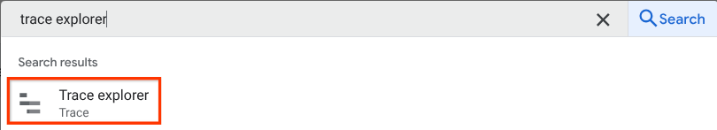
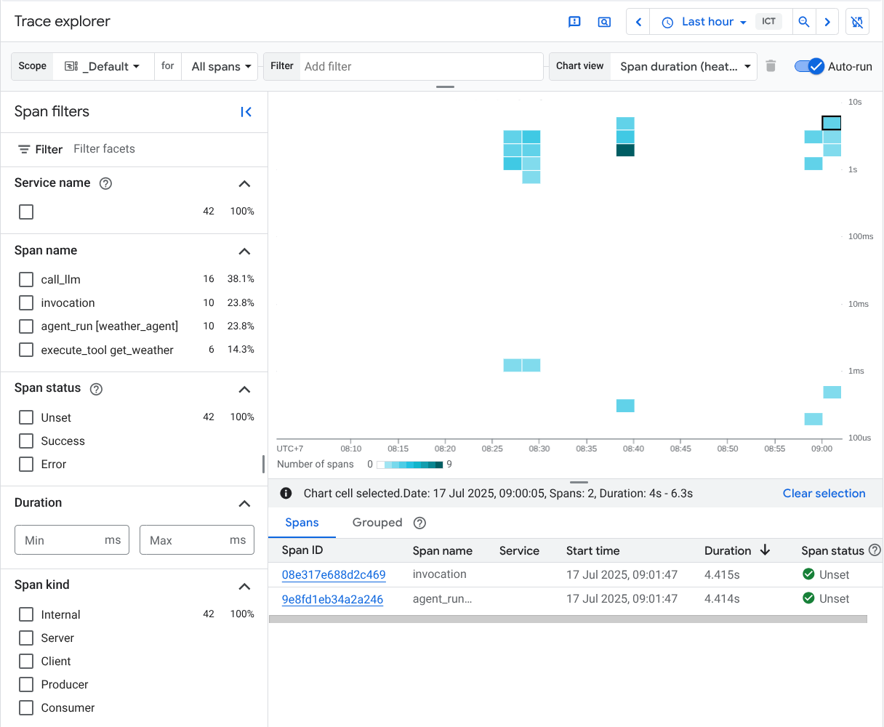
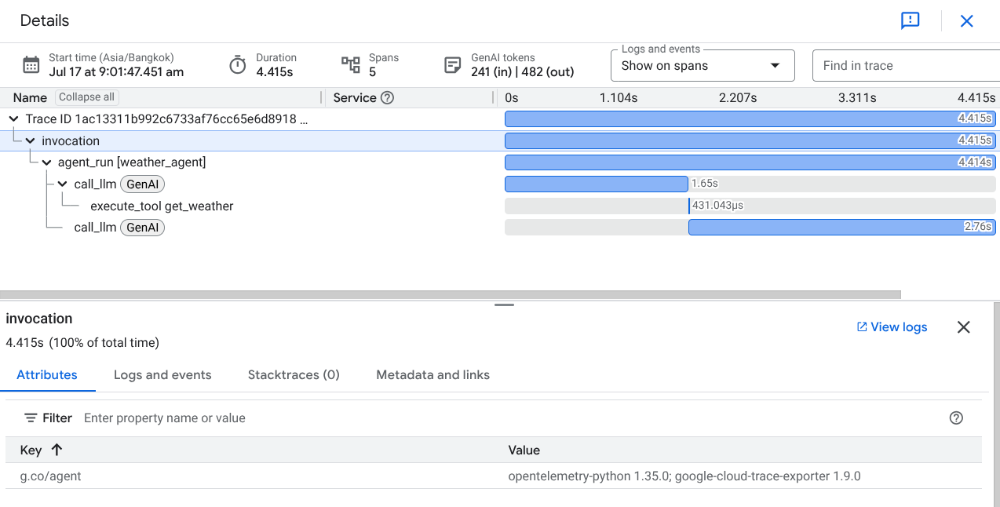

# Google Cloud Trace observability for ADK

<div class="language-support-tag">
  <span class="lst-supported">Supported in ADK</span><span class="lst-python">Python</span><span class="lst-typescript">TypeScript</span><span class="lst-go">Go</span>
</div>

During local development, you can inspect agent behavior with the [Trace view in
the ADK web UI](/evaluate/#debugging-with-the-trace-view). Once your agent is
deployed, you need a way to observe traces from real traffic in one place.

[Cloud Trace](https://cloud.google.com/trace) is the distributed tracing
component of Google Cloud Observability. It collects and visualizes trace data
so you can monitor latency, debug errors, and improve performance across your
applications. For ADK agents, Cloud Trace captures how each request flows
through model calls, tool executions, and agent steps, so you can pinpoint
bottlenecks and errors in production.

## Overview

Cloud Trace is built on [OpenTelemetry](https://opentelemetry.io/), an
open-source standard that supports many languages and ingestion methods for
generating trace data. This aligns with observability practices for ADK
applications, which also leverage OpenTelemetry-compatible instrumentation,
allowing you to:

- **Trace agent interactions**: Cloud Trace continuously gathers and analyzes
  trace data from your project, enabling you to rapidly diagnose latency issues
  and errors within your ADK applications. This automatic data collection
  simplifies the process of identifying problems in complex agent workflows.
- **Debug issues**: Quickly diagnose latency issues and errors by analyzing
  detailed traces. These traces are crucial for understanding issues that
  manifest as increased communication latency across different services or
  during specific agent actions like tool calls.
- **In-depth analysis and visualization**: Trace Explorer is the primary tool
  for analyzing traces, offering visual aids like heatmaps for span duration and
  line charts for span rates. It also provides a spans table, groupable by
  service and operation, which gives one-click access to representative traces
  and a waterfall view to easily identify bottlenecks and sources of errors
  within your agent's execution path.

The following example will assume the following agent directory structure:

```
working_dir/
├── weather_agent/
│   ├── agent.py
│   └── __init__.py
└── deploy_agent_engine.py
└── deploy_fast_api_app.py
└── agent_runner.py
```

=== "Python"
    ```python
    --8<-- "examples/inline/python/integrations/cloud-trace/001-overview.py"
    ```

## Cloud Trace setup

### Use the ADK CLI

You can enable cloud tracing by adding a flag when deploying or running your
agent using the ADK CLI.

=== "Python"

    When deploying your agent using the `adk deploy` command:

    ```bash
    adk deploy agent_engine \
        --project=$GOOGLE_CLOUD_PROJECT \
        --region=$GOOGLE_CLOUD_LOCATION \
        --trace_to_cloud \
        $AGENT_PATH
    ```

=== "Go"

    When running your agent built with the ADK Go launcher:

    ```bash
    adkgo web -otel_to_cloud
    ```

### Programmatic setup

#### Use ADK app abstractions

=== "Python"

    If you are using the Agent Platform SDK `AdkApp` abstraction, you can enable cloud tracing by adding `enable_tracing=True`:

    ```python
    --8<-- "examples/inline/python/integrations/cloud-trace/002-use-adk-app-abstractions.py"
    ```

#### Use telemetry modules

For fully customized agent runtimes, you can enable cloud tracing by using the built-in telemetry modules.

=== "Python"

    ```python
    --8<-- "examples/inline/python/integrations/cloud-trace/003-use-telemetry-modules.py"
    ```

=== "TypeScript"

    ```typescript
    --8<-- "examples/inline/typescript/integrations/cloud-trace/004-use-telemetry-modules.ts"
    ```

=== "Go"

    ```go
    --8<-- "examples/inline/go/integrations/cloud-trace/005-use-telemetry-modules.go.txt"
    ```

## Inspect Cloud Trace data

After the setup is complete, whenever you interact with the agent, it will
automatically send trace data to Cloud Trace. You can inspect the traces by
visiting the **Trace Explorer** in the [Google Cloud
Console](https://console.cloud.google.com/traces/explorer).



You will see all available traces produced by the ADK agent, with span names
such as `invoke_agent`, `generate_content`, `call_llm`, and `execute_tool`.



If you click on one of the traces, you will see a waterfall view of the detailed
process, similar to the trace view in the local ADK web UI.



### Captured attributes

ADK automatically enriches traces with the following attributes to help you
filter and analyze your agent's behavior:

- `gen_ai.agent.name`: The name of the agent being executed.
- `gcp.vertex.agent.invocation_id`: The unique ID of the invocation.
- `gcp.vertex.agent.event_id`: The ID of the specific event.
- `gen_ai.conversation.id`: The session ID.

## Resources

To learn more about tracing, OpenTelemetry, and Google Cloud integrations,
explore the following documentation:

- [Google Cloud Trace Documentation](https://cloud.google.com/trace)
- [OpenTelemetry Documentation](https://opentelemetry.io/docs/)
- [Connect to Google Cloud and Agent Platform](/get-started/google-cloud/)
