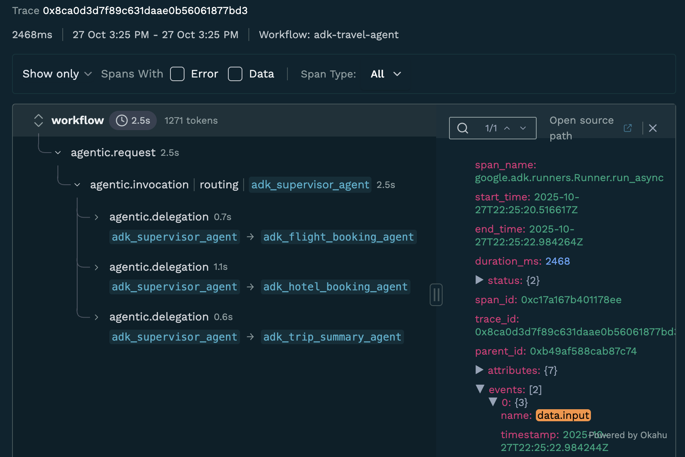

# Monocle observability for ADK

<div class="language-support-tag">
  <span class="lst-supported">Supported in ADK</span><span class="lst-python">Python</span>
</div>

[Monocle](https://github.com/monocle2ai/monocle) is an open-source observability platform for monitoring, debugging, and improving LLM applications and AI Agents. It provides comprehensive tracing capabilities for your Google ADK applications through automatic instrumentation. Monocle generates OpenTelemetry-compatible traces that can be exported to various destinations including local files or console output.

## Overview

Monocle automatically instruments Google ADK applications, allowing you to:

- **Trace agent interactions** - Automatically capture every agent run, tool call, and model request with full context and metadata
- **Monitor execution flow** - Track agent state, delegation events, and execution flow through detailed traces
- **Debug issues** - Analyze detailed traces to quickly identify bottlenecks, failed tool calls, and unexpected agent behavior
- **Flexible export options** - Export traces to local files or console for analysis
- **OpenTelemetry compatible** - Generate standard OpenTelemetry traces that work with any OTLP-compatible backend

Monocle automatically instruments the following Google ADK components:

- **`BaseAgent.run_async`** - Captures agent execution, agent state, and delegation events
- **`FunctionTool.run_async`** - Captures tool execution, including tool name, parameters, and results
- **`Runner.run_async`** - Captures runner execution, including request context and execution flow

## Installation

### 1. Install Required Packages { #install-required-packages }

```bash
pip install monocle_apptrace google-adk
```

## Setup

### 1. Configure Monocle Telemetry { #configure-monocle-telemetry }

Monocle automatically instruments Google ADK when you initialize telemetry. Simply call `setup_monocle_telemetry()` at the start of your application:

```python
--8<-- "examples/inline/python/integrations/monocle/001-1-configure-monocle-telemetry-configure.py"
```

That's it! Monocle will automatically detect and instrument your Google ADK agents, tools, and runners.

### 2. Configure Exporters (Optional) { #configure-exporters }

By default, Monocle exports traces to local JSON files. You can configure different exporters using environment variables.

#### Export to Console (for debugging)

Set the environment variable:

```bash
export MONOCLE_EXPORTER="console"
```

#### Export to Local Files (default)

```bash
export MONOCLE_EXPORTER="file"
```

Or simply omit the `MONOCLE_EXPORTER` variable - it defaults to `file`.

## Observe

Now that you have tracing setup, all Google ADK SDK requests will be automatically traced by Monocle.

```python
--8<-- "examples/inline/python/integrations/monocle/002-observe.py"
```

## Accessing Traces

By default, Monocle generates traces in JSON files in the local directory `./monocle`. The file name format is:

```
monocle_trace_{workflow_name}_{trace_id}_{timestamp}.json
```

Each trace file contains an array of OpenTelemetry-compatible spans that capture:

- **Agent execution spans** - Agent state, delegation events, and execution flow
- **Tool execution spans** - Tool name, input parameters, and output results
- **LLM interaction spans** - Model calls, prompts, responses, and token usage (if using Gemini or other LLMs)

You can analyze these trace files using any OpenTelemetry-compatible tool or write custom analysis scripts.

## Visualizing Traces with VS Code Extension

The [Okahu Trace Visualizer](https://marketplace.visualstudio.com/items?itemName=OkahuAI.okahu-ai-observability) VS Code extension provides an interactive way to visualize and analyze Monocle-generated traces directly in Visual Studio Code.

### Installation

1. Open VS Code
2. Press `Ctrl+P` (or `Cmd+P` on Mac) to open Quick Open
3. Paste the following command and press Enter:

```
ext install OkahuAI.okahu-ai-observability
```

Alternatively, you can install it from the [VS Code Marketplace](https://marketplace.visualstudio.com/items?itemName=OkahuAI.okahu-ai-observability).

### Features

The extension provides:

- **Custom Activity Bar Panel** - Dedicated sidebar for trace file management
- **Interactive File Tree** - Browse and select trace files with custom React UI
- **Split View Analysis** - Gantt chart visualization alongside JSON data viewer
- **Real-time Communication** - Seamless data flow between VS Code and React components
- **VS Code Theming** - Fully integrated with VS Code's light/dark themes

### Usage

1. After running your ADK application with Monocle tracing enabled, trace files will be generated in the `./monocle` directory
2. Open the Okahu Trace Visualizer panel from the VS Code Activity Bar
3. Browse and select trace files from the interactive file tree
4. View your traces with:
   - **Gantt chart visualization** - See the timeline and hierarchy of spans
   - **JSON data viewer** - Inspect detailed span attributes and events
   - **Token counts** - View token usage for LLM calls
   - **Error badges** - Quickly identify failed operations



## What Gets Traced

Monocle automatically captures the following information from Google ADK:

- **Agent Execution**: Agent state, delegation events, and execution flow
- **Tool Calls**: Tool name, input parameters, and output results
- **Runner Execution**: Request context and overall execution flow
- **Timing Information**: Start time, end time, and duration for each operation
- **Error Information**: Exceptions and error states

All traces are generated in OpenTelemetry format, making them compatible with any OTLP-compatible observability backend.

## Support and Resources

- [Monocle Documentation](https://docs.okahu.ai/monocle_overview/)
- [Monocle GitHub Repository](https://github.com/monocle2ai/monocle)
- [Google ADK Travel Agent Example](https://github.com/okahu-demos/adk-travel-agent)
- [Discord Community](https://discord.gg/D8vDbSUhJX)
