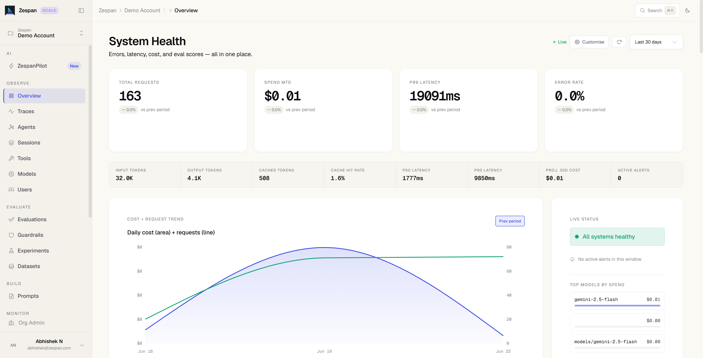
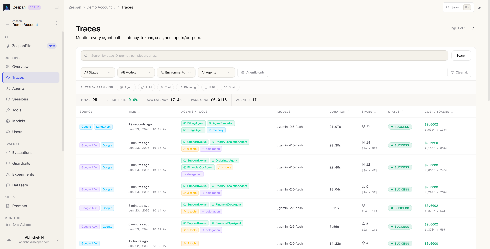

# Zespan observability for ADK

<div class="language-support-tag">
  <span class="lst-supported">Supported in ADK</span><span class="lst-python">Python</span><span class="lst-typescript">TypeScript</span>
</div>

[Zespan](https://zespan.com) is an agent relability platform for AI applications.
The Zespan SDK instruments ADK agents natively — capturing every agent invocation, model
call, tool execution, and multi-agent delegation as linked spans, then shipping them to
the [Zespan dashboard](https://app.zespan.com) for inspection, cost attribution, and
evaluation.




## Overview

<div class="language-support-tag">
  <span class="lst-supported">Supported in ADK</span><span class="lst-python">Python</span><span class="lst-typescript">TypeScript</span>
</div>

[Zespan](https://zespan.com) is an ai agent reliability platform for AI applications.
The Zespan SDK instruments ADK agents natively — capturing every agent invocation, model
call, tool execution, and multi-agent delegation as linked spans, then shipping them to
the [Zespan dashboard](https://app.zespan.com) for inspection, cost attribution,
evaluation and more.

## Overview

Once your ADK agents are instrumented, the Zespan platform provides:

- **Trace agent runs:** Capture every agent invocation, tool call, and model request
  with latency, token counts, and cost — including multi-agent delegation chains.
- **Cost attribution:** Break down Agent spend by model, agent, and time period;
  track cache savings and forecast future spend.
- **Evaluations:** Define custom quality metrics and run them against captured traces
  to measure agent behavior over time.
- **Datasets:** Build evaluation datasets from real traces, upload CSV test cases, and
  run batch evaluations against your agents.
- **Guardrails:** Configure content safety policies to block, redact, or flag unsafe
  LLM inputs and outputs — no redeployment required.
- **Simulations:** Run your agent against a dataset of test cases to catch regressions
  before they reach production.
- **Prompt management:** Fetch and manage versioned prompts from the Zespan library
  with built-in caching and variable substitution.
- **Error tracking:** Group and triage model errors, tool failures, timeouts, and rate
  limits across all agent runs.

## Prerequisites

1. Sign up at [app.zespan.com](https://app.zespan.com).
2. Create a project and copy the **API key** from **Onboarding → API Key**.
3. Set the environment variables:

   ```bash
   export ZESPAN_API_KEY=<your-zespan-api-key>
   export GOOGLE_API_KEY=<your-google-api-key>
   ```

## Installation

=== "Python"

```bash
pip install zespan google-adk
```

=== "TypeScript"

```bash
npm install @zespan/sdk @google/adk
```

## Sending traces to Zespan

=== "Python"
Initialize Zespan once at startup, create a single `ZespanADKCallbackHandler`
instance, and spread its `.callbacks` dict into each `LlmAgent` constructor.
Use the **same handler instance** across all agents so spans share one trace.

```python
import asyncio
import os

import zespan
from zespan import ZespanADKCallbackHandler
from google.adk.agents import LlmAgent
from google.adk.runners import InMemoryRunner
from google.genai import types

zespan.init(api_key=os.environ["ZESPAN_API_KEY"])

handler = ZespanADKCallbackHandler()


def get_weather(city: str) -> dict:
    """Retrieves the current weather report for a specified city."""
    if city.lower() == "new york":
        return {
            "status": "success",
            "report": "The weather in New York is sunny with a temperature of 25°C.",
        }
        return {
            "status": "error",
            "error_message": f"Weather information for '{city}' is not available.",
        }


agent = LlmAgent(
    name="weather_agent",
    model="gemini-2.5-flash",
    description="Agent to answer weather questions.",
    instruction="Use the available tools to find an answer.",
    tools=[get_weather],
    **handler.callbacks,
)


async def main():
    runner = InMemoryRunner(agent=agent, app_name="weather_app")
    await runner.session_service.create_session(
        app_name="weather_app", user_id="user", session_id="session"
    )
    async for event in runner.run_async(
        user_id="user",
        session_id="session",
        new_message=types.Content(
            role="user",
            parts=[types.Part(text="What is the weather in New York?")],
        ),
    ):
        if event.is_final_response():
            print(event.content.parts[0].text.strip())


if __name__ == "__main__":
    asyncio.run(main())
```

=== "TypeScript"
Two approaches are available.
**`instrumentADK`** — wraps coordinator and runner in one call;
intercepts the full event stream including delegations.

```typescript
import { zespan, instrumentADK } from "@zespan/sdk";
import { LlmAgent, InMemoryRunner } from "@google/adk";

zespan.init({ apiKey: process.env.ZESPAN_API_KEY! });

function getWeather(city: string): object {
  if (city.toLowerCase() === "new york") {
    return {
      status: "success",
      report: "The weather in New York is sunny with a temperature of 25°C.",
    };
  }
  return {
    status: "error",
    error_message: `Weather information for '${city}' is not available.`,
  };
}

const coordinator = new LlmAgent({
  name: "weather_agent",
  model: "gemini-2.5-flash",
  description: "Agent to answer weather questions.",
  instruction: "Use the available tools to find an answer.",
  tools: [getWeather],
});

const runner = new InMemoryRunner({
  agent: coordinator,
  appName: "weather_app",
});

const { runner: tracedRunner } = instrumentADK({ coordinator, runner });

for await (const event of tracedRunner.runEphemeral({
  userId: "user",
  newMessage: { parts: [{ text: "What is the weather in New York?" }] },
})) {
  if (event.isFinalResponse()) {
    console.log(event.content.parts[0].text);
  }
}
```

**`ZespanADKCallbackHandler`** — uses ADK's native callback system; spread
`.callbacks` into each agent config. Use the **same instance** across all agents.

```typescript
import { zespan, ZespanADKCallbackHandler } from "@zespan/sdk";
import { LlmAgent, InMemoryRunner } from "@google/adk";

zespan.init({ apiKey: process.env.ZESPAN_API_KEY! });

const handler = new ZespanADKCallbackHandler();

const agent = new LlmAgent({
  name: "weather_agent",
  model: "gemini-2.5-flash",
  description: "Agent to answer weather questions.",
  instruction: "Use the available tools to find an answer.",
  tools: [getWeather],
  ...handler.callbacks,
});

const runner = new InMemoryRunner({ agent, appName: "weather_app" });

for await (const event of runner.runEphemeral({
  userId: "user",
  newMessage: { parts: [{ text: "What is the weather in New York?" }] },
})) {
  if (event.isFinalResponse()) {
    console.log(event.content.parts[0].text);
  }
}
```

## Multi-agent systems

=== "Python"
Use the **same handler instance** across the coordinator and all sub-agents.
Spans are linked under a single trace via the shared ADK invocation ID.

```python
handler = ZespanADKCallbackHandler()

specialist = LlmAgent(
    name="lookup_agent",
    model="gemini-2.5-flash",
    tools=[lookup_tool],
    **handler.callbacks,
)

coordinator = LlmAgent(
    name="coordinator",
    model="gemini-2.5-flash",
    sub_agents=[specialist],
    **handler.callbacks,
)
```

=== "TypeScript"
With `instrumentADK`: recursively wraps all `subAgents` automatically.

```typescript
const specialist = new LlmAgent({
  name: "lookup_agent",
  model: "gemini-2.5-flash",
  tools: [lookupTool],
});

const coordinator = new LlmAgent({
  name: "coordinator",
  model: "gemini-2.5-flash",
  subAgents: [specialist],
});

const { runner: tracedRunner } = instrumentADK({
  coordinator,
  runner: new InMemoryRunner({ agent: coordinator, appName: "my_app" }),
});
```

With `ZespanADKCallbackHandler`: spread same instance into every agent.

```typescript
const handler = new ZespanADKCallbackHandler();

const specialist = new LlmAgent({
  name: "lookup_agent",
  model: "gemini-2.5-flash",
  tools: [lookupTool],
  ...handler.callbacks,
});

const coordinator = new LlmAgent({
  name: "coordinator",
  model: "gemini-2.5-flash",
  subAgents: [specialist],
  ...handler.callbacks,
});
```

## View traces in the dashboard

Run the agent, then open your project at [app.zespan.com](https://app.zespan.com).
Each ADK run produces a hierarchical trace showing:

- Agent spans with latency and delegation links between coordinator and sub-agents
- LLM spans with token counts, cost, finish reason, and optional prompt/completion text
- Tool spans with input arguments and return values

## Resources

- [Zespan](https://zespan.com)
- [`zespan` on PyPI](https://pypi.org/project/zespan/)
- [`@zespan/sdk` on npm](https://www.npmjs.com/package/@zespan/sdk)
- [Zespan documentation](https://docs.zespan.com)
