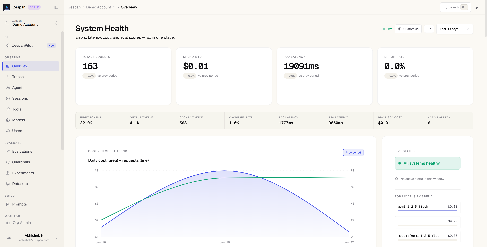
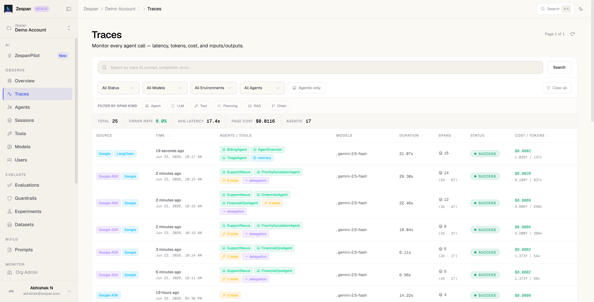

# Zespan observability for ADK

<div class="language-support-tag">
  <span class="lst-supported">Supported in ADK</span><span class="lst-python">Python</span><span class="lst-typescript">TypeScript</span>
</div>

[Zespan](https://zespan.com) is an agent reliability platform for AI
applications. The Zespan SDK instruments ADK agents natively by capturing every
agent invocation, model call, tool execution, and multi-agent delegation as
linked spans, then shipping them to the [Zespan
dashboard](https://app.zespan.com) for inspection, cost attribution, and
evaluation.

## Overview

Once your ADK agents are instrumented, the Zespan platform provides:

- **Tracing:** Capture every agent, model, tool, and delegation span with
  latency, tokens, and cost.
- **Cost attribution:** Break down spend by model, agent, and time period.
- **Evaluations:** Score agent behavior with custom metrics, datasets, and
  simulations.
- **Guardrails:** Block, redact, or flag unsafe inputs and outputs at runtime.
- **Prompt management:** Fetch and version prompts with caching and variable
  substitution.



## Prerequisites

Before you begin, set up a Zespan account and credentials:

1. Sign up at [app.zespan.com](https://app.zespan.com).
2. Create a project and copy the **API key** from **Onboarding → API Key**.
3. Set the environment variables:

   ```bash
   export ZESPAN_API_KEY=<your-zespan-api-key>
   export GOOGLE_API_KEY=<your-google-api-key>
   ```

## Installation

Install the Zespan SDK alongside ADK:

=== "Python"

    ```bash
    pip install zespan google-adk
    ```

=== "TypeScript"

    ```bash
    npm install @zespan/sdk @google/adk
    ```

## Send traces

Instrument an ADK agent with the Zespan SDK to start capturing traces:

=== "Python"

    Initialize Zespan once at startup, then create a `ZespanADKCallbackHandler`
    and spread its `.callbacks` into your `LlmAgent`.

    ```python
    --8<-- "examples/inline/python/integrations/zespan/001-send-traces.py"
    ```

=== "TypeScript"

    Two approaches are available.

    **`instrumentADK`** wraps coordinator and runner in one call and intercepts
    the full event stream, including delegations.

    ```typescript
    --8<-- "examples/inline/typescript/integrations/zespan/002-send-traces.ts"
    ```

    **`ZespanADKCallbackHandler`** uses ADK's native callback system; spread
    `.callbacks` into your agent config.

    ```typescript
    --8<-- "examples/inline/typescript/integrations/zespan/003-send-traces.ts"
    ```

## Multi-agent systems

Zespan links coordinator and sub-agent spans into a single trace:

=== "Python"

    Use the **same handler instance** across the coordinator and all sub-agents.
    Spans are linked under a single trace via the shared ADK invocation ID.

    ```python
    --8<-- "examples/inline/python/integrations/zespan/004-multi-agent-systems.py"
    ```

=== "TypeScript"

    With `instrumentADK`, all `subAgents` are wrapped recursively and automatically.

    ```typescript
    --8<-- "examples/inline/typescript/integrations/zespan/005-multi-agent-systems.ts"
    ```

    With `ZespanADKCallbackHandler`, spread the same instance into every agent.

    ```typescript
    --8<-- "examples/inline/typescript/integrations/zespan/006-multi-agent-systems.ts"
    ```

## View traces in the dashboard

Run the agent, then open your project at
[app.zespan.com](https://app.zespan.com). Each ADK run produces a hierarchical
trace showing:

- Agent spans with latency and delegation links between coordinator and
  sub-agents
- LLM spans with token counts, cost, finish reason, and optional
  prompt/completion text
- Tool spans with input arguments and return values



## Resources

- [Zespan](https://zespan.com)
- [`zespan` on PyPI](https://pypi.org/project/zespan/)
- [`@zespan/sdk` on npm](https://www.npmjs.com/package/@zespan/sdk)
- [Zespan documentation](https://docs.zespan.com)
