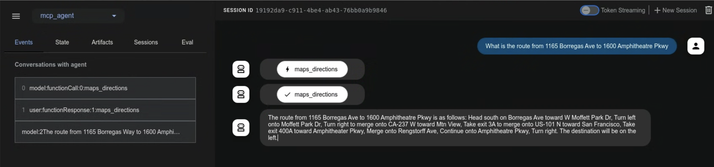

# 모델 컨텍스트 프로토콜 도구

 이 가이드는 모델 컨텍스트 프로토콜(MCP)을 ADK와 통합하는 두 가지 방법을 안내합니다.

## 모델 컨텍스트 프로토콜(MCP)이란 무엇인가요?

모델 컨텍스트 프로토콜(MCP)은 Gemini 및 Claude와 같은 거대 언어 모델(LLM)이 외부 애플리케이션, 데이터 소스 및 도구와 통신하는 방법을 표준화하기 위해 설계된 개방형 표준입니다. 이는 LLM이 컨텍스트를 얻고, 작업을 실행하며, 다양한 시스템과 상호 작용하는 방식을 단순화하는 보편적인 연결 메커니즘으로 생각할 수 있습니다.

MCP는 클라이언트-서버 아키텍처를 따르며, **데이터**(리소스), **대화형 템플릿**(프롬프트), **실행 가능한 함수**(도구)가 **MCP 서버**에 의해 노출되고 **MCP 클라이언트**(LLM 호스트 애플리케이션 또는 AI 에이전트일 수 있음)에 의해 소비되는 방식을 정의합니다.

이 가이드는 두 가지 주요 통합 패턴을 다룹니다:

1. **ADK 내에서 기존 MCP 서버 사용:** ADK 에이전트가 MCP 클라이언트 역할을 하여 외부 MCP 서버에서 제공하는 도구를 활용합니다.
2. **MCP 서버를 통해 ADK 도구 노출:** ADK 도구를 래핑하여 모든 MCP 클라이언트에서 접근할 수 있도록 하는 MCP 서버를 구축합니다.

## 전제 조건

시작하기 전에 다음 설정이 완료되었는지 확인하세요:

* **ADK 설정:** 빠른 시작의 표준 ADK [설정 지침](../get-started/quickstart.md/#venv-install)을 따르세요.
* **Python/Java 설치/업데이트:** MCP는 Python의 경우 3.9 이상, Java의 경우 17+ 버전이 필요합니다.
* **Node.js 및 npx 설정:** **(Python만 해당)** 많은 커뮤니티 MCP 서버는 Node.js 패키지로 배포되며 `npx`를 사용하여 실행됩니다. 아직 설치하지 않았다면 Node.js(npx 포함)를 설치하세요. 자세한 내용은 [https://nodejs.org/en](https://nodejs.org/en)을 참조하세요.
* **설치 확인:** **(Python만 해당)** 활성화된 가상 환경 내에서 `adk`와 `npx`가 PATH에 있는지 확인하세요:

```shell
# 두 명령어 모두 실행 파일의 경로를 출력해야 합니다.
which adk
which npx
```

## 1. `adk web`에서 ADK 에이전트와 함께 MCP 서버 사용 (ADK를 MCP 클라이언트로)

이 섹션에서는 외부 MCP(모델 컨텍스트 프로토콜) 서버의 도구를 ADK 에이전트에 통합하는 방법을 보여줍니다. 이는 ADK 에이전트가 MCP 인터페이스를 노출하는 기존 서비스에서 제공하는 기능을 사용해야 할 때 **가장 일반적인** 통합 패턴입니다. `MCPToolset` 클래스를 에이전트의 `tools` 목록에 직접 추가하여 MCP 서버에 원활하게 연결하고, 도구를 검색하며, 에이전트가 사용할 수 있도록 하는 방법을 보게 될 것입니다. 이러한 예제는 주로 `adk web` 개발 환경 내에서의 상호 작용에 중점을 둡니다.

### `MCPToolset` 클래스

`MCPToolset` 클래스는 MCP 서버의 도구를 통합하기 위한 ADK의 기본 메커니즘입니다. 에이전트의 `tools` 목록에 `MCPToolset` 인스턴스를 포함하면 지정된 MCP 서버와의 상호 작용을 자동으로 처리합니다. 작동 방식은 다음과 같습니다:

1.  **연결 관리:** 초기화 시 `MCPToolset`은 MCP 서버와의 연결을 설정하고 관리합니다. 이는 로컬 서버 프로세스(표준 입력/출력을 통한 통신을 위한 `StdioServerParameters` 사용) 또는 원격 서버(서버 전송 이벤트를 위한 `SseServerParams` 사용)일 수 있습니다. 도구 세트는 또한 에이전트나 애플리케이션이 종료될 때 이 연결을 정상적으로 종료하는 것을 처리합니다.
2.  **도구 검색 및 조정:** 연결되면 `MCPToolset`은 MCP 서버에 사용 가능한 도구를 쿼리하고(`list_tools` MCP 메서드 통해), 발견된 MCP 도구의 스키마를 ADK 호환 `BaseTool` 인스턴스로 변환합니다.
3.  **에이전트에 노출:** 이렇게 조정된 도구는 네이티브 ADK 도구인 것처럼 `LlmAgent`에서 사용할 수 있게 됩니다.
4.  **도구 호출 프록시:** `LlmAgent`가 이러한 도구 중 하나를 사용하기로 결정하면, `MCPToolset`은 호출을 투명하게 MCP 서버로 프록시하고(`call_tool` MCP 메서드 사용), 필요한 인수를 보내고, 서버의 응답을 에이전트에게 다시 반환합니다.
5.  **필터링 (선택 사항):** `MCPToolset`을 생성할 때 `tool_filter` 매개변수를 사용하여 MCP 서버의 모든 도구를 에이전트에 노출하는 대신 특정 하위 집합만 선택할 수 있습니다.

다음 예제는 `adk web` 개발 환경 내에서 `MCPToolset`을 사용하는 방법을 보여줍니다. MCP 연결 수명 주기를 더 세밀하게 제어해야 하거나 `adk web`을 사용하지 않는 시나리오의 경우, 이 페이지 뒷부분의 "`adk web` 외부에서 에이전트에 MCP 도구 사용하기" 섹션을 참조하세요.

### 예제 1: 파일 시스템 MCP 서버

이 예제는 파일 시스템 작업을 제공하는 로컬 MCP 서버에 연결하는 방법을 보여줍니다.

#### 1단계: `MCPToolset`으로 에이전트 정의하기

`agent.py` 파일을 생성합니다(예: `./adk_agent_samples/mcp_agent/agent.py`). `MCPToolset`은 `LlmAgent`의 `tools` 목록 내에서 직접 인스턴스화됩니다.

*   **중요:** `args` 목록의 `"/path/to/your/folder"`를 MCP 서버가 접근할 수 있는 로컬 시스템의 **절대 경로**로 바꾸세요.
*   **중요:** `.env` 파일을 `./adk_agent_samples` 디렉토리의 상위 디렉토리에 배치하세요.

```python
# ./adk_agent_samples/mcp_agent/agent.py
import os # 경로 작업에 필요
from google.adk.agents import LlmAgent
from google.adk.tools.mcp_tool.mcp_toolset import MCPToolset, StdioServerParameters

# 가능한 경우 경로를 동적으로 정의하거나, 사용자가 절대 경로의 필요성을 이해하도록 하는 것이 좋습니다.
# 이 예제에서는 이 파일에 상대적인 경로를 구성하며,
# '/path/to/your/folder'가 agent.py와 동일한 디렉토리에 있다고 가정합니다.
# 설정에 필요한 경우 실제 절대 경로로 교체하세요.
TARGET_FOLDER_PATH = os.path.join(os.path.dirname(os.path.abspath(__file__)), "/path/to/your/folder")
# TARGET_FOLDER_PATH가 MCP 서버를 위한 절대 경로인지 확인하세요.
# ./adk_agent_samples/mcp_agent/your_folder를 생성한 경우,

root_agent = LlmAgent(
    model='gemini-2.0-flash',
    name='filesystem_assistant_agent',
    instruction='사용자가 파일을 관리하도록 돕습니다. 파일을 나열하고, 읽는 등의 작업을 할 수 있습니다.',
    tools=[
        MCPToolset(
            connection_params=StdioServerParameters(
                command='npx',
                args=[
                    "-y",  # npx가 설치를 자동 확인하는 인수
                    "@modelcontextprotocol/server-filesystem",
                    # 중요: 이것은 npx 프로세스가 접근할 수 있는 폴더의 절대 경로여야 합니다.
                    # 시스템의 유효한 절대 경로로 교체하세요.
                    # 예: "/Users/youruser/accessible_mcp_files"
                    # 또는 동적으로 구성된 절대 경로 사용:
                    os.path.abspath(TARGET_FOLDER_PATH),
                ],
            ),
            # 선택 사항: MCP 서버에서 노출되는 도구 필터링
            # tool_filter=['list_directory', 'read_file']
        )
    ],
)
```


#### 2단계: `__init__.py` 파일 생성하기

ADK가 검색할 수 있는 Python 패키지로 만들기 위해 `agent.py`와 동일한 디렉토리에 `__init__.py`가 있는지 확인하세요.

```python
# ./adk_agent_samples/mcp_agent/__init__.py
from . import agent
```

#### 3단계: `adk web` 실행 및 상호작용

터미널에서 `mcp_agent`의 상위 디렉토리(예: `adk_agent_samples`)로 이동하여 다음을 실행하세요:

```shell
cd ./adk_agent_samples # 또는 상응하는 상위 디렉토리
adk web
```

!!!info "Windows 사용자 참고"

    `_make_subprocess_transport NotImplementedError`가 발생하면 대신 `adk web --no-reload`를 사용하는 것을 고려해보세요.


브라우저에서 ADK 웹 UI가 로드되면:

1.  에이전트 드롭다운에서 `filesystem_assistant_agent`를 선택합니다.
2.  다음과 같은 프롬프트를 시도해 보세요:
    *   "현재 디렉토리의 파일 목록을 보여줘."
    *   "sample.txt라는 파일을 읽을 수 있니?" (`TARGET_FOLDER_PATH`에 생성했다고 가정).
    *   "`another_file.md`의 내용은 뭐야?"

에이전트가 MCP 파일 시스템 서버와 상호작용하고, 서버의 응답(파일 목록, 파일 내용)이 에이전트를 통해 전달되는 것을 볼 수 있습니다. `adk web` 콘솔(명령을 실행한 터미널)에서도 `npx` 프로세스가 stderr에 출력하는 경우 로그를 볼 수 있습니다.


### 예제 2: Google Maps MCP 서버

이 예제는 Google Maps MCP 서버에 연결하는 방법을 보여줍니다.

#### 1단계: API 키 얻기 및 API 활성화

1.  **Google Maps API 키:** [API 키 사용](https://developers.google.com/maps/documentation/javascript/get-api-key#create-api-keys)의 지침에 따라 Google Maps API 키를 얻습니다.
2.  **API 활성화:** Google Cloud 프로젝트에서 다음 API가 활성화되어 있는지 확인하세요:
    *   Directions API
    *   Routes API
    지침은 [Google Maps Platform 시작하기](https://developers.google.com/maps/get-started#enable-api-sdk) 문서를 참조하세요.

#### 2단계: Google Maps용 `MCPToolset`으로 에이전트 정의하기

`agent.py` 파일을 수정합니다(예: `./adk_agent_samples/mcp_agent/agent.py`). `YOUR_GOOGLE_MAPS_API_KEY`를 얻은 실제 API 키로 바꾸세요.

```python
# ./adk_agent_samples/mcp_agent/agent.py
import os
from google.adk.agents import LlmAgent
from google.adk.tools.mcp_tool.mcp_toolset import MCPToolset, StdioServerParameters

# 환경 변수에서 API 키를 검색하거나 직접 삽입합니다.
# 환경 변수를 사용하는 것이 일반적으로 더 안전합니다.
# 'adk web'을 실행하는 터미널에서 이 환경 변수가 설정되어 있는지 확인하세요.
# 예: export GOOGLE_MAPS_API_KEY="YOUR_ACTUAL_KEY"
google_maps_api_key = os.environ.get("GOOGLE_MAPS_API_KEY")

if not google_maps_api_key:
    # 테스트를 위한 대체 또는 직접 할당 - 프로덕션에는 권장되지 않음
    google_maps_api_key = "YOUR_GOOGLE_MAPS_API_KEY_HERE" # env var를 사용하지 않는 경우 교체
    if google_maps_api_key == "YOUR_GOOGLE_MAPS_API_KEY_HERE":
        print("경고: GOOGLE_MAPS_API_KEY가 설정되지 않았습니다. 환경 변수 또는 스크립트에서 설정해 주세요.")
        # 키가 중요하고 찾을 수 없는 경우 오류를 발생시키거나 종료할 수 있습니다.

root_agent = LlmAgent(
    model='gemini-2.0-flash',
    name='maps_assistant_agent',
    instruction='Google Maps 도구를 사용하여 지도, 길찾기, 장소 찾기를 도와주세요.',
    tools=[
        MCPToolset(
            connection_params=StdioServerParameters(
                command='npx',
                args=[
                    "-y",
                    "@modelcontextprotocol/server-google-maps",
                ],
                # npx 프로세스에 API 키를 환경 변수로 전달합니다.
                # 이것이 Google Maps용 MCP 서버가 키를 예상하는 방식입니다.
                env={
                    "GOOGLE_MAPS_API_KEY": google_maps_api_key
                }
            ),
            # 필요한 경우 특정 Maps 도구 필터링 가능:
            # tool_filter=['get_directions', 'find_place_by_id']
        )
    ],
)
```

#### 3단계: `__init__.py` 파일이 있는지 확인하기

예제 1에서 만들었다면 이 단계를 건너뛸 수 있습니다. 그렇지 않으면 `./adk_agent_samples/mcp_agent/` 디렉토리에 `__init__.py`가 있는지 확인하세요:

```python
# ./adk_agent_samples/mcp_agent/__init__.py
from . import agent
```

#### 4단계: `adk web` 실행 및 상호작용

1.  **환경 변수 설정 (권장):**
    `adk web`을 실행하기 전에 터미널에서 Google Maps API 키를 환경 변수로 설정하는 것이 가장 좋습니다:
    ```shell
    export GOOGLE_MAPS_API_KEY="YOUR_ACTUAL_GOOGLE_MAPS_API_KEY"
    ```
    `YOUR_ACTUAL_GOOGLE_MAPS_API_KEY`를 키로 바꾸세요.

2.  **`adk web` 실행**:
    `mcp_agent`의 상위 디렉토리(예: `adk_agent_samples`)로 이동하여 다음을 실행하세요:
    ```shell
    cd ./adk_agent_samples # 또는 상응하는 상위 디렉토리
    adk web
    ```

3.  **UI에서 상호작용**:
    *   `maps_assistant_agent`를 선택합니다.
    *   다음과 같은 프롬프트를 시도해 보세요:
        *   "GooglePlex에서 SFO까지 가는 길을 알려줘."
        *   "골든게이트 공원 근처 커피숍을 찾아줘."
        *   "프랑스 파리에서 독일 베를린까지의 경로는 뭐야?"

에이전트가 Google Maps MCP 도구를 사용하여 길찾기나 위치 기반 정보를 제공하는 것을 볼 수 있습니다.




## 2. ADK 도구로 MCP 서버 구축하기 (ADK를 노출하는 MCP 서버)

이 패턴을 사용하면 기존 ADK 도구를 래핑하여 모든 표준 MCP 클라이언트 애플리케이션에서 사용할 수 있도록 할 수 있습니다. 이 섹션의 예제는 사용자 정의로 구축된 MCP 서버를 통해 ADK `load_web_page` 도구를 노출합니다.

### 단계 요약

`mcp` 라이브러리를 사용하여 표준 Python MCP 서버 애플리케이션을 만듭니다. 이 서버 내에서 다음을 수행합니다:

1.  노출하려는 ADK 도구를 인스턴스화합니다(예: `FunctionTool(load_web_page)`).
2.  MCP 서버의 `@app.list_tools()` 핸들러를 구현하여 ADK 도구를 알립니다. 여기에는 `google.adk.tools.mcp_tool.conversion_utils`의 `adk_to_mcp_tool_type` 유틸리티를 사용하여 ADK 도구 정의를 MCP 스키마로 변환하는 작업이 포함됩니다.
3.  MCP 서버의 `@app.call_tool()` 핸들러를 구현합니다. 이 핸들러는 다음을 수행합니다:
    *   MCP 클라이언트로부터 도구 호출 요청을 받습니다.
    *   요청이 래핑된 ADK 도구 중 하나를 대상으로 하는지 식별합니다.
    *   ADK 도구의 `.run_async()` 메서드를 실행합니다.
    *   ADK 도구의 결과를 MCP 호환 응답(예: `mcp.types.TextContent`)으로 포맷합니다.

### 전제 조건

ADK 설치와 동일한 Python 환경에 MCP 서버 라이브러리를 설치합니다:

```shell
pip install mcp
```

### 1단계: MCP 서버 스크립트 생성하기

MCP 서버를 위한 새 Python 파일을 만듭니다. 예: `my_adk_mcp_server.py`.

### 2단계: 서버 로직 구현하기

다음 코드를 `my_adk_mcp_server.py`에 추가합니다. 이 스크립트는 ADK `load_web_page` 도구를 노출하는 MCP 서버를 설정합니다.

```python
# my_adk_mcp_server.py
import asyncio
import json
import os
from dotenv import load_dotenv

# MCP 서버 가져오기
from mcp import types as mcp_types # 충돌을 피하기 위해 별칭 사용
from mcp.server.lowlevel import Server, NotificationOptions
from mcp.server.models import InitializationOptions
import mcp.server.stdio # stdio 서버로 실행하기 위해

# ADK 도구 가져오기
from google.adk.tools.function_tool import FunctionTool
from google.adk.tools.load_web_page import load_web_page # 예제 ADK 도구
# ADK <-> MCP 변환 유틸리티
from google.adk.tools.mcp_tool.conversion_utils import adk_to_mcp_tool_type

# --- 환경 변수 로드 (ADK 도구에 필요한 경우, 예: API 키) ---
load_dotenv() # 필요한 경우 동일한 디렉토리에 .env 파일 생성

# --- ADK 도구 준비 ---
# 노출하려는 ADK 도구 인스턴스화.
# 이 도구는 MCP 서버에 의해 래핑되고 호출됩니다.
print("ADK load_web_page 도구 초기화 중...")
adk_tool_to_expose = FunctionTool(load_web_page)
print(f"ADK 도구 '{adk_tool_to_expose.name}'가 초기화되었고 MCP를 통해 노출될 준비가 되었습니다.")
# --- ADK 도구 준비 끝 ---

# --- MCP 서버 설정 ---
print("MCP 서버 인스턴스 생성 중...")
# mcp.server 라이브러리를 사용하여 이름 있는 MCP 서버 인스턴스 생성
app = Server("adk-tool-exposing-mcp-server")

# 사용 가능한 도구 목록을 나열하는 MCP 서버 핸들러 구현
@app.list_tools()
async def list_mcp_tools() -> list[mcp_types.Tool]:
    """이 서버가 노출하는 도구 목록을 나열하는 MCP 핸들러."""
    print("MCP 서버: list_tools 요청 수신.")
    # ADK 도구 정의를 MCP 도구 스키마 형식으로 변환
    mcp_tool_schema = adk_to_mcp_tool_type(adk_tool_to_expose)
    print(f"MCP 서버: 광고 도구: {mcp_tool_schema.name}")
    return [mcp_tool_schema]

# 도구 호출을 실행하는 MCP 서버 핸들러 구현
@app.call_tool()
async def call_mcp_tool(
    name: str, arguments: dict
) -> list[mcp_types.Content]: # MCP는 mcp_types.Content를 사용
    """MCP 클라이언트가 요청한 도구 호출을 실행하는 MCP 핸들러."""
    print(f"MCP 서버: '{name}'에 대한 call_tool 요청 수신, 인수: {arguments}")

    # 요청된 도구 이름이 래핑된 ADK 도구와 일치하는지 확인
    if name == adk_tool_to_expose.name:
        try:
            # ADK 도구의 run_async 메서드 실행.
            # 참고: 이 MCP 서버가 전체 ADK Runner 호출 외부에서 ADK 도구를
            # 실행하고 있기 때문에 tool_context는 여기서 None입니다.
            # ADK 도구에 ToolContext 기능(상태 또는 인증 등)이 필요한 경우,
            # 이 직접 호출은 더 정교한 처리가 필요할 수 있습니다.
            adk_tool_response = await adk_tool_to_expose.run_async(
                args=arguments,
                tool_context=None,
            )
            print(f"MCP 서버: ADK 도구 '{name}' 실행됨. 응답: {adk_tool_response}")

            # ADK 도구의 응답(종종 dict)을 MCP 호환 형식으로 포맷.
            # 여기서는 응답 딕셔너리를 TextContent 내의 JSON 문자열로 직렬화합니다.
            # ADK 도구의 출력 및 클라이언트 요구에 따라 포맷을 조정하세요.
            response_text = json.dumps(adk_tool_response, indent=2)
            # MCP는 mcp_types.Content 파트 목록을 예상합니다
            return [mcp_types.TextContent(type="text", text=response_text)]

        except Exception as e:
            print(f"MCP 서버: ADK 도구 '{name}' 실행 오류: {e}")
            # MCP 형식으로 오류 메시지 반환
            error_text = json.dumps({"error": f"도구 '{name}' 실행 실패: {str(e)}"})
            return [mcp_types.TextContent(type="text", text=error_text)]
    else:
        # 알 수 없는 도구 호출 처리
        print(f"MCP 서버: 도구 '{name}'를 이 서버에서 찾거나 노출하지 않았습니다.")
        error_text = json.dumps({"error": f"이 서버에서 도구 '{name}'를 구현하지 않았습니다."})
        return [mcp_types.TextContent(type="text", text=error_text)]

# --- MCP 서버 러너 ---
async def run_mcp_stdio_server():
    """표준 입력/출력을 통해 연결을 수신하는 MCP 서버를 실행합니다."""
    # mcp.server.stdio 라이브러리의 stdio_server 컨텍스트 관리자 사용
    async with mcp.server.stdio.stdio_server() as (read_stream, write_stream):
        print("MCP Stdio 서버: 클라이언트와 핸드셰이크 시작 중...")
        await app.run(
            read_stream,
            write_stream,
            InitializationOptions(
                server_name=app.name, # 위에서 정의된 서버 이름 사용
                server_version="0.1.0",
                capabilities=app.get_capabilities(
                    # 서버 기능 정의 - 옵션은 MCP 문서 참조
                    notification_options=NotificationOptions(),
                    experimental_capabilities={},
                ),
            ),
        )
        print("MCP Stdio 서버: 실행 루프가 완료되었거나 클라이언트 연결이 끊어졌습니다.")

if __name__ == "__main__":
    print("stdio를 통해 ADK 도구를 노출하기 위해 MCP 서버 시작 중...")
    try:
        asyncio.run(run_mcp_stdio_server())
    except KeyboardInterrupt:
        print("\nMCP 서버 (stdio)가 사용자에 의해 중지되었습니다.")
    except Exception as e:
        print(f"MCP 서버 (stdio)에서 오류 발생: {e}")
    finally:
        print("MCP 서버 (stdio) 프로세스 종료 중.")
# --- MCP 서버 끝 ---
```

### 3단계: 사용자 정의 MCP 서버를 ADK 에이전트로 테스트하기

이제 방금 구축한 MCP 서버에 대한 클라이언트 역할을 할 ADK 에이전트를 만듭니다. 이 ADK 에이전트는 `MCPToolset`을 사용하여 `my_adk_mcp_server.py` 스크립트에 연결합니다.

`agent.py`를 만듭니다(예: `./adk_agent_samples/mcp_client_agent/agent.py`):

```python
# ./adk_agent_samples/mcp_client_agent/agent.py
import os
from google.adk.agents import LlmAgent
from google.adk.tools.mcp_tool import MCPToolset, StdioServerParameters

# 중요: 이것을 my_adk_mcp_server.py 스크립트의 절대 경로로 바꾸세요
PATH_TO_YOUR_MCP_SERVER_SCRIPT = "/path/to/your/my_adk_mcp_server.py" # <<< 교체

if PATH_TO_YOUR_MCP_SERVER_SCRIPT == "/path/to/your/my_adk_mcp_server.py":
    print("경고: PATH_TO_YOUR_MCP_SERVER_SCRIPT가 설정되지 않았습니다. agent.py에서 업데이트하세요.")
    # 경로가 중요한 경우 선택적으로 오류 발생

root_agent = LlmAgent(
    model='gemini-2.0-flash',
    name='web_reader_mcp_client_agent',
    instruction="사용자가 제공한 URL에서 콘텐츠를 가져오려면 'load_web_page' 도구를 사용하세요.",
    tools=[
        MCPToolset(
            connection_params=StdioServerParameters(
                command='python3', # MCP 서버 스크립트를 실행하는 명령어
                args=[PATH_TO_YOUR_MCP_SERVER_SCRIPT], # 인수는 스크립트 경로
            )
            # tool_filter=['load_web_page'] # 선택 사항: 특정 도구만 로드되도록 보장
        )
    ],
)
```

그리고 동일한 디렉토리에 `__init__.py`를 만듭니다:
```python
# ./adk_agent_samples/mcp_client_agent/__init__.py
from . import agent
```

**테스트 실행 방법:**

1.  **사용자 정의 MCP 서버 시작 (선택 사항, 별도 관찰용):**
    하나의 터미널에서 `my_adk_mcp_server.py`를 직접 실행하여 로그를 볼 수 있습니다:
    ```shell
    python3 /path/to/your/my_adk_mcp_server.py
    ```
    "Launching MCP Server..."를 출력하고 대기합니다. 그런 다음 (`adk web`을 통해 실행되는) ADK 에이전트가 `StdioServerParameters`의 `command`가 이를 실행하도록 설정된 경우 이 프로세스에 연결합니다.
    *(또는, `MCPToolset`은 에이전트가 초기화될 때 이 서버 스크립트를 하위 프로세스로 자동으로 시작합니다.)*

2.  **클라이언트 에이전트에 대해 `adk web` 실행:**
    `mcp_client_agent`의 상위 디렉토리(예: `adk_agent_samples`)로 이동하여 다음을 실행합니다:
    ```shell
    cd ./adk_agent_samples # 또는 상응하는 상위 디렉토리
    adk web
    ```

3.  **ADK 웹 UI에서 상호작용:**
    *   `web_reader_mcp_client_agent`를 선택합니다.
    *   "https://example.com에서 콘텐츠를 로드해줘"와 같은 프롬프트를 시도합니다.

ADK 에이전트(`web_reader_mcp_client_agent`)는 `MCPToolset`을 사용하여 `my_adk_mcp_server.py`를 시작하고 연결합니다. MCP 서버는 `call_tool` 요청을 받고, ADK `load_web_page` 도구를 실행하며, 결과를 반환합니다. 그러면 ADK 에이전트가 이 정보를 전달합니다. ADK 웹 UI(및 해당 터미널)와 별도로 실행한 경우 `my_adk_mcp_server.py` 터미널에서 로그를 볼 수 있습니다.

이 예는 ADK 도구가 MCP 서버 내에 캡슐화되어 ADK 에이전트뿐만 아니라 더 광범위한 MCP 호환 클라이언트에서 접근할 수 있는 방법을 보여줍니다.

[문서](https://modelcontextprotocol.io/quickstart/server#core-mcp-concepts)를 참조하여 Claude Desktop으로 시도해 보세요.

## `adk web` 외부에서 에이전트에 MCP 도구 사용하기

이 섹션은 다음과 같은 경우에 해당됩니다:

* ADK를 사용하여 자신만의 에이전트를 개발하고 있습니다.
* 그리고, `adk web`을 사용하지 **않습니다**.
* 그리고, 자신만의 UI를 통해 에이전트를 노출하고 있습니다.


MCP 도구를 사용하려면 일반 도구를 사용하는 것과는 다른 설정이 필요합니다. MCP 도구에 대한 사양은 원격으로 실행되거나 다른 프로세스에서 실행되는 MCP 서버에서 비동기적으로 가져오기 때문입니다.

다음 예제는 위의 "예제 1: 파일 시스템 MCP 서버" 예제에서 수정되었습니다. 주요 차이점은 다음과 같습니다:

1. 도구와 에이전트가 비동기적으로 생성됩니다.
2. MCP 서버에 대한 연결이 닫힐 때 에이전트와 도구가 제대로 소멸되도록 종료 스택을 적절하게 관리해야 합니다.

```python
# agent.py (필요에 따라 get_tools_async 및 기타 부분 수정)
# ./adk_agent_samples/mcp_agent/agent.py
import os
import asyncio
from dotenv import load_dotenv
from google.genai import types
from google.adk.agents.llm_agent import LlmAgent
from google.adk.runners import Runner
from google.adk.sessions import InMemorySessionService
from google.adk.artifacts.in_memory_artifact_service import InMemoryArtifactService # 선택 사항
from google.adk.tools.mcp_tool.mcp_toolset import MCPToolset, SseServerParams, StdioServerParameters

# 상위 디렉토리의 .env 파일에서 환경 변수 로드
# API 키와 같은 env var를 사용하기 전에 맨 위에 배치
load_dotenv('../.env')

# TARGET_FOLDER_PATH가 MCP 서버를 위한 절대 경로인지 확인.
TARGET_FOLDER_PATH = os.path.join(os.path.dirname(os.path.abspath(__file__)), "/path/to/your/folder")

# --- 1단계: 에이전트 정의 ---
async def get_agent_async():
  """MCP 서버의 도구를 갖춘 ADK 에이전트를 생성합니다."""
  toolset = MCPToolset(
      # 로컬 프로세스 통신을 위해 StdioServerParameters 사용
      connection_params=StdioServerParameters(
          command='npx', # 서버를 실행하는 명령어
          args=["-y",    # 명령어에 대한 인수
                "@modelcontextprotocol/server-filesystem",
                TARGET_FOLDER_PATH],
      ),
      tool_filter=['read_file', 'list_directory'] # 선택 사항: 특정 도구 필터링
      # 원격 서버의 경우 대신 SseServerParams를 사용합니다:
      # connection_params=SseServerParams(url="http://remote-server:port/path", headers={...})
  )

  # 에이전트에서 사용
  root_agent = LlmAgent(
      model='gemini-2.0-flash', # 가용성에 따라 모델 이름 조정
      name='enterprise_assistant',
      instruction='사용자가 파일 시스템에 접근하도록 돕습니다',
      tools=[toolset], # ADK 에이전트에 MCP 도구 제공
  )
  return root_agent, toolset

# --- 2단계: 메인 실행 로직 ---
async def async_main():
  session_service = InMemorySessionService()
  # 이 예제에서는 아티팩트 서비스가 필요하지 않을 수 있음
  artifacts_service = InMemoryArtifactService()

  session = await session_service.create_session(
      state={}, app_name='mcp_filesystem_app', user_id='user_fs'
  )

  # TODO: 쿼리를 지정한 폴더와 관련되도록 변경하세요.
  # 예: "'documents' 하위 폴더의 파일 목록" 또는 "'notes.txt' 파일 읽기"
  query = "tests 폴더의 파일 목록"
  print(f"사용자 쿼리: '{query}'")
  content = types.Content(role='user', parts=[types.Part(text=query)])

  root_agent, toolset = await get_agent_async()

  runner = Runner(
      app_name='mcp_filesystem_app',
      agent=root_agent,
      artifact_service=artifacts_service, # 선택 사항
      session_service=session_service,
  )

  print("에이전트 실행 중...")
  events_async = runner.run_async(
      session_id=session.id, user_id=session.user_id, new_message=content
  )

  async for event in events_async:
    print(f"수신된 이벤트: {event}")

  # 정리는 에이전트 프레임워크에 의해 자동으로 처리됩니다.
  # 하지만 필요한 경우 수동으로 닫을 수도 있습니다:
  print("MCP 서버 연결 닫는 중...")
  await toolset.close()
  print("정리 완료.")

if __name__ == '__main__':
  try:
    asyncio.run(async_main())
  except Exception as e:
    print(f"오류 발생: {e}")
```


## 주요 고려 사항

MCP와 ADK로 작업할 때 다음 사항을 염두에 두세요:

*   **프로토콜 대 라이브러리:** MCP는 통신 규칙을 정의하는 프로토콜 사양입니다. ADK는 에이전트 구축을 위한 Python 라이브러리/프레임워크입니다. MCPToolset은 ADK 프레임워크 내에서 MCP 프로토콜의 클라이언트 측을 구현하여 이 둘을 연결합니다. 반대로, Python에서 MCP 서버를 구축하려면 model-context-protocol 라이브러리를 사용해야 합니다.

*   **ADK 도구 대 MCP 도구:**

    *   ADK 도구(BaseTool, FunctionTool, AgentTool 등)는 ADK의 LlmAgent 및 Runner 내에서 직접 사용하도록 설계된 Python 객체입니다.
    *   MCP 도구는 프로토콜의 스키마에 따라 MCP 서버에서 노출하는 기능입니다. MCPToolset은 이러한 도구를 LlmAgent에게 ADK 도구처럼 보이게 만듭니다.
    *   Langchain/CrewAI 도구는 해당 라이브러리 내의 특정 구현이며, 종종 MCP의 서버/프로토콜 구조가 없는 간단한 함수나 클래스입니다. ADK는 일부 상호 운용성을 위해 래퍼(LangchainTool, CrewaiTool)를 제공합니다.

*   **비동기적 특성:** ADK와 MCP Python 라이브러리 모두 asyncio Python 라이브러리를 기반으로 합니다. 도구 구현 및 서버 핸들러는 일반적으로 비동기 함수여야 합니다.

*   **상태 저장 세션 (MCP):** MCP는 클라이언트와 서버 인스턴스 간에 상태를 저장하는 영구 연결을 설정합니다. 이는 일반적인 상태 비저장 REST API와 다릅니다.

    *   **배포:** 이 상태 저장은 특히 많은 사용자를 처리하는 원격 서버의 경우 확장 및 배포에 어려움을 초래할 수 있습니다. 원래 MCP 설계는 종종 클라이언트와 서버가 동일한 위치에 있다고 가정했습니다. 이러한 영구 연결을 관리하려면 신중한 인프라 고려 사항(예: 로드 밸런싱, 세션 선호도)이 필요합니다.
    *   **ADK MCPToolset:** 이 연결 수명 주기를 관리합니다. 예제에 표시된 exit\_stack 패턴은 ADK 에이전트가 완료될 때 연결(그리고 잠재적으로 서버 프로세스)이 제대로 종료되도록 보장하는 데 중요합니다.

## 추가 자료

*   [모델 컨텍스트 프로토콜 문서](https://modelcontextprotocol.io/ )
*   [MCP 사양](https://modelcontextprotocol.io/specification/)
*   [MCP Python SDK 및 예제](https://github.com/modelcontextprotocol/)