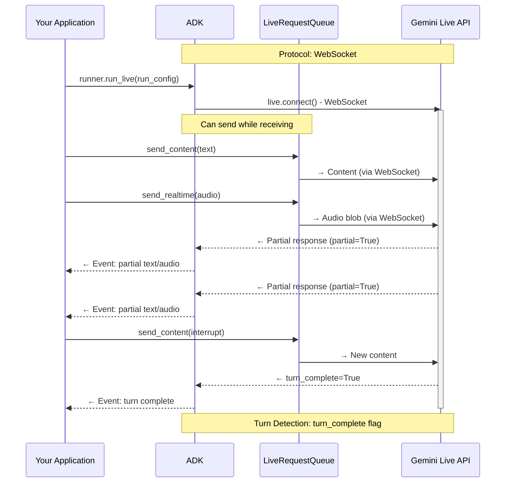
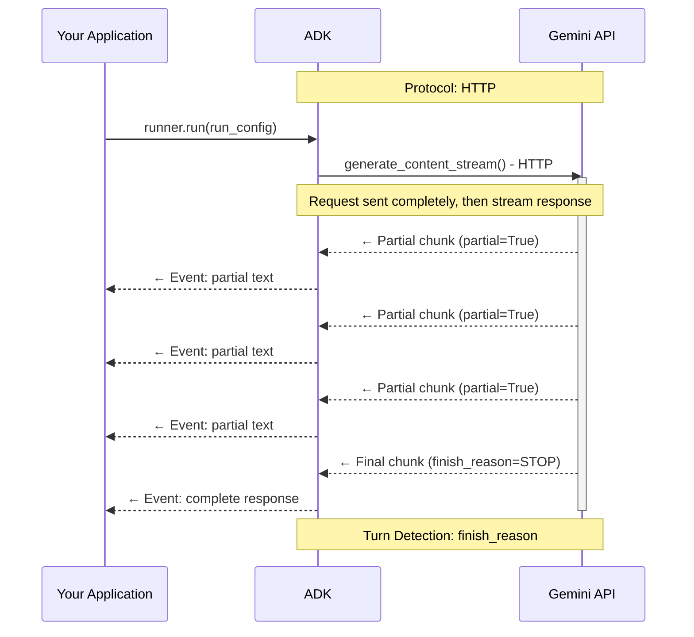

# Configuration

<div class="language-support-tag">
    <span class="lst-supported">Supported in ADK</span><span class="lst-python">Python v0.5.0</span><span class="lst-java">Java v0.2.0</span><span class="lst-preview">Experimental</span>
</div>

`RunConfig` is where you shape a live session: whether the agent replies in text or
audio, which streaming mode it uses, and what limits it runs under. You pass it to
[`Runner.run_live()`](https://google.github.io/adk-docs/api-reference/python/), and it
applies to that session only — two users of the same agent can run with completely
different configurations.

This page is the `RunConfig` reference for live agents. Voice, transcription, and turn
detection have their own page: see [Voice](voice.md).

## RunConfig Parameter Quick Reference

This table provides a quick reference for all RunConfig parameters covered in this part:

| Parameter | Type | Purpose | Platform Support | Reference |
|-----------|------|---------|------------------|-----------|
| **response_modalities** | list[str] | Control output format (TEXT or AUDIO) | Both | [Details](#response-modalities) |
| **streaming_mode** | StreamingMode | Choose BIDI or SSE mode | Both | [Details](#streamingmode-bidi-or-sse) |
| **session_resumption** | SessionResumptionConfig | Enable automatic reconnection | Both | [Details](sessions.md#live-api-session-resumption) |
| **context_window_compression** | ContextWindowCompressionConfig | Unlimited session duration | Both | [Details](sessions.md#live-api-context-window-compression) |
| **max_llm_calls** | int | Limit total LLM calls per session | Both | [Details](#max_llm_calls) |
| **save_live_blob** | bool | Persist audio/video streams | Both | [Details](#save_live_blob) |
| **custom_metadata** | dict[str, Any] | Attach metadata to invocation events | Both | [Details](#custom_metadata) |
| **support_cfc** | bool | Enable compositional function calling | Gemini (2.x models only) | [Details](#support_cfc-experimental) |
| **speech_config** | SpeechConfig | Voice and language configuration | Both | [Voice configuration](voice.md#voice-configuration-speech-config) |
| **input_audio_transcription** | AudioTranscriptionConfig | Transcribe user speech | Both | [Audio transcription](voice.md#audio-transcription) |
| **output_audio_transcription** | AudioTranscriptionConfig | Transcribe model speech | Both | [Audio transcription](voice.md#audio-transcription) |
| **realtime_input_config** | RealtimeInputConfig | VAD configuration | Both | [Voice activity detection](voice.md#voice-activity-detection-vad) |
| **proactivity** | ProactivityConfig | Enable proactive audio | Gemini (native audio only) | [Proactivity and affective dialog](voice.md#proactivity-and-affective-dialog) |
| **enable_affective_dialog** | bool | Emotional adaptation | Gemini (native audio only) | [Proactivity and affective dialog](voice.md#proactivity-and-affective-dialog) |

!!! note "Source Reference"

    [`run_config.py`](https://github.com/google/adk-python/blob/427a983b18088bdc22272d02714393b0a779ecdf/src/google/adk/agents/run_config.py)

**Platform Support Legend:**

- **Both**: Supported on both Gemini Live API and Gemini Live API (Agent Platform)
- **Gemini**: Only supported on Gemini Live API
- **Model-specific**: Requires specific model architecture (e.g., native audio)

**Import Paths:**

All configuration type classes referenced in the table above are imported from `google.genai.types`:

```python
from google.genai import types
from google.adk.agents.run_config import RunConfig, StreamingMode

# Configuration types are accessed via types module
run_config = RunConfig(
    session_resumption=types.SessionResumptionConfig(),
    context_window_compression=types.ContextWindowCompressionConfig(...),
    speech_config=types.SpeechConfig(...),
    # etc.
)
```

The `RunConfig` class itself and `StreamingMode` enum are imported from `google.adk.agents.run_config`.

## Response Modalities

Response modalities control how the model generates output—as text or audio. Both Gemini Live API and Gemini Live API (Agent Platform) have the same restriction: only one response modality per session.

**Configuration:**

```python
# Phase 2: Session initialization - RunConfig determines streaming behavior

# Default behavior: ADK automatically sets response_modalities to ["AUDIO"]
# when not specified (required by native audio models)
run_config = RunConfig(
    streaming_mode=StreamingMode.BIDI  # Bidirectional WebSocket communication
)

# The above is equivalent to:
run_config = RunConfig(
    response_modalities=["AUDIO"],  # Automatically set by ADK in run_live()
    streaming_mode=StreamingMode.BIDI  # Bidirectional WebSocket communication
)

# ✅ CORRECT: Text-only responses
run_config = RunConfig(
    response_modalities=["TEXT"],  # Model responds with text only
    streaming_mode=StreamingMode.BIDI  # Still uses bidirectional streaming
)

# ✅ CORRECT: Audio-only responses (explicit)
run_config = RunConfig(
    response_modalities=["AUDIO"],  # Model responds with audio only
    streaming_mode=StreamingMode.BIDI  # Bidirectional WebSocket communication
)
```

Both Gemini Live API and Gemini Live API (Agent Platform) restrict sessions to a single response modality. Attempting to use both will result in an API error:

```python
# ❌ INCORRECT: Both modalities not supported
run_config = RunConfig(
    response_modalities=["TEXT", "AUDIO"],  # ERROR: Cannot use both
    streaming_mode=StreamingMode.BIDI
)
# Error from Live API: "Only one response modality is supported per session"
```

**Default Behavior:**

When `response_modalities` is not specified, ADK's `run_live()` method automatically sets it to `["AUDIO"]` because native audio models require an explicit response modality. You can override this by explicitly setting `response_modalities=["TEXT"]` if needed.

**Key constraints:**

- You must choose either `TEXT` or `AUDIO` at session start. **Cannot switch between modalities mid-session**
- You must choose `AUDIO` for [native audio models](models.md#native-audio-models). If you want to receive both audio and text responses from native audio models, use the Audio Transcript feature which provides text transcripts of the audio output. See [Audio transcription](voice.md#audio-transcription) for details
- Response modality only affects model output—**you can always send text, voice, or video input (if the model supports those input modalities)** regardless of the chosen response modality

## StreamingMode: BIDI or SSE

ADK supports two distinct streaming modes that use different API endpoints and protocols:

- `StreamingMode.BIDI`: ADK uses WebSocket to connect to the **Live API** (the bidirectional streaming endpoint via `live.connect()`)
- `StreamingMode.SSE`: ADK uses HTTP streaming to connect to the **standard Gemini API** (the unary/streaming endpoint via `generate_content_async()`)

"Live API" refers specifically to the bidirectional WebSocket endpoint (`live.connect()`), while "Gemini API" or "standard Gemini API" refers to the traditional HTTP-based endpoint (`generate_content()` / `generate_content_async()`). Both are part of the broader Gemini API platform but use different protocols and capabilities.

**Note:** These modes refer to the **ADK-to-Gemini API communication protocol**, not your application's client-facing architecture. You can build WebSocket servers, REST APIs, SSE endpoints, or any other architecture for your clients with either mode.

This guide focuses on `StreamingMode.BIDI`, which is required for real-time audio/video interactions and Live API features. However, it's worth understanding the differences between BIDI and SSE modes to choose the right approach for your use case.

**Configuration:**

```python
from google.adk.agents.run_config import RunConfig, StreamingMode

# BIDI streaming for real-time audio/video
run_config = RunConfig(
    streaming_mode=StreamingMode.BIDI,
    response_modalities=["AUDIO"]  # Supports audio/video modalities
)

# SSE streaming for text-based interactions
run_config = RunConfig(
    streaming_mode=StreamingMode.SSE,
    response_modalities=["TEXT"]  # Text-only modality
)
```

### Protocol and Implementation Differences

The two streaming modes differ fundamentally in their communication patterns and capabilities. BIDI mode enables true bidirectional communication where you can send new input while receiving model responses, while SSE mode follows a traditional request-then-response pattern where you send a complete request and stream back the response.

**StreamingMode.BIDI - Bidirectional WebSocket Communication:**

BIDI mode establishes a persistent WebSocket connection that allows simultaneous sending and receiving. This enables real-time features like interruptions, live audio streaming, and immediate turn-taking:



**StreamingMode.SSE - Unidirectional HTTP Streaming:**

SSE (Server-Sent Events) mode uses HTTP streaming where you send a complete request upfront, then receive the response as a stream of chunks. This is a simpler, more traditional pattern suitable for text-based chat applications:



### Progressive SSE Streaming

**Progressive SSE streaming** is an experimental feature that enhances how SSE mode delivers streaming responses. When enabled, this feature improves response aggregation by:

- **Content ordering preservation**: Maintains the original order of mixed content types (text, function calls, inline data)
- **Intelligent text merging**: Only merges consecutive text parts of the same type (regular text vs thought text)
- **Progressive delivery**: Marks all intermediate chunks as `partial=True`, with a single final aggregated response at the end
- **Deferred function execution**: Skips executing function calls in partial events, only executing them in the final aggregated event to avoid duplicate executions

**Enabling the feature:**

This is an experimental (WIP stage) feature disabled by default. Enable it via environment variable:

```bash
export ADK_ENABLE_PROGRESSIVE_SSE_STREAMING=1
```

**When to use:**

- You're using `StreamingMode.SSE` and need better handling of mixed content types (text + function calls)
- Your responses include thought text (extended thinking) mixed with regular text
- You want to ensure function calls execute only once after complete response aggregation

**Note:** This feature only affects `StreamingMode.SSE`. It does not apply to `StreamingMode.BIDI` (the focus of this guide), which uses the Live API's native bidirectional protocol.

### When to Use Each Mode

Your choice between BIDI and SSE depends on your application requirements and the interaction patterns you need to support. Here's a practical guide to help you choose:

**Use BIDI when:**

- Building voice/video applications with real-time interaction
- Need bidirectional communication (send while receiving)
- Require Live API features (audio transcription, VAD, proactivity, affective dialog)
- Supporting interruptions and natural turn-taking (see [Handling the interrupted flag](events.md#handling-interrupted-flag))
- Implementing live streaming tools or real-time data feeds
- Can plan for concurrent session quotas (50-1,000 sessions depending on platform/tier)

**Use SSE when:**

- Building text-based chat applications
- Standard request/response interaction pattern
- Using models without Live API support (e.g., Gemini 1.5 Pro, Gemini 1.5 Flash)
- Simpler deployment without WebSocket requirements
- Need larger context windows (Gemini 1.5 supports up to 2M tokens)
- Prefer standard API rate limits (RPM/TPM) over concurrent session quotas

!!! note "Streaming Mode and Model Compatibility"
    SSE mode uses the standard Gemini API (`generate_content_async`) via HTTP streaming, while BIDI mode uses the Live API (`live.connect()`) via WebSocket. Gemini 1.5 models (Pro, Flash) don't support the Live API protocol and therefore must be used with SSE mode. Gemini 2.0/2.5 Live models support both protocols but are typically used with BIDI mode to access real-time audio/video features.

### Standard Gemini Models (1.5 Series) Accessed via SSE

While this guide focuses on Bidi-streaming with Gemini 2.0 Live models, ADK also supports the Gemini 1.5 model family through SSE streaming. These models offer different trade-offs—larger context windows and proven stability, but without real-time audio/video features. Here's what the 1.5 series supports when accessed via SSE:

**Models:**

- `gemini-pro-latest`
- `gemini-flash-latest`

**Supported:**

- ✅ Text input/output (`response_modalities=["TEXT"]`)
- ✅ SSE streaming (`StreamingMode.SSE`)
- ✅ Function calling with automatic execution
- ✅ Large context windows (up to 2M tokens for 1.5-pro)

**Not Supported:**

- ❌ Live audio features (audio I/O, transcription, VAD)
- ❌ Bidi-streaming via `run_live()`
- ❌ Proactivity and affective dialog
- ❌ Video input


## Miscellaneous Controls

ADK provides additional RunConfig options to control session behavior, manage costs, and persist audio data for debugging and compliance purposes.

```python
run_config = RunConfig(
    # Limit total LLM calls per invocation
    max_llm_calls=500,  # Default: 500 (prevents runaway loops)
                        # 0 or negative = unlimited (use with caution)

    # Save audio/video artifacts for debugging/compliance
    save_live_blob=True,  # Default: False

    # Attach custom metadata to events
    custom_metadata={"user_tier": "premium", "session_type": "support"},  # Default: None

    # Enable compositional function calling (experimental)
    support_cfc=True  # Default: False (Gemini 2.x models only)
)
```

### max_llm_calls

This parameter caps the total number of LLM invocations allowed per invocation context, providing protection against runaway costs and infinite agent loops.

**Limitation for BIDI Streaming:**

**The `max_llm_calls` limit does NOT apply to `run_live()` with `StreamingMode.BIDI`.** This parameter only protects SSE streaming mode and `run_async()` flows. If you're building bidirectional streaming applications (the focus of this guide), you will NOT get automatic cost protection from this parameter.

**For Live streaming sessions**, implement your own safeguards:

- Session duration limits
- Turn count tracking
- Custom cost monitoring by tracking token usage in model turn events (see [Event types and handling](events.md#event-types-and-handling))
- Application-level circuit breakers

### save_live_blob

This parameter controls whether audio and video streams are persisted to ADK's session and artifact services for debugging, compliance, and quality assurance purposes.

!!! warning "Migration Note: save_live_audio Deprecated"

    **If you're using `save_live_audio`:** This parameter has been deprecated in favor of `save_live_blob`. ADK will automatically migrate `save_live_audio=True` to `save_live_blob=True` with a deprecation warning, but this compatibility layer will be removed in a future release. Update your code to use `save_live_blob` instead.

Currently, **only audio is persisted** by ADK's implementation. When enabled, ADK persists audio streams to:

- **[Session service](/sessions/)**: Conversation history includes audio references
- **[Artifact service](/artifacts/)**: Audio files stored with unique IDs

**Use cases:**

- **Debugging**: Voice interaction issues, assistant behavior analysis
- **Compliance**: Audit trails for regulated industries (healthcare, financial services)
- **Quality Assurance**: Monitoring conversation quality, identifying issues
- **Training Data**: Collecting data for model improvement
- **Development/Testing**: Testing environments and cost-sensitive deployments

**Storage considerations:**

Enabling `save_live_blob=True` has significant storage implications:

- **Audio file sizes**: At 16kHz PCM, audio input generates ~1.92 MB per minute
- **Session storage**: Audio is stored in both session service and artifact service
- **Retention policy**: Check your artifact service configuration for retention periods
- **Cost impact**: Storage costs can accumulate quickly for high-volume voice applications

**Best practices:**

- Enable only when needed (debugging, compliance, training)
- Implement retention policies to auto-delete old audio artifacts
- Consider sampling (e.g., save 10% of sessions for quality monitoring)
- Use compression if supported by your artifact service

### custom_metadata

This parameter allows you to attach arbitrary key-value metadata to events generated during the current invocation. The metadata is stored in the `Event.custom_metadata` field and persisted to session storage, enabling you to tag events with application-specific context for analytics, debugging, routing, or compliance tracking.

**Configuration:**

```python
from google.adk.agents.run_config import RunConfig

# Attach metadata to all events in this invocation
run_config = RunConfig(
    custom_metadata={
        "user_tier": "premium",
        "session_type": "customer_support",
        "campaign_id": "promo_2025",
        "ab_test_variant": "variant_b"
    }
)
```

**How it works:**

When you provide `custom_metadata` in RunConfig:

1. **Metadata attachment**: The dictionary is attached to every `Event` generated during the invocation
2. **Session persistence**: Events with metadata are stored in the session service (database, Agent Platform, or in-memory)
3. **Event access**: Retrieve metadata from any event via `event.custom_metadata`
4. **A2A integration**: For Agent-to-Agent (A2A) communication, ADK automatically propagates A2A request metadata to this field

**Type specification:**

```python
custom_metadata: Optional[dict[str, Any]] = None
```

The metadata is a flexible dictionary accepting any JSON-serializable values (strings, numbers, booleans, nested objects, arrays).

**Use cases:**

- **User segmentation**: Tag events with user tier, subscription level, or cohort information
- **Session classification**: Label sessions by type (support, sales, onboarding) for analytics
- **Campaign tracking**: Associate events with marketing campaigns or experiments
- **A/B testing**: Track which variant of your application generated the event
- **Compliance**: Attach jurisdiction, consent flags, or data retention policies
- **Debugging**: Add trace IDs, feature flags, or environment identifiers
- **Analytics**: Store custom dimensions for downstream analysis

**Example - Retrieving metadata from events:**

```python
async for event in runner.run_live(
    session=session,
    live_request_queue=queue,
    run_config=RunConfig(
        custom_metadata={"user_id": "user_123", "experiment": "new_ui"}
    )
):
    if event.custom_metadata:
        print(f"User: {event.custom_metadata.get('user_id')}")
        print(f"Experiment: {event.custom_metadata.get('experiment')}")
```

**Agent-to-Agent (A2A) integration:**

When using `RemoteA2AAgent`, ADK automatically extracts metadata from A2A requests and populates `custom_metadata`:

```python
# A2A request metadata is automatically mapped to custom_metadata
# Source: a2a/converters/request_converter.py
custom_metadata = {
    "a2a_metadata": {
        # Original A2A request metadata appears here
    }
}
```

This enables seamless metadata propagation across agent boundaries in multi-agent architectures.

**Best practices:**

- Use consistent key naming conventions across your application
- Avoid storing sensitive data (PII, credentials) in metadata—use encryption if necessary
- Keep metadata size reasonable to minimize storage overhead
- Document your metadata schema for team consistency
- Consider using metadata for session filtering and search in production debugging

### support_cfc (Experimental)

This parameter enables Compositional Function Calling (CFC), allowing the model to orchestrate multiple tools in sophisticated patterns—calling tools in parallel, chaining outputs as inputs to other tools, or conditionally executing tools based on intermediate results.

**⚠️ Experimental Feature:** CFC support is experimental and subject to change.

**Critical behavior:** When `support_cfc=True`, ADK **always uses the Live API** (WebSocket) internally, regardless of the `streaming_mode` setting. This is because only the Live API backend supports CFC capabilities.

```python
# Even with SSE mode, ADK routes through Live API when CFC is enabled
run_config = RunConfig(
    support_cfc=True,
    streaming_mode=StreamingMode.SSE  # ADK uses Live API internally
)
```

**Model requirements:**

ADK validates CFC compatibility at session initialization and will raise an error if the model is unsupported:

- ✅ **Supported**: `gemini-2.x` models (e.g., `gemini-2.5-flash-native-audio-preview-12-2025`)
- ❌ **Not supported**: `gemini-1.5-x` models
- **Validation**: ADK checks that the model name starts with `gemini-2` when `support_cfc=True` ([`runners.py:1354-1360`](https://github.com/google/adk-python/blob/427a983b18088bdc22272d02714393b0a779ecdf/src/google/adk/runners.py#L1354-L1360))
- **Code executor**: ADK automatically injects `BuiltInCodeExecutor` when CFC is enabled for safe parallel tool execution

**CFC capabilities:**

- **Parallel execution**: Call multiple independent tools simultaneously (e.g., fetch weather for multiple cities at once)
- **Function chaining**: Use one tool's output as input to another (e.g., `get_location()` → `get_weather(location)`)
- **Conditional execution**: Execute tools based on intermediate results from prior tool calls

**Use cases:**

CFC is designed for complex, multi-step workflows that benefit from intelligent tool orchestration:

- Data aggregation from multiple APIs simultaneously
- Multi-step analysis pipelines where tools feed into each other
- Complex research tasks requiring conditional exploration
- Any scenario needing sophisticated tool coordination beyond sequential execution

**For bidirectional streaming applications:** While CFC works with BIDI mode, it's primarily optimized for text-based tool orchestration. For real-time audio/video interactions (the focus of this guide), standard function calling typically provides better performance and simpler implementation.

**Learn more:**

- [Gemini Function Calling Guide](https://ai.google.dev/gemini-api/docs/function-calling) - Official documentation on compositional and parallel function calling
- [ADK Parallel Functions Example](https://github.com/google/adk-python/blob/427a983b18088bdc22272d02714393b0a779ecdf/contributing/samples/parallel_functions/agent.py) - Working example with async tools
- [ADK Performance Guide](/tools-custom/performance/) - Best practices for parallel-ready tools

