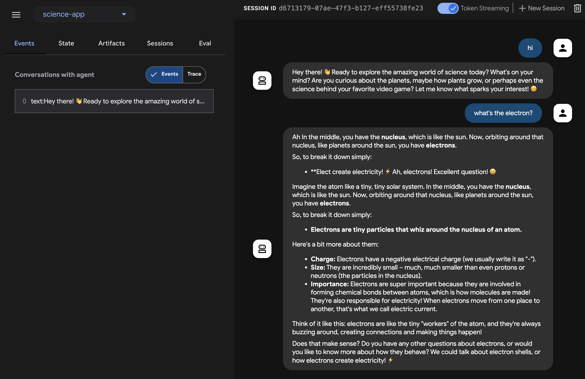

# Build a streaming agent with Java

This quickstart guide will walk you through the process of creating a basic agent and leveraging ADK Streaming with Java to facilitate low-latency, bidirectional voice interactions.

You'll begin by setting up your Java and Maven environment, structuring your project, and defining the necessary dependencies. Following this, you'll create a simple `ScienceTeacherAgent`, test its text-based streaming capabilities using the Dev UI, and then progress to enabling live audio communication, transforming your agent into an interactive voice-driven application.

## **Create your first agent** {#create-your-first-agent}

### **Prerequisites**

* In this getting started guide, you will be programming in Java. Check if **Java** is installed on your machine. Ideally, you should be using Java 17 or more (you can check that by typing **java \-version**)

* You’ll also be using the **Maven** build tool for Java. So be sure to have [Maven installed](https://maven.apache.org/install.html) on your machine before going further (this is the case for Cloud Top or Cloud Shell, but not necessarily for your laptop).

### **Prepare the project structure**

To get started with ADK Java, let’s create a Maven project with the following directory structure:

```
adk-agents/
├── pom.xml
└── src/
    └── main/
        └── java/
            └── agents/
                └── ScienceTeacherAgent.java
```

Follow the instructions in [Installation](../../get-started/installation.md) page to add `pom.xml` for using the ADK package.

!!! Note
    Feel free to use whichever name you like for the root directory of your project (instead of adk-agents)

### **Running a compilation**

Let’s see if Maven is happy with this build, by running a compilation (**mvn compile** command):

```shell
$ mvn compile
[INFO] Scanning for projects...
[INFO]
[INFO] --------------------< adk-agents:adk-agents >--------------------
[INFO] Building adk-agents 1.0-SNAPSHOT
[INFO]   from pom.xml
[INFO] --------------------------------[ jar ]---------------------------------
[INFO]
[INFO] --- resources:3.3.1:resources (default-resources) @ adk-demo ---
[INFO] skip non existing resourceDirectory /home/user/adk-demo/src/main/resources
[INFO]
[INFO] --- compiler:3.13.0:compile (default-compile) @ adk-demo ---
[INFO] Nothing to compile - all classes are up to date.
[INFO] ------------------------------------------------------------------------
[INFO] BUILD SUCCESS
[INFO] ------------------------------------------------------------------------
[INFO] Total time:  1.347 s
[INFO] Finished at: 2025-05-06T15:38:08Z
[INFO] ------------------------------------------------------------------------
```

Looks like the project is set up properly for compilation\!

### **Creating an agent**

Create the **ScienceTeacherAgent.java** file under the `src/main/java/agents/` directory with the following content:

```java
--8<-- "examples/inline/java/live/get-started/streaming-java/001-creating-an-agent.java"
```

We will use `Dev UI` to run this agent later. For the tool to automatically recognize the agent, its Java class has to comply with the following two rules:

* The agent should be stored in a global **public static** variable named **ROOT\_AGENT** of type **BaseAgent** and initialized at declaration time.
* The agent definition has to be a **static** method so it can be loaded during the class initialization by the dynamic compiling classloader.

## **Run agent with Dev UI** {#run-agent-with-adk-web-server}

`Dev UI` is a web server where you can quickly run and test your agents for development purpose, without building your own UI application for the agents.

### **Define environment variables**

To run the server, you’ll need to export two environment variables:

* a Gemini key that you can [get from AI Studio](https://ai.google.dev/gemini-api/docs/api-key),
* a variable to specify we’re not using Agent Platform this time.

```shell
export GOOGLE_GENAI_USE_ENTERPRISE=FALSE
export GOOGLE_API_KEY=YOUR_API_KEY
```

### **Run Dev UI**

Run the following command from the terminal to launch the Dev UI.

```console title="terminal"
mvn exec:java \
    -Dexec.mainClass="com.google.adk.web.AdkWebServer" \
    -Dexec.args="--adk.agents.source-dir=." \
    -Dexec.classpathScope="compile"
```

**Step 1:** Open the URL provided (usually `http://localhost:8080` or
`http://127.0.0.1:8080`) directly in your browser.

**Step 2.** In the top-left corner of the UI, you can select your agent in
the dropdown. Select "science-app".

!!!note "Troubleshooting"

    If you do not see "science-app" in the dropdown menu, make sure you
    are running the `mvn` command from the root of your maven project.

!!! warning "Caution: ADK Web for development only"

    ADK Web is ***not meant for use in production deployments***. You should
    use ADK Web for development and debugging purposes only.

## Try Dev UI with voice and video

With your favorite browser, navigate to: [http://127.0.0.1:8080/](http://127.0.0.1:8080/)

You should see the following interface:



Click the microphone button to enable the voice input, and ask a question `What's the electron?` in voice. You will hear the answer in voice in real-time.

To try with video, reload the web browser, click the camera button to enable the video input, and ask questions like "What do you see?". The agent will answer what they see in the video input.

### Caveat

- You can not use text chat with the native-audio models. You will see errors when entering text messages on `adk web`.

### Stop the tool

Stop the tool by pressing `Ctrl-C` on the console.

## **Run agent with a custom live audio app** {#run-agent-with-live-audio}

Now, let's try audio streaming with the agent and a custom live audio application.

### **A Maven pom.xml build file for Live Audio**

Replace your existing pom.xml with the following.

```xml
<?xml version="1.0" encoding="UTF-8"?>
<project xmlns="http://maven.apache.org/POM/4.0.0"
  xmlns:xsi="http://www.w3.org/2001/XMLSchema-instance"
  xsi:schemaLocation="http://maven.apache.org/POM/4.0.0 http://maven.apache.org/xsd/maven-4.0.0.xsd">
  <modelVersion>4.0.0</modelVersion>

  <groupId>com.google.adk.samples</groupId>
  <artifactId>google-adk-sample-live-audio</artifactId>
  <version>0.1.0</version>
  <name>Google ADK - Sample - Live Audio</name>
  <description>
    A sample application demonstrating a live audio conversation using ADK,
    runnable via samples.liveaudio.LiveAudioRun.
  </description>
  <packaging>jar</packaging>

  <properties>
    <project.build.sourceEncoding>UTF-8</project.build.sourceEncoding>
    <java.version>17</java.version>
    <auto-value.version>1.11.0</auto-value.version>
    <!-- Main class for exec-maven-plugin -->
    <exec.mainClass>samples.liveaudio.LiveAudioRun</exec.mainClass>
    <google-adk.version>1.6.0</google-adk.version>
  </properties>

  <dependencyManagement>
    <dependencies>
      <dependency>
        <groupId>com.google.cloud</groupId>
        <artifactId>libraries-bom</artifactId>
        <version>26.53.0</version>
        <type>pom</type>
        <scope>import</scope>
      </dependency>
    </dependencies>
  </dependencyManagement>

  <dependencies>
    <dependency>
      <groupId>com.google.adk</groupId>
      <artifactId>google-adk</artifactId>
      <version>${google-adk.version}</version>
    </dependency>
    <dependency>
      <groupId>commons-logging</groupId>
      <artifactId>commons-logging</artifactId>
      <version>1.2</version> <!-- Or use a property if defined in a parent POM -->
    </dependency>
  </dependencies>

  <build>
    <plugins>
      <plugin>
        <groupId>org.apache.maven.plugins</groupId>
        <artifactId>maven-compiler-plugin</artifactId>
        <version>3.13.0</version>
        <configuration>
          <source>${java.version}</source>
          <target>${java.version}</target>
          <parameters>true</parameters>
          <annotationProcessorPaths>
            <path>
              <groupId>com.google.auto.value</groupId>
              <artifactId>auto-value</artifactId>
              <version>${auto-value.version}</version>
            </path>
          </annotationProcessorPaths>
        </configuration>
      </plugin>
      <plugin>
        <groupId>org.codehaus.mojo</groupId>
        <artifactId>build-helper-maven-plugin</artifactId>
        <version>3.6.0</version>
        <executions>
          <execution>
            <id>add-source</id>
            <phase>generate-sources</phase>
            <goals>
              <goal>add-source</goal>
            </goals>
            <configuration>
              <sources>
                <source>.</source>
              </sources>
            </configuration>
          </execution>
        </executions>
      </plugin>
      <plugin>
        <groupId>org.codehaus.mojo</groupId>
        <artifactId>exec-maven-plugin</artifactId>
        <version>3.2.0</version>
        <configuration>
          <mainClass>${exec.mainClass}</mainClass>
          <classpathScope>runtime</classpathScope>
        </configuration>
      </plugin>
    </plugins>
  </build>
</project>
```

### **Creating Live Audio Run tool**

Create the **LiveAudioRun.java** file under the `src/main/java/` directory with the following content. This tool runs the agent on it with live audio input and output.

```java
--8<-- "examples/inline/java/live/get-started/streaming-java/002-creating-live-audio-run-tool.java"
```

### **Run the Live Audio Run tool**

To run Live Audio Run tool, use the following command on the `adk-agents` directory:

```
mvn compile exec:java
```

Then you should see:

```
$ mvn compile exec:java
...
Initializing microphone input and speaker output...
Conversation started. Press Enter to stop...
Speaker initialized.
Microphone initialized. Start speaking...
```

With this message, the tool is ready to take voice input. Talk to the agent with a question like `What's the electron?`.

!!! Caution
    When you observe the agent keep speaking by itself and doesn't stop, try using earphones to suppress the echoing.

## **Summary** {#summary}

Streaming for ADK enables developers to create agents capable of low-latency, bidirectional voice and video communication, enhancing interactive experiences. The article demonstrates that text streaming is a built-in feature of ADK Agents, requiring no additional specific code, while also showcasing how to implement live audio conversations for real-time voice interaction with an agent. This allows for more natural and dynamic communication, as users can speak to and hear from the agent seamlessly.
