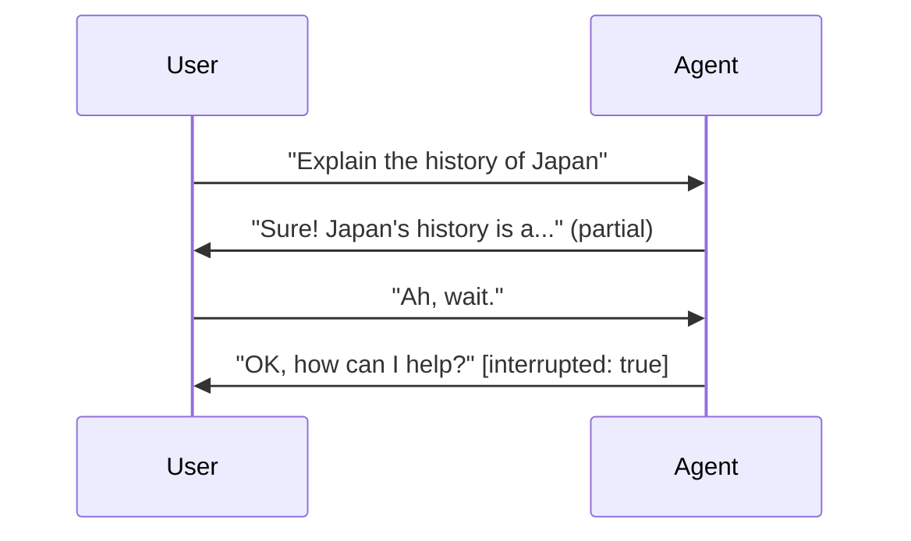

# Live and voice agents

    Supported in ADKPython v0.5.0Java v0.2.0Experimental

ADK is the framework for building live and voice agents. A live agent holds an open, two-way
connection with the user: instead of sending a message and waiting for a reply, the user and
the agent both speak, listen, and respond at the same time, and the user can interrupt the
agent mid-sentence the way people interrupt each other in real conversation. Live agents
accept text, audio, and video input and reply with text or speech.

A live agent is an ADK agent, built with the same agent, tool, and session abstractions you
use everywhere else. You describe the agent's behavior; ADK manages the real-time connection,
tool execution, and session state underneath. Today that connection runs on the
[Gemini Live API](https://ai.google.dev/gemini-api/docs/live-api); ADK handles the wiring so
your agent code stays the same as the platform evolves.

  

    

      <iframe src="https://www.youtube-nocookie.com/embed/vLUkAGeLR1k" title="ADK Gemini Live API Toolkit in 5 minutes" frameborder="0" allow="accelerometer; autoplay; clipboard-write; encrypted-media; gyroscope; picture-in-picture; web-share" allowfullscreen></iframe>
    

  

  

    

      <iframe src="https://www.youtube-nocookie.com/embed/Hwx94smxT_0" title="Shopper's Concierge 2 Demo" frameborder="0" allow="accelerometer; autoplay; clipboard-write; encrypted-media; gyroscope; picture-in-picture; web-share" allowfullscreen></iframe>
    

  

## Build live agents

-   :material-rocket-launch-outline: **Get started**

    ---

    Build your first live agent and talk to it in the browser.

    - [Start here](get-started/index.md) — pick a language and build one
    - Jump straight to [Python](get-started/streaming-python.md) or
      [Java](get-started/streaming-java.md)

-   :material-book-open-variant: **Building**

    ---

    The capability pages, roughly in the order you will need them.

    - [Sessions](sessions.md) — `run_live()`, resumption, scale
    - [Events](events.md) — what comes back and how to handle it
    - [Tools](tools.md) — automatic execution and streaming tools
    - [Workflows](workflows.md) — multi-agent under a live connection
    - [Audio and video](audio-video.md) — formats and streaming
    - [Configuration](configuration.md) — `RunConfig`, voice, transcription, turn detection

-   :material-server-network: **Production**

    ---

    Take a live agent beyond `adk web`.

    - [Evaluation](evaluation.md) — score voice conversations before you ship
    - [Build a custom server](custom-server.md)
    - [Supported models](models.md)

## Which kind of streaming do you need?

"Streaming" covers three different things in ADK, and picking the wrong one is a common
source of confusion.

| | What it does | User can interrupt? | Use it when | Where |
| :---- | :---- | :---- | :---- | :---- |
| **Server-side streaming** | One-way flow from server to client, like a live feed. | No | You push dashboard or feed updates, not a conversation. | Outside ADK |
| **Token-level streaming** | Text arrives word by word, but you wait for it to finish before sending more. | No | You want a responsive text chat. | `StreamingMode.SSE` ([Configuration](configuration.md#streamingmode-bidi-or-sse)) |
| **Bidirectional streaming** | Both sides speak, listen, and respond at once over one open connection. | **Yes** | You are building voice or video conversation. | `runner.run_live()` — these pages |

These pages are about the third row.

## Why build live agents on ADK

The Live API gives you the streaming protocol. ADK gives you everything around it, so you
write agent behavior instead of streaming infrastructure.

| | Raw Live API (`google-genai`) | ADK |
|---|---|---|
| Tool execution | Manual | [Automatic](tools.md#automatic-tool-execution) |
| Reconnection | Manual | [Automatic session resumption](sessions.md#session-resumption) |
| Events | Custom structures | [Unified event model](events.md) |
| Async coordination | Manual | [`LiveRequestQueue` + `run_live()`](sessions.md) |
| Session persistence | Manual | [SQL, Agent Platform, in-memory](../sessions/index.md) |
| Multi-agent | Not available | [Workflows, sub-agents, transfer](workflows.md) |

## Demos and resources

-   :material-shopping-outline: **LensMosaic: Visual Shopping with Live AI**

    ---

    Merges live camera input, voice, and product discovery. Point your camera at any object
    to find similar products. Built with ADK live agents, Gemini Embedding, Vector Search,
    and FastAPI.

    - [Live demo](https://lens-mosaic-nhhfh7g7iq-uc.a.run.app)
    - [Source](https://github.com/kazunori279/lens-mosaic)

-   :material-post-outline: **A Visual Guide to Bidi-streaming**

    ---

    Diagrams and illustrations covering how streaming works and how to build interactive
    agents with ADK.

    - [Read the post](https://medium.com/google-cloud/adk-bidi-streaming-a-visual-guide-to-real-time-multimodal-ai-agent-development-62dd08c81399)

-   :material-post-outline: **Google ADK + Gemini Live API**

    ---

    Using live agents for real-time audio/video, with a Python server example built on
    `LiveRequestQueue`.

    - [Read the post](https://medium.com/google-cloud/google-adk-vertex-ai-live-api-125238982d5e)

