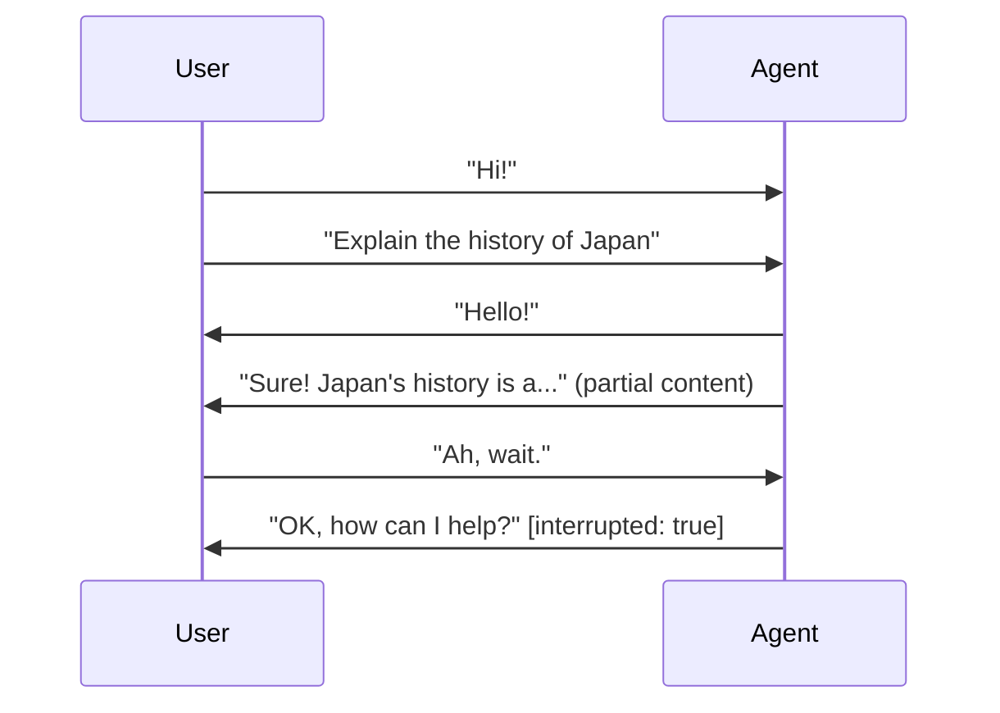
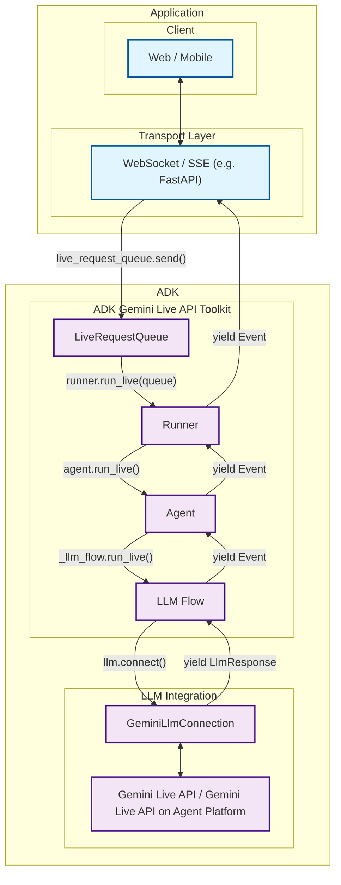
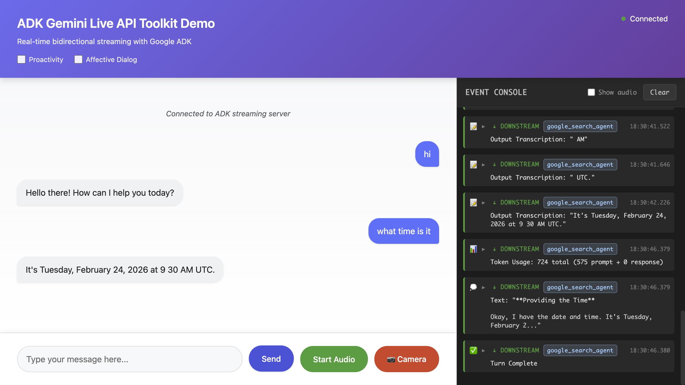

# Live and Voice Agents

<div class="language-support-tag">
    <span class="lst-supported">Supported in ADK</span><span class="lst-python">Python v0.5.0</span><span class="lst-java">Java v0.2.0</span><span class="lst-preview">Experimental</span>
</div>

Live agents hold an open, two-way connection with the user. Instead of sending a message
and waiting for a reply, the user and the agent can both speak, listen, and respond at the
same time — and the user can interrupt the agent mid-sentence, the way people interrupt
each other in real conversation. Live agents accept text, audio, and video input, and reply
with text or speech.

This capability is powered by the [Gemini Live API](https://ai.google.dev/gemini-api/docs/live).
ADK wraps it in the same agent, tool, and session abstractions you use everywhere else, so
a live agent is an ADK agent — not a separate framework.

<div class="video-grid">
  <div class="video-item">
    <div class="video-container">
      <iframe src="https://www.youtube-nocookie.com/embed/vLUkAGeLR1k" title="ADK Gemini Live API Toolkit in 5 minutes" frameborder="0" allow="accelerometer; autoplay; clipboard-write; encrypted-media; gyroscope; picture-in-picture; web-share" allowfullscreen></iframe>
    </div>
  </div>
  <div class="video-item">
    <div class="video-container">
      <iframe src="https://www.youtube-nocookie.com/embed/Hwx94smxT_0" title="Shopper's Concierge 2 Demo" frameborder="0" allow="accelerometer; autoplay; clipboard-write; encrypted-media; gyroscope; picture-in-picture; web-share" allowfullscreen></iframe>
    </div>
  </div>
</div>

## Start here

<div class="grid cards" markdown>

-   :material-rocket-launch-outline: **Get started**

    ---

    Build your first live agent and talk to it in the browser.

    - [Quickstart (Python)](get-started/streaming-python.md)
    - [Quickstart (Java)](get-started/streaming-java.md)

-   :material-book-open-variant: **Build**

    ---

    The capability pages, roughly in the order you will need them.

    - [Sessions](sessions.md) — lifecycle, `run_live()`, resumption, scale
    - [Events](events.md) — what comes back and how to handle it
    - [Tools](tools.md) — automatic execution and streaming tools
    - [Workflows](workflows.md) — multi-agent under a live connection
    - [Audio and video](audio-video.md) — formats and streaming
    - [Configuration](configuration.md) — `RunConfig` reference
    - [Voice](voice.md) — voices, transcription, turn detection

-   :material-server-network: **Ship**

    ---

    Take a live agent beyond `adk web`.

    - [Build a custom server](custom-server.md)
    - [Supported models](models.md)

</div>

## What is bidirectional streaming?

Bidi-streaming (Bidirectional streaming) represents a fundamental shift from traditional AI interactions. Instead of the rigid "ask-and-wait" pattern, it enables **real-time, two-way communication** where both human and AI can speak, listen, and respond simultaneously. This creates natural, human-like conversations with immediate responses and the revolutionary ability to interrupt ongoing interactions.

Think of the difference between sending emails and having a phone conversation. Traditional AI interactions are like emails—you send a complete message, wait for a complete response, then send another complete message. Bidi-streaming is like a phone conversation—fluid, natural, with the ability to interrupt, clarify, and respond in real-time.

### Key characteristics

These characteristics distinguish Bidi-streaming from traditional AI interactions and make it uniquely powerful for creating engaging user experiences:

- **Two-way Communication**: Continuous data exchange without waiting for complete responses. Users can interrupt the AI mid-response with new input, creating a natural conversational flow. The AI responds after detecting the user has finished speaking (via automatic voice activity detection or explicit activity signals).

- **Responsive Interruption**: Perhaps the most important feature for the natural user experience—users can interrupt the agent mid-response with new input, just like in human conversation. If an AI is explaining quantum physics and you suddenly ask "wait, what's an electron?", the AI stops immediately and addresses your question.

- **Best for Multimodal**: Bidi-streaming excels at multimodal interactions because it can process different input types simultaneously through a single connection. Users can speak while showing documents, type follow-up questions during voice calls, or seamlessly switch between communication modes without losing context. This unified approach eliminates the complexity of managing separate channels for each modality.



### Which kind of streaming do you need?

"Streaming" covers three different things in ADK, and picking the wrong one is a common
source of confusion. Use this table to find the one you want:

| | What it does | Can the user interrupt? | Use it when | Where it lives |
| :---- | :---- | :---- | :---- | :---- |
| **Server-side streaming** | One-way flow from server to client. Like watching a live video feed — continuous data, no interaction. | No | You are pushing dashboard or feed updates, not holding a conversation. | Outside ADK |
| **Token-level streaming** | The model's text response arrives word by word, but you must wait for it to finish before sending more input. Like watching someone type. | No | You want a responsive-feeling text chat. | `StreamingMode.SSE` — see [Configuration](configuration.md#streamingmode-bidi-or-sse) |
| **Bidirectional streaming** | Both sides can speak, listen, and respond at once, over one open connection. | **Yes** | You are building voice or video conversation. | `StreamingMode.BIDI` — these pages |

The rest of this section is about the third row.

### Real-world applications

Bidi-streaming revolutionizes agentic AI applications by enabling agents to operate with human-like responsiveness and intelligence. These applications showcase how streaming transforms static AI interactions into dynamic, agent-driven experiences that feel genuinely intelligent and proactive.

In a video of the [Shopper's Concierge demo](https://www.youtube.com/watch?v=LwHPYyw7u6U), the multimodal Bidi-streaming feature significantly improve the user experience of e-commerce by enabling a faster and more intuitive shopping experience. The combination of conversational understanding and rapid, parallelized searching culminates in advanced capabilities like virtual try-on, boosting buyer confidence and reducing the friction of online shopping.

<div class="video-grid">
  <div class="video-item">
    <div class="video-container">
      <iframe src="https://www.youtube-nocookie.com/embed/LwHPYyw7u6U?si=xxIEhnKBapzQA6VV" title="Shopper's Concierge" frameborder="0" allow="accelerometer; autoplay; clipboard-write; encrypted-media; gyroscope; picture-in-picture; web-share" referrerpolicy="strict-origin-when-cross-origin" allowfullscreen></iframe>
    </div>
  </div>
</div>

Also, there are many possible real-world applications for Bidi-streaming:

#### Customer service and contact centers

This is the most direct application. The technology can create sophisticated virtual agents that go far beyond traditional chatbots.

- Use case: A customer calls a retail company's support line about a defective product.
- Multimodality (video): The customer can say, "My coffee machine is leaking from the bottom, let me show you." They can then use their phone's camera to stream live video of the issue. The AI agent can use its vision capabilities to identify the model and the specific point of failure.
- Live Interaction & Interruption: If the agent says, "Okay, I'm processing a return for your Model X coffee maker," the customer can interrupt with, "No, wait, it's the Model Y Pro," and the agent can immediately correct its course without restarting the conversation.

#### E-commerce and personalized shopping

The agent can act as a live, interactive personal shopper, enhancing the online retail experience.

- Use Case: A user is browsing a fashion website and wants styling advice.
- Multimodality (Voice & Image): The user can hold up a piece of clothing to their webcam and ask, "Can you find me a pair of shoes that would go well with these pants?" The agent analyzes the color and style of the pants.
- Live Interaction: The conversation can be a fluid back-and-forth: "Show me something more casual." ... "Okay, how about these sneakers?" ... "Perfect, add the blue ones in size 10 to my cart."

#### Field service and technical assistance

Technicians working on-site can use a hands-free, voice-activated assistant to get real-time help.

- Use Case: An HVAC technician is on-site trying to diagnose a complex commercial air conditioning unit.
- Multimodality (Video & Voice): The technician, wearing smart glasses or using a phone, can stream their point-of-view to the AI agent. They can ask, "I'm hearing a strange noise from this compressor. Can you identify it and pull up the diagnostic flowchart for this model?"
- Live Interaction: The agent can guide the technician step-by-step, and the technician can ask clarifying questions or interrupt at any point without taking their hands off their tools.

#### Healthcare and telemedicine

The agent can serve as a first point of contact for patient intake, triage, and basic consultations.

- Use Case: A patient uses a provider's app for a preliminary consultation about a skin condition.
- Multimodality (Video/Image): The patient can securely share a live video or high-resolution image of a rash. The AI can perform a preliminary analysis and ask clarifying questions.

#### Financial services and wealth management

An agent can provide clients with a secure, interactive, and data-rich way to manage their finances.

- Use Case: A client wants to review their investment portfolio and discuss market trends.
- Multimodality (Screen Sharing): The agent can share its screen to display charts, graphs, and portfolio performance data. The client could also share their screen to point to a specific news article and ask, "What is the potential impact of this event on my tech stocks?"
- Live Interaction: Analyze the client's current portfolio allocation by accessing their account data.Simulate the impact of a potential trade on the portfolio's risk profile.

## Live API platforms

ADK Gemini Live API Toolkit capabilities are powered by Live API technology, available through two platforms: **[Gemini Live API](https://ai.google.dev/gemini-api/docs/live)** (via Google AI Studio) and **[Gemini Live API (Agent Platform)](https://cloud.google.com/vertex-ai/generative-ai/docs/live-api)** (via Google Cloud). Both provide real-time, low-latency streaming conversations with Gemini models, but serve different development and deployment needs.

Throughout this guide, we use **"Live API"** to refer to both platforms collectively, specifying "Gemini Live API" or "Gemini Live API (Agent Platform)" only when discussing platform-specific features or differences.

### What is the Live API?

Live API is Google's real-time conversational AI technology that enables **low-latency Bidi-streaming** with Gemini models. Unlike traditional request-response APIs, Live API establishes persistent WebSocket connections that support:

**Core Capabilities:**

- **Multimodal streaming**: Processes continuous streams of audio, video, and text in real-time
- **Voice Activity Detection (VAD)**: Automatically detects when users finish speaking, enabling natural turn-taking without explicit signals. The AI knows when to start responding and when to wait for more input
- **Immediate responses**: Delivers human-like spoken or text responses with minimal latency
- **Intelligent interruption**: Enables users to interrupt the AI mid-response, just like human conversations
- **Audio Transcription**: Real-time transcription of both user input and model output, enabling accessibility features and conversation logging without separate transcription services
- **Session Management**: Long conversations can span multiple connections through session resumption, with the API preserving full conversation history and context across reconnections
- **Tool Integration**: Function calling works seamlessly in streaming mode, with tools executing in the background while conversation continues

**Native Audio Model Features:**

- **Proactive Audio**: The model can initiate responses based on context awareness, creating more natural interactions where the AI offers help or clarification proactively (Native Audio models only)
- **Affective Dialog**: Advanced models understand tone of voice and emotional context, adapting responses to match the conversational mood and user sentiment (Native Audio models only)

!!! note "Learn More"

    For detailed information about Native Audio models and these features, see [Proactivity and affective dialog](voice.md#proactivity-and-affective-dialog).

**Technical Specifications:**

- **Audio input**: 16-bit PCM at 16kHz (mono)
- **Audio output**: 16-bit PCM at 24kHz (native audio models)
- **Video input**: 1 frame per second, recommended 768x768 resolution
- **Context windows**: Varies by model (typically 32k-128k tokens for Live API models). See [Gemini models](https://ai.google.dev/gemini-api/docs/models/gemini) for specific limits.
- **Languages**: 24+ languages supported with automatic detection

### Choosing a platform

Both APIs provide the same core Live API technology, but differ in deployment platform, authentication, and enterprise features:

| **Aspect** | **Gemini Live API** | **Gemini Live API (Agent Platform)** |
|--------|-----------------|-------------------|
| **Access** | Google AI Studio | Google Cloud |
| **Authentication** | API key (`GOOGLE_API_KEY`) | Google Cloud credentials (`GOOGLE_CLOUD_PROJECT`, `GOOGLE_CLOUD_LOCATION`) |
| **Best for** | Rapid prototyping, development, experimentation | Production deployments, enterprise applications |
| **Session Duration** | Audio-only: 15 min<br>Audio+video: 2 min<br>With [context window compression](sessions.md#live-api-context-window-compression): Unlimited | Both: 10 min<br>With [context window compression](sessions.md#live-api-context-window-compression): Unlimited |
| **Concurrent Sessions** | Tier-based quotas (see [API quotas](https://ai.google.dev/gemini-api/docs/quota)) | Up to 1,000 per project (configurable via quota requests) |
| **Enterprise Features** | Basic | Advanced monitoring, logging, SLAs, session resumption (24h) |
| **Setup Complexity** | Minimal (API key only) | Requires Google Cloud project setup |
| **API Version** | `v1beta` | `v1beta1` |
| **API Endpoint** | `generativelanguage.googleapis.com` | `{location}-aiplatform.googleapis.com` |
| **Billing** | Usage tracked via API key | Google Cloud project billing |

!!! note "Live API Reference Notes"

    **Concurrent session limits**: Quota-based and may vary by account tier or configuration. Check your current quotas in Google AI Studio or Google Cloud Console.

    **Official Documentation**: [Gemini Live API Guide](https://ai.google.dev/gemini-api/docs/live-guide) | [Gemini Live API (Agent Platform) Overview](https://cloud.google.com/vertex-ai/generative-ai/docs/live-api)

## Why build live agents on ADK

Building realtime Agent applications from scratch presents significant engineering challenges. While Live API provides the underlying streaming technology, integrating it into production applications requires solving complex problems: managing WebSocket connections and reconnection logic, orchestrating tool execution and response handling, persisting conversation state across sessions, coordinating concurrent data flows for multimodal inputs, and handling platform differences between development and production environments.

ADK transforms these challenges into simple, declarative APIs. Instead of spending months building infrastructure for session management, tool orchestration, and state persistence, developers can focus on defining agent behavior and creating user experiences. This section explores what ADK handles automatically and why it's the recommended path for building production-ready streaming applications.

**Raw Live API v. ADK Gemini Live API Toolkit:**

| Feature | Raw Live API (`google-genai` SDK) | ADK Gemini Live API Toolkit (`adk-python` and `adk-java` SDK) |
|---------|-----------------------------------|------------------------------------------------------|
| **Agent Framework** | ❌ Not available | ✅ Single agent, multi-agent with sub-agents, and sequential workflow agents, Tool ecosystem, Deployment ready, Evaluation, Security and more (see [ADK Agent docs](/agents/)) |
| **Tool Execution** | ❌ Manual tool execution and response handling | ✅ Automatic tool execution (see [Tool call events](events.md#tool-call-events)) |
| **Connection Management** | ❌ Manual reconnection and session resumption | ✅ Automatic reconnection and session resumption (see [Live API session resumption](sessions.md#live-api-session-resumption)) |
| **Event Model** | ❌ Custom event structures and serialization | ✅ Unified event model with metadata (see [Events](events.md)) |
| **Async Event Processing Framework** | ❌ Manual async coordination and stream handling | ✅ `LiveRequestQueue`, `run_live()` async generator, automatic bidirectional flow coordination (see [Sessions](sessions.md) and [Events](events.md)) |
| **App-level Session Persistence** | ❌ Manual implementation | ✅ SQL databases (PostgreSQL, MySQL, SQLite), Agent Platform, in-memory (see [ADK Session docs](/sessions/)) |

### Platform flexibility

One of ADK's most powerful features is its transparent support for both [Gemini Live API](https://ai.google.dev/gemini-api/docs/live) and [Gemini Live API (Agent Platform)](https://cloud.google.com/vertex-ai/generative-ai/docs/live-api). This platform flexibility enables a seamless development-to-production workflow: develop locally with Gemini API using free API keys, then deploy to production with Agent Platform using enterprise Google Cloud infrastructure—all **without changing application code**, only environment configuration.

#### How platform selection works

ADK uses the `GOOGLE_GENAI_USE_ENTERPRISE` environment variable to determine which Live API platform to use:

- `GOOGLE_GENAI_USE_ENTERPRISE=FALSE` (or not set): Uses Gemini Live API via Google AI Studio
- `GOOGLE_GENAI_USE_ENTERPRISE=TRUE`: Uses Gemini Live API (Agent Platform) via Google Cloud

This environment variable is read by the underlying `google-genai` SDK when ADK creates the LLM connection. No code changes are needed when switching platforms—only environment configuration changes.

##### Development: Gemini Live API (Google AI Studio)

```bash
# .env.development
GOOGLE_GENAI_USE_ENTERPRISE=FALSE
GOOGLE_API_KEY=your_api_key_here
```

**Benefits:**

- Rapid prototyping with free API keys from Google AI Studio
- No Google Cloud setup required
- Instant experimentation with streaming features
- Zero infrastructure costs during development

##### Production: Gemini Live API (Agent Platform)

```bash
# .env.production
GOOGLE_GENAI_USE_ENTERPRISE=TRUE
GOOGLE_CLOUD_PROJECT=your_project_id
GOOGLE_CLOUD_LOCATION=us-central1
```

**Benefits:**

- Enterprise-grade infrastructure via Google Cloud
- Advanced monitoring, logging, and cost controls
- Integration with existing Google Cloud services
- Production SLAs and support
- **No code changes required** - just environment configuration

By handling the complexity of session management, tool orchestration, state persistence, and platform differences, ADK lets you focus on building intelligent agent experiences rather than wrestling with streaming infrastructure. The same code works seamlessly across development and production environments, giving you the full power of Bidi-streaming without the implementation burden.

## Architecture

Now that you understand Live API technology and why ADK adds value, let's explore how ADK actually works. This section maps the complete data flow from your application through ADK's pipeline to Live API and back, showing which components handle which responsibilities.

You'll see how key components like `LiveRequestQueue`, `Runner`, and `Agent` orchestrate streaming conversations without requiring you to manage WebSocket connections, coordinate async flows, or handle platform-specific API differences.

### High-level architecture



| Developer provides: | ADK provides: | Live API provide: |
|---------------------|---------------|------------------|
| **Web / Mobile**: Frontend applications that users interact with, handling UI/UX, user input capture, and response display<br><br>**[WebSocket](https://developer.mozilla.org/en-US/docs/Web/API/WebSocket) / [SSE](https://developer.mozilla.org/en-US/docs/Web/API/Server-sent_events) Server**: Real-time communication server (such as [FastAPI](https://fastapi.tiangolo.com/)) that manages client connections, handles streaming protocols, and routes messages between clients and ADK<br><br>**`Agent`**: Custom AI agent definition with specific instructions, tools, and behavior tailored to your application's needs | **[LiveRequestQueue](../api-reference/python/google-adk.html#google.adk.agents.LiveRequestQueue)**: Message queue that buffers and sequences incoming user messages (text content, audio blobs, control signals) for orderly processing by the agent<br><br>**[Runner](../api-reference/python/google-adk.html#google.adk.runners.Runner)**: Execution engine that orchestrates agent sessions, manages conversation state, and provides the `run_live()` streaming interface<br><br>**[RunConfig](../api-reference/python/google-adk.html#google.adk.agents.RunConfig)**: Configuration for streaming behavior, modalities, and advanced features<br><br>**Internal components** (managed automatically, not directly used by developers): [LLM Flow](https://github.com/google/adk-python/blob/427a983b18088bdc22272d02714393b0a779ecdf/src/google/adk/flows/llm_flows/base_llm_flow.py) for processing pipeline and [GeminiLlmConnection](https://github.com/google/adk-python/blob/427a983b18088bdc22272d02714393b0a779ecdf/src/google/adk/models/gemini_llm_connection.py) for protocol translation | **[Gemini Live API](https://ai.google.dev/gemini-api/docs/live)** (via Google AI Studio) and **[Gemini Live API (Agent Platform)](https://cloud.google.com/vertex-ai/generative-ai/docs/live-api)** (via Google Cloud): Google's real-time language model services that process streaming input, generate responses, handle interruptions, support multimodal content (text, audio, video), and provide advanced AI capabilities like function calling and contextual understanding |

This architecture demonstrates ADK's clear separation of concerns: your application handles user interaction and transport protocols, ADK manages the streaming orchestration and state, and Live API provide the AI intelligence. By abstracting away the complexity of LLM-side streaming connection management, event loops, and protocol translation, ADK enables you to focus on building agent behavior and user experiences rather than streaming infrastructure.

## Live demos

<div class="grid cards" markdown>

-   :material-shopping-outline: **LensMosaic: Visual Shopping with Live AI**

    ---

    [](https://lens-mosaic-nhhfh7g7iq-uc.a.run.app)

    A demo app that merges live camera input, voice interaction, and intelligent product discovery. Point your camera at any object to find similar products, combine visual and voice input for personalized recommendations, or chat with a real-time AI shopping assistant. Built with ADK live agents, Gemini Embedding, Vector Search, and FastAPI.

    - [LensMosaic Demo](https://lens-mosaic-nhhfh7g7iq-uc.a.run.app)
    - [Source Code](https://github.com/kazunori279/lens-mosaic)

-   :material-microphone-outline: **Bidi Demo**

    ---

    [](https://bidi-demo-761793285222.us-central1.run.app/)

    A reference implementation with multimodal support (text, audio, image). This FastAPI-based demo shows real-time WebSocket communication, automatic transcription, tool calling with Google Search, and complete streaming lifecycle management. It is the demo referenced throughout these pages.

    - [Bidi Demo](https://bidi-demo-761793285222.us-central1.run.app/)
    - [Source Code](https://github.com/google/adk-samples/tree/main/python/agents/bidi-demo)

</div>

## More resources

<div class="grid cards" markdown>

-   :material-post-outline: **Blog post: A Visual Guide to Bidi-streaming**

    ---

    A visual guide to real-time multimodal AI agent development with ADK, with diagrams and illustrations covering how streaming works and how to build interactive agents.

    - [Read the post](https://medium.com/google-cloud/adk-bidi-streaming-a-visual-guide-to-real-time-multimodal-ai-agent-development-62dd08c81399)

-   :material-post-outline: **Blog post: Google ADK + Gemini Live API**

    ---

    How to use live agents in ADK for real-time audio/video streaming, with a Python server example using `LiveRequestQueue` to build custom, interactive agents.

    - [Read the post](https://medium.com/google-cloud/google-adk-vertex-ai-live-api-125238982d5e)

-   :material-post-outline: **Blog post: Supercharge ADK Development with Claude Code Skills**

    ---

    Using Claude Code Skills to accelerate ADK development, with an example of building a streaming chat app.

    - [Read the post](https://medium.com/@kazunori279/supercharge-adk-development-with-claude-code-skills-d192481cbe72)

</div>
