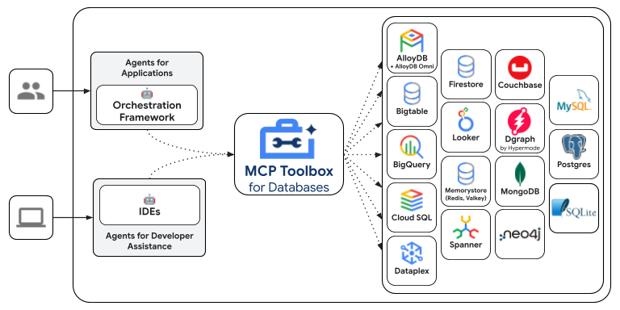

# Model Context Protocol (MCP)

## What is Model Context Protocol (MCP)?

The [Model Context Protocol (MCP)](https://modelcontextprotocol.io/introduction) is an open standard designed to standardize how Large Language Models (LLMs) like Gemini and Claude communicate with external applications, data sources, and tools. Think of it as a universal connection mechanism that simplifies how LLMs obtain context, execute actions, and interact with various systems.

MCP follows a client-server architecture, defining how **data** (resources), **interactive templates** (prompts), and **actionable functions** (tools) are exposed by an **MCP server** and consumed by an **MCP client** (which could be an LLM host application or an AI agent).

-   :material-console-line: **MCP tools**

    ---

    This guide walks you through two ways of integrating Model Context Protocol (MCP) with ADK.

    [:octicons-arrow-right-24: More information](../tools/mcp-tools.md)

-   :material-console-line: **MCP Toolbox for Databases**

    ---

    [MCP Toolbox for Databases](https://github.com/googleapis/genai-toolbox) is an
    open source MCP server for databases. It was designed with enterprise-grade and
    production-quality in mind. It enables you to develop tools easier, faster, and
    more securely by handling the complexities such as connection pooling,
    authentication, and more. Google’s Agent Development Kit (ADK) has built in support for Toolbox.
    
    [:octicons-arrow-right-24: More information](../tools/google-cloud-tools.md#toolbox-tools-for-databases)

    

