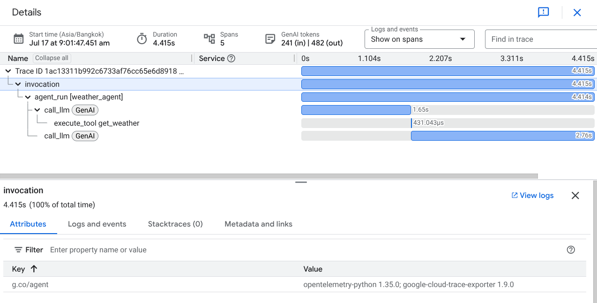

# Agent Observability with Cloud Trace

With ADK, you’ve already capable of inspecting and observing your agent interaction locally utilizing the powerful web development UI discussed in [here](https://google.github.io/adk-docs/evaluate/#debugging-with-the-trace-view). However, if we aim for cloud deployment, we will need a centralized dashboard to observe real traffic.

Cloud Trace is a component of Google Cloud Observability. It is a powerful tool for monitoring, debugging, and improving the performance of your applications by focusing specifically on tracing capabilities. For Agent Development Kit (ADK) applications, Cloud Trace enables comprehensive tracing, helping you understand how requests flow through your agent's interactions and identify performance bottlenecks or errors within your AI agents.

## Overview

Cloud Trace is built on [OpenTelemetry](https://opentelemetry.io/), an open-source standard that supports many languages and ingestion methods for generating trace data. This aligns with observability practices for ADK applications, which also leverage OpenTelemetry-compatible instrumentation, allowing you to :

- Trace agent interactions : Cloud Trace continuously gathers and analyzes trace data from your project, enabling you to rapidly diagnose latency issues and errors within your ADK applications. This automatic data collection simplifies the process of identifying problems in complex agent workflows.
- Debug issues : Quickly diagnose latency issues and errors by analyzing detailed traces. Crucial for understanding issues that manifest as increased communication latency across different services or during specific agent actions like tool calls.
- In-depth Analysis and Visualization: Trace Explorer is the primary tool for analyzing traces, offering visual aids like heatmaps for span duration and line charts for request/error rates. It also provides a spans table, groupable by service and operation, which gives one-click access to representative traces and a waterfall view to easily identify bottlenecks and sources of errors within your agent's execution path

The following example will assume the following agent directory structure

```
working_dir/
├── weather_agent/
│   ├── agent.py
│   └── __init__.py
└── deploy_agent_engine.py
└── deploy_fast_api_app.py
└── agent_runner.py
```

```python
# weather_agent/agent.py

import os
from google.adk.agents import Agent

os.environ.setdefault("GOOGLE_CLOUD_PROJECT", "{your-project-id}")
os.environ.setdefault("GOOGLE_CLOUD_LOCATION", "global")
os.environ.setdefault("GOOGLE_GENAI_USE_VERTEXAI", "True")


# Define a tool function
def get_weather(city: str) -> dict:
    """Retrieves the current weather report for a specified city.

    Args:
        city (str): The name of the city for which to retrieve the weather report.

    Returns:
        dict: status and result or error msg.
    """
    if city.lower() == "new york":
        return {
            "status": "success",
            "report": (
                "The weather in New York is sunny with a temperature of 25 degrees"
                " Celsius (77 degrees Fahrenheit)."
            ),
        }
    else:
        return {
            "status": "error",
            "error_message": f"Weather information for '{city}' is not available.",
        }


# Create an agent with tools
root_agent = Agent(
    name="weather_agent",
    model="gemini-2.5-flash",
    description="Agent to answer questions using weather tools.",
    instruction="You must use the available tools to find an answer.",
    tools=[get_weather],
)
```

## Cloud Trace Setup

### From Agent Engine Deployment

To enable cloud tracing on ADK Agent Engine deployment, you can add `enable_tracing=True` when initialize the `AdkApp` object

```python
# deploy_agent_engine.py

from vertexai.preview import reasoning_engines
from vertexai import agent_engines
from weather_agent.agent import root_agent

import vertexai

PROJECT_ID = "{your-project-id}"
LOCATION = "{your-preferred-location}"
STAGING_BUCKET = "{your-staging-bucket}"

vertexai.init(
    project=PROJECT_ID,
    location=LOCATION,
    staging_bucket=STAGING_BUCKET,
)

adk_app = reasoning_engines.AdkApp(
    agent=root_agent,
    enable_tracing=True,
)


remote_app = agent_engines.create(
    agent_engine=adk_app,
    extra_packages=[
        "./weather_agent",
    ],
    requirements=[
        "google-cloud-aiplatform[adk,agent_engines]",
    ],
)
```

### From Built-in `get_fast_api_app` Module

Now, if you want to customize your own agent service, you also can enable cloud tracing by initialize the FastAPI app using built-in `get_fast_api_app` module and set `trace_to_cloud=True`

```python
# deploy_fast_api_app.py

import os
from google.adk.cli.fast_api import get_fast_api_app
from fastapi import FastAPI

# Set GOOGLE_CLOUD_PROJECT environment variable for cloud tracing
os.environ.setdefault("GOOGLE_CLOUD_PROJECT", "alvin-exploratory-2")

# Discover the `weather_agent` directory in current working dir
AGENT_DIR = os.path.dirname(os.path.abspath(__file__))

# Create FastAPI app with enabled cloud tracing
app: FastAPI = get_fast_api_app(
    agents_dir=AGENT_DIR,
    web=True,
    trace_to_cloud=True,
)

app.title = "weather-agent"
app.description = "API for interacting with the Agent weather-agent"


# Main execution
if __name__ == "__main__":
    import uvicorn

    uvicorn.run(app, host="0.0.0.0", port=8080)
```


### From Customized Agent Runner

If you want to fully customize your ADK agent runtime, you also can enable cloud tracing by using `CloudTraceSpanExporter` module from Opentelemetry.

```python
# agent_runner.py

from google.adk.runners import Runner
from google.adk.sessions import InMemorySessionService
from weather_agent.agent import root_agent as weather_agent
from google.genai.types import Content, Part
from opentelemetry import trace
from opentelemetry.exporter.cloud_trace import CloudTraceSpanExporter
from opentelemetry.sdk.trace import export
from opentelemetry.sdk.trace import TracerProvider

APP_NAME = "weather_agent"
USER_ID = "u_123"
SESSION_ID = "s_123"

provider = TracerProvider()
processor = export.BatchSpanProcessor(
    CloudTraceSpanExporter(project_id="{your-project-id}")
)
provider.add_span_processor(processor)
trace.set_tracer_provider(provider)

session_service = InMemorySessionService()
runner = Runner(agent=weather_agent, app_name=APP_NAME, session_service=session_service)


async def main():
    session = await session_service.get_session(
        app_name=APP_NAME, user_id=USER_ID, session_id=SESSION_ID
    )
    if session is None:
        session = await session_service.create_session(
            app_name=APP_NAME, user_id=USER_ID, session_id=SESSION_ID
        )

    user_content = Content(
        role="user", parts=[Part(text="hello, what's weather in paris?")]
    )

    final_response_content = "No response"
    async for event in runner.run_async(
        user_id=USER_ID, session_id=SESSION_ID, new_message=user_content
    ):
        if event.is_final_response() and event.content and event.content.parts:
            final_response_content = event.content.parts[0].text

    print(final_response_content)


if __name__ == "__main__":
    import asyncio

    asyncio.run(main())
```

## Inspect Cloud Traces

After the setup is complete, whenever you interact with the agent it will automatically send trace data to Cloud Trace. You can inspect the traces by going to [console.cloud.google.com](https://console.cloud.google.com) and visit the Trace Explorer on the configured Google Cloud Project


And then you will see all available traces produced by ADK agent which configured in several span names such as `invocation` , `agent_run` . `call_llm` and `execute_tool`


If you click on one of the traces, you will see the waterfall view of the detailed process, kinda similar of what we can see in the web development UI



## Resources

- [Google Cloud Trace Documentation](https://cloud.google.com/trace)
