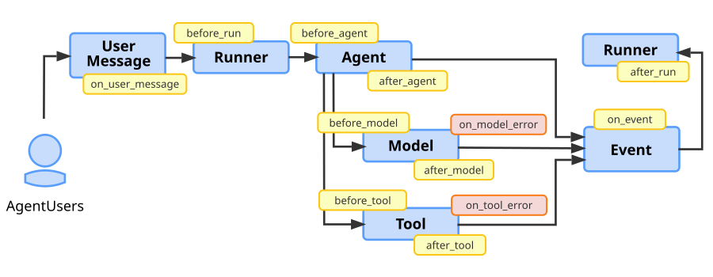

# Plugins

<div class="language-support-tag">
    <span class="lst-supported">Supported in ADK</span><span class="lst-python">Python v1.7.0</span><span class="lst-typescript">TypeScript v0.2.5</span><span class="lst-go">Go v0.4.0</span><span class="lst-java">Java v0.3.0</span><span class="lst-kotlin">Kotlin v0.7.0</span>
</div>

A Plugin in Agent Development Kit (ADK) is a custom code module that can be
executed at various stages of an agent workflow lifecycle using callback hooks.
You use Plugins for functionality that is applicable across your agent workflow.
Some typical applications of Plugins are as follows:

-   **Logging and tracing**: Create detailed logs of agent, tool, and
    generative AI model activity for debugging and performance analysis.
-   **Policy enforcement**: Implement security guardrails, such as a
    function that checks if users are authorized to use a specific tool and
    prevent its execution if they do not have permission.
-   **Monitoring and metrics**: Collect and export metrics on token usage,
    execution times, and invocation counts to monitoring systems such as
    Prometheus or
    [Google Cloud Observability](https://cloud.google.com/stackdriver/docs)
    (formerly Stackdriver).
-   **Response caching**: Check if a request has been made before, so you
    can return a cached response, skipping expensive or time consuming AI model
    or tool calls.
-   **Request or response modification**: Dynamically add information to AI
    model prompts or standardize tool output responses.

!!! tip "Tip: Use Plugins for safety features"
    When implementing security guardrails and policies, use ADK Plugins for
    better modularity and flexibility than Callbacks. For more details, see
    [Callbacks and Plugins for Security Guardrails](/safety/#callbacks-and-plugins-for-security-guardrails).

!!! tip "Tip: ADK Integrations"
    For a list of pre-built plugins and other integrations for ADK, see
    [Tools and Integrations](/integrations/).

## How do Plugins work?

An ADK Plugin extends the `BasePlugin` class and contains one or more
`callback` methods, indicating where in the agent lifecycle the Plugin should be
executed. You integrate Plugins into an agent by registering them in your
agent's `Runner` class. For more information on how and where you can trigger
Plugins in your agent application, see
[Plugin callback hooks](#plugin-callback-hooks).

Plugin functionality builds on
[Callbacks](../callbacks/index.md), which is a key design
element of the ADK's extensible architecture. While a typical Agent Callback is
configured on a *single agent, a single tool* for a *specific task*, a Plugin is
registered *once* on the `Runner` and its callbacks apply *globally* to every
agent, tool, and LLM call managed by that runner. Plugins let you package
related callback functions together to be used across a workflow. This makes
Plugins an ideal solution for implementing features that cut across your entire
agent application.

## Prebuilt Plugins

ADK includes several plugins that you can add to your agent workflows
immediately:

*   [**Reflect and Retry Tools**](/integrations/reflect-and-retry/):
    Tracks tool failures and intelligently retries tool requests.
*   [**BigQuery Analytics**](/integrations/bigquery-agent-analytics/):
    Enables agent logging and analysis with BigQuery.
*   [**Context Filter**](https://github.com/google/adk-python/blob/main/src/google/adk/plugins/context_filter_plugin.py):
    Filters the generative AI context to reduce its size.
*   [**Global Instruction**](https://github.com/google/adk-python/blob/main/src/google/adk/plugins/global_instruction_plugin.py):
    Plugin that provides global instructions functionality at the App level.
*   [**Save Files as Artifacts**](https://github.com/google/adk-python/blob/main/src/google/adk/plugins/save_files_as_artifacts_plugin.py):
    Saves files included in user messages as Artifacts.
*   [**Logging**](https://github.com/google/adk-python/blame/main/src/google/adk/plugins/logging_plugin.py):
    Log important information at each agent workflow callback point.

## Define and register Plugins

This section explains how to define Plugin classes and register them as part of
your agent workflow. For a complete code example, see
[Plugin Basic](https://github.com/google/adk-python/tree/main/contributing/samples/plugins/plugin_basic)
in the repository.

### Create Plugin class

Start by extending the `BasePlugin` class and add one or more `callback`
methods, as shown in the following code example:

=== "Python"

    ```py title="count_plugin.py"
    --8<-- "examples/inline/python/plugins/index/001-create-plugin-class.py"
    ```

=== "TypeScript"

    ```typescript title="count_plugin.ts"
    --8<-- "examples/inline/typescript/plugins/index/002-create-plugin-class.ts"
    ```

=== "Java"

    ```java title="CountInvocationPlugin.java"
    --8<-- "examples/inline/java/plugins/index/003-create-plugin-class.java"
    ```

=== "Go"

    ```go title="count_plugin.go"
    --8<-- "examples/inline/go/plugins/index/004-create-plugin-class.go.txt"
    ```

=== "Kotlin"

    ```kotlin
    --8<-- "examples/kotlin/snippets/plugins/CountInvocationPlugin.kt:create_plugin"
    ```

This example code implements callbacks for `before_agent_callback` and
`before_model_callback` to count execution of these tasks during the lifecycle
of the agent.

### Register Plugin class

Integrate your Plugin class by registering it during your agent initialization
as part of your `Runner` class, using the `plugins` parameter. You can specify
multiple Plugins with this parameter. The following code example shows how to
register the `CountInvocationPlugin` plugin defined in the previous section with
a simple ADK agent.

=== "Python"

    ```py
    --8<-- "examples/inline/python/plugins/index/005-register-plugin-class.py"
    ```

=== "TypeScript"

    ```typescript
    --8<-- "examples/inline/typescript/plugins/index/006-register-plugin-class.ts"
    ```

=== "Java"

    ```java
    --8<-- "examples/inline/java/plugins/index/007-register-plugin-class.java"
    ```

=== "Go"

    ```go
    --8<-- "examples/inline/go/plugins/index/008-register-plugin-class.go.txt"
    ```

=== "Kotlin"

    ```kotlin
    --8<-- "examples/kotlin/snippets/plugins/CountInvocationPlugin.kt:register_plugin"
    ```

### Run the agent with the Plugin

Run the plugin as you typically would. The following shows how to run the
command line:

=== "Python"

    ```sh
    python3 -m path.to.main.py
    ```

=== "TypeScript"

    ```sh
    npx ts-node path.to.main.ts
    ```

=== "Java"

    ```sh
    ./mvnw -q clean compile exec:java -Dexec.mainClass="com.example.Main"
    ```

=== "Go"

    ```sh
    go run path/to/main.go
    ```

The output of this previously described agent should look similar to the
following:

```log
[Plugin] Agent run count: 1
[Plugin] LLM request count: 1
** Got event from hello_world
Hello world: query is [hello world]
** Got event from hello_world
[Plugin] LLM request count: 2
** Got event from hello_world
```


For more information on running ADK agents, see the
[Agent Runtime](/runtime/#ways-to-run-agents)
guides.

## Build workflows with Plugins

Plugin callback hooks are a mechanism for implementing logic that intercepts,
modifies, and even controls the agent's execution lifecycle. Each hook is a
specific method in your Plugin class that you can implement to run code at a key
moment. You have a choice between two modes of operation based on your hook's
return value:

-   **To Observe:** Implement a hook with no return value (`None`). This
    approach is for tasks such as logging or collecting metrics, as it allows
    the agent's workflow to proceed to the next step without interruption. For
    example, you could use `after_tool_callback` in a Plugin to log every
    tool's result for debugging.
-   **To Intervene:** Implement a hook and return a value. This approach
    short-circuits the workflow. The `Runner` halts processing, skips any
    subsequent plugins and the original intended action, like a Model call, and
    use a Plugin callback's return value as the result. A common use case is
    implementing `before_model_callback` to return a cached `LlmResponse`,
    preventing a redundant and costly API call.
-   **To Amend:** Implement a hook and modify the Context object. This
    approach allows you to modify the context data for the module to be
    executed without otherwise interrupting the execution of that module. For
    example, adding additional, standardized prompt text for Model object execution.

**Caution:** Plugin callback functions have precedence over callbacks
implemented at the object level. This behavior means that Any Plugin callbacks
code is executed *before* any Agent, Model, or Tool objects callbacks are
executed. Furthermore, if a Plugin-level agent callback returns any value, and
not an empty (`None`) response, the Agent, Model, or Tool-level callback is *not
executed* (skipped).

The Plugin design establishes a hierarchy of code execution and separates
global concerns from local agent logic. A Plugin is the stateful *module* you
build, such as `PerformanceMonitoringPlugin`, while the callback hooks are the
specific *functions* within that module that get executed. This architecture
differs fundamentally from standard Agent Callbacks in these critical ways:

-   **Scope:** Plugin hooks are *global*. You register a Plugin once on the
    `Runner`, and its hooks apply universally to every Agent, Model, and Tool
    it manages. In contrast, Agent Callbacks are *local*, configured
    individually on a specific agent instance.
-   **Execution Order:** Plugins have *precedence*. For any given event, the
    Plugin hooks always run before any corresponding Agent Callback. This
    system behavior makes Plugins the correct architectural choice for
    implementing cross-cutting features like security policies, universal
    caching, and consistent logging across your entire application.

### Agent Callbacks and Plugins

As mentioned in the previous section, there are some functional similarities
between Plugins and Agent Callbacks. The following table compares the
differences between Plugins and Agent Callbacks in more detail.

<table>
  <thead>
    <tr>
      <th></th>
      <th><strong>Plugins</strong></th>
      <th><strong>Agent Callbacks</strong></th>
    </tr>
  </thead>
  <tbody>
    <tr>
      <td><strong>Scope</strong></td>
      <td><strong>Global</strong>: Apply to all agents/tools/LLMs in the
<code>Runner</code>.</td>
      <td><strong>Local</strong>: Apply only to the specific agent instance
they are configured on.</td>
    </tr>
    <tr>
      <td><strong>Primary Use Case</strong></td>
      <td><strong>Horizontal Features</strong>: Logging, policy, monitoring,
global caching.</td>
      <td><strong>Specific Agent Logic</strong>: Modifying the behavior or
state of a single agent.</td>
    </tr>
    <tr>
      <td><strong>Configuration</strong></td>
      <td>Configure once on the <code>Runner</code>.</td>
      <td>Configure individually on each <code>BaseAgent</code> instance.</td>
    </tr>
    <tr>
      <td><strong>Execution Order</strong></td>
      <td>Plugin callbacks run <strong>before</strong> Agent Callbacks.</td>
      <td>Agent callbacks run <strong>after</strong> Plugin callbacks.</td>
    </tr>
  </tbody>
</table>

## Plugin callback hooks

You define when a Plugin is called with the callback functions to define in
your Plugin class. Callbacks are available when a user message is received,
before and after an `Runner`, `Agent`, `Model`, or `Tool` is called, for
`Events`, and when a `Model`, or `Tool` error occurs. These callbacks include,
and take precedence over, the any callbacks defined within your Agent, Model,
and Tool classes.

The following diagram illustrates callback points where you can attach and run
Plugin functionality during your agents workflow:


**Figure 1.** Diagram of ADK agent workflow with Plugin callback hook
locations.

The following sections describe the available callback hooks for Plugins in
more detail.

-   [User Message callbacks](#user-message-callbacks)
-   [Runner start callbacks](#runner-start-callbacks)
-   [Agent execution callbacks](#agent-execution-callbacks)
-   [Model callbacks](#model-callbacks)
-   [Tool callbacks](#tool-callbacks)
-   [Runner end callbacks](#runner-end-callbacks)

### User Message callbacks

*A User Message c*allback (`on_user_message_callback`) happens when a user
sends a message. The `on_user_message_callback` is the very first hook to run,
giving you a chance to inspect or modify the initial input.\

-   **When It Runs:** This callback happens immediately after
    `runner.run()`, before any other processing.
-   **Purpose:** The first opportunity to inspect or modify the user's raw
    input.
-   **Flow Control:** Returns a `types.Content` object to **replace** the
    user's original message.

The following code example shows the basic syntax of this callback:

=== "Python"

    ```py
    --8<-- "examples/inline/python/plugins/index/009-user-message-callbacks.py"
    ```

=== "TypeScript"

    ```typescript
    --8<-- "examples/inline/typescript/plugins/index/010-user-message-callbacks.ts"
    ```

=== "Java"

    ```java
    --8<-- "examples/inline/java/plugins/index/011-user-message-callbacks.java"
    ```

=== "Go"

    ```go
    --8<-- "examples/inline/go/plugins/index/012-user-message-callbacks.go.txt"
    ```

### Runner start callbacks

A *Runner start* callback (`before_run_callback`) happens when the `Runner`
object takes the potentially modified user message and prepares for execution.
The `before_run_callback` fires here, allowing for global setup before any agent
logic begins.

-   **When It Runs:** After the `on_user_message_callback`, when the `Runner`
    prepares for execution and before any agent logic begins.
-   **Purpose:** Global setup or initialization before the invocation runs.
-   **Flow Control:** Return a `types.Content` object to **halt execution**:
    the `Runner` exits early and ends the run with that content as the result.
    Return `None` to proceed normally.

The following code example shows the basic syntax of this callback:

=== "Python"

    ```py
    --8<-- "examples/inline/python/plugins/index/013-runner-start-callbacks.py"
    ```

=== "TypeScript"

    ```typescript
    --8<-- "examples/inline/typescript/plugins/index/014-runner-start-callbacks.ts"
    ```

=== "Java"

    ```java
    --8<-- "examples/inline/java/plugins/index/015-runner-start-callbacks.java"
    ```

=== "Go"

    ```go
    --8<-- "examples/inline/go/plugins/index/016-runner-start-callbacks.go.txt"
    ```

### Agent execution callbacks

*Agent execution* callbacks (`before_agent`, `after_agent`) happen when a
`Runner` object invokes an agent. The `before_agent_callback` runs immediately
before the agent's main work begins. The main work encompasses the agent's
entire process for handling the request, which could involve calling models or
tools. After the agent has finished all its steps and prepared a result, the
`after_agent_callback` runs.

**Caution:** Plugins that implement these callbacks are executed *before* the
Agent-level callbacks are executed. Furthermore, if a Plugin-level agent
callback returns anything other than a `None` or null response, the Agent-level
callback is *not executed* (skipped).

For more information about Agent callbacks defined as part of an Agent object,
see
[Types of Callbacks](../callbacks/types-of-callbacks.md#agent-lifecycle-callbacks).

### Model callbacks

Model callbacks **(`before_model`, `after_model`, `on_model_error`)** happen
before and after a Model object executes. The Plugins feature also supports a
callback in the event of an error, as detailed below:

-   If an agent needs to call an AI model, `before_model_callback` runs first.
-   If the model call is successful, `after_model_callback` runs next.
-   If the model call fails with an exception, the `on_model_error_callback`
    is triggered instead, allowing for graceful recovery.

**Caution:** Plugins that implement the **`before_model`** and  `**after_model`
**callback methods are executed *before* the Model-level callbacks are executed.
Furthermore, if a Plugin-level model callback returns anything other than a
`None` or null response, the Model-level callback is *not executed* (skipped).

#### Model on error callback details

The on error callback for Model objects is only supported by the Plugins
feature works as follows:

-   **When It Runs:** When an exception is raised during the model call.
-   **Common Use Cases:** Graceful error handling, logging the specific
    error, or returning a fallback response, such as "The AI service is
    currently unavailable."
-   **Flow Control:**
    -   Returns an `LlmResponse` object to **suppress the exception**
        and provide a fallback result.
    -   Returns `None` to allow the original exception to be raised.

**Note**: If the execution of the Model object returns a `LlmResponse`, the
system resumes the execution flow, and `after_model_callback` will be triggered
normally.****

The following code example shows the basic syntax of this callback:

=== "Python"

    ```py
    --8<-- "examples/inline/python/plugins/index/017-model-on-error-callback-details.py"
    ```

=== "TypeScript"

    ```typescript
    --8<-- "examples/inline/typescript/plugins/index/018-model-on-error-callback-details.ts"
    ```

=== "Java"

    ```java
    --8<-- "examples/inline/java/plugins/index/019-model-on-error-callback-details.java"
    ```

=== "Go"

    ```go
    --8<-- "examples/inline/go/plugins/index/020-model-on-error-callback-details.go.txt"
    ```

### Tool callbacks

Tool callbacks **(`before_tool`, `after_tool`, `on_tool_error`)** for Plugins
happen before or after the execution of a tool, or when an error occurs. The
Plugins feature also supports a callback in the event of an error, as detailed
below:\

-   When an agent executes a Tool, `before_tool_callback` runs first.
-   If the tool executes successfully, `after_tool_callback` runs next.
-   If the tool raises an exception, the `on_tool_error_callback` is
    triggered instead, giving you a chance to handle the failure. If
    `on_tool_error_callback` returns a dict, `after_tool_callback` will be
    triggered normally.

**Caution:** Plugins that implement these callbacks are executed *before* the
Tool-level callbacks are executed. Furthermore, if a Plugin-level tool callback
returns anything other than a `None` or null response, the Tool-level callback
is *not executed* (skipped).

#### Tool on error callback details

The on error callback for Tool objects is only supported by the Plugins feature
works as follows:

-   **When It Runs:** When an exception is raised during the execution of a
    tool's `run` method.
-   **Purpose:** Catching specific tool exceptions (like `APIError`),
    logging the failure, and providing a user-friendly error message back to
    the LLM.
-   **Flow Control:** Return a `dict` to **suppress the exception**, provide
    a fallback result. Return `None` to allow the original exception to be raised.

**Note**: By returning a `dict`, this resumes the execution flow, and
`after_tool_callback` will be triggered normally.

The following code example shows the basic syntax of this callback:

=== "Python"
    ```py
    --8<-- "examples/inline/python/plugins/index/021-tool-on-error-callback-details.py"
    ```

=== "TypeScript"

    ```typescript
    --8<-- "examples/inline/typescript/plugins/index/022-tool-on-error-callback-details.ts"
    ```

=== "Java"

    ```java
    --8<-- "examples/inline/java/plugins/index/023-tool-on-error-callback-details.java"
    ```

=== "Go"

    ```go
    --8<-- "examples/inline/go/plugins/index/024-tool-on-error-callback-details.go.txt"
    ```

### Event callbacks

An *Event callback* (`on_event_callback`) happens when an agent produces
outputs such as a text response or a tool call result, it yields them as `Event`
objects. The `on_event_callback` fires for each event, allowing you to modify it
before it's streamed to the client.

-   **When It Runs:** After an agent yields an `Event` but before it's sent
    to the user. An agent's run may produce multiple events.
-   **Purpose:** Useful for modifying or enriching events (e.g., adding
    metadata) or for triggering side effects based on specific events.
-   **Flow Control:** Return an `Event` object to **replace** the original
    event.

The following code example shows the basic syntax of this callback:

=== "Python"

    ```py
    --8<-- "examples/inline/python/plugins/index/025-event-callbacks.py"
    ```

=== "TypeScript"

    ```typescript
    --8<-- "examples/inline/typescript/plugins/index/026-event-callbacks.ts"
    ```

=== "Java"

    ```java
    --8<-- "examples/inline/java/plugins/index/027-event-callbacks.java"
    ```

=== "Go"

    ```go
    --8<-- "examples/inline/go/plugins/index/028-event-callbacks.go.txt"
    ```

### Runner end callbacks

The *Runner end* callback **(`after_run_callback`)** happens when the agent has
finished its entire process and all events have been handled, the `Runner`
completes its run. The `after_run_callback` is the final hook, perfect for
cleanup and final reporting.

-   **When It Runs:** After the `Runner` fully completes the execution of a
    request.
-   **Purpose:** Ideal for global cleanup tasks, such as closing connections
    or finalizing logs and metrics data.
-   **Flow Control:** This callback is for teardown only and cannot alter
    the final result.

The following code example shows the basic syntax of this callback:

=== "Python"

    ```py
    --8<-- "examples/inline/python/plugins/index/029-runner-end-callbacks.py"
    ```

=== "TypeScript"

    ```typescript
    --8<-- "examples/inline/typescript/plugins/index/030-runner-end-callbacks.ts"
    ```

=== "Java"

    ```java
    --8<-- "examples/inline/java/plugins/index/031-runner-end-callbacks.java"
    ```

=== "Go"

    ```go
    --8<-- "examples/inline/go/plugins/index/032-runner-end-callbacks.go.txt"
    ```

## Next steps

Check out these resources for developing and applying Plugins to your ADK
projects:

-   For more ADK Plugin code examples, see the
    [ADK Samples repository](https://github.com/google/adk-samples).
-   For information on applying Plugins for security purposes, see
    [Callbacks and Plugins for Security Guardrails](/safety/#callbacks-and-plugins-for-security-guardrails).
