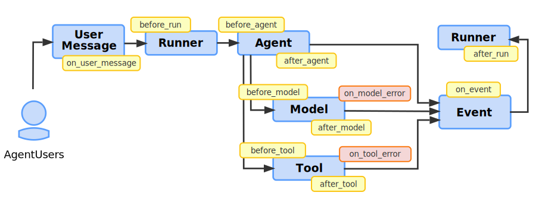

# Plugins

<div class="language-support-tag">
  <span class="lst-supported">Supported in ADK</span><span class="lst-python">Python v1.13.0</span>
</div>

In the Agent Development Kit (ADK), you can use Plugins to customize and
extend the functionality of your agent applications. With Plugins, you can add
features that apply across all agents in your application, like logging, security
checks, or custom authentication logic.

You use Plugins for functionality that is applicable across your agent workflow.
Some typical applications of Plugins are as follows:

*   **Logging:** Record agent interactions for performance analysis and
    debugging.
*   **Security:** Implement guardrails to prevent harmful or undesirable agent
    behavior.
*   **Caching:** Store and retrieve generative AI model activity for debugging and
    performance analysis.
*   **Authentication:** Add a layer to authenticate with external services that
    your agent uses.

When you use Plugins with your agent applications, you can enable integration
with third-party services like
[Google Cloud Observability](https://cloud.google.com/stackdriver/docs) that
enhance the security and performance of your ADK workflows.

ADK is architected to allow you to seamlessly add Plugins to your agent
applications. Because of their cross-cutting applicability, you can develop and
maintain Plugins independently from the core business logic of your agents.

When implementing security guardrails and policies, use ADK Plugins for
consistent enforcement across all agents. For more information, see
[Callbacks and Plugins for Security Guardrails](/adk-docs/safety/#callbacks-and-plugins-for-security-guardrails).

!!! warning

    Plugins are not supported by the
    [ADK web UI](/adk-docs/get-started/quickstart/#dev-ui-adk-web).
    If your ADK workflow uses Plugins, you must run your workflow without the
    web UI.

## How do Plugins work?

Plugins use the ADK's callback system to inject custom logic at specific points
in the agent execution lifecycle, before or after a particular action is
executed. You integrate Plugins into an agent by registering them in your
application. For information on defining and registering Plugins in your agent
application, see
[Define and register Plugins](/adk-docs/plugins/#define-and-register-plugins).

When you register a Plugin at the app level, its callbacks are automatically
applied to every agent, tool, and LLM call managed by that runner. Plugins let
you package reusable logic that can be applied to multiple agents without having
to add callbacks to each agent individually. The cross-cutting behavior of
Plugins an ideal solution for implementing features that cut across your entire
application workflow, such as logging or authentication.

## Define and register Plugins

To create a Plugin, you define a class that inherits from the `BasePlugin` class,
and then implement one or more of the available callback methods. These methods
correspond to specific events in the agent lifecycle, as detailed in the
[Plugin callbacks reference](/adk-docs/plugins/#plugin-callbacks).

The following code example shows how to create a simple Plugin that counts the
number of invocations in an agent workflow:

```python
from google.adk.agents.callback_context import CallbackContext
from google.adk.plugins.base_plugin import BasePlugin


class CountInvocationPlugin(BasePlugin):
    """A plugin that counts the number of invocations in a workflow."""

    def __init__(self):
        super().__init__("CountInvocationPlugin")
        self.invocation_count = 0

    async def before_run_callback(
        self, *, callback_context: CallbackContext
    ) -> None:
        """Increment the invocation count before each run."""
        self.invocation_count += 1
        print(f"Invocation count: {self.invocation_count}")
```

After you define your Plugin, you register it when you instantiate your app object
as part of your `Runner` class, using the `plugins` parameter. You can specify
multiple Plugins with this parameter. The following code example shows how to
register the Plugin defined in the preceding example:

```python
import asyncio

from google.adk.agents import Agent
from google.adk.apps import App
from google.adk.runners import Runner
from google.adk.sessions.in_memory_session_service import InMemorySessionService
from google.genai.types import Content, Part

from plugins.count_invocation_plugin import CountInvocationPlugin

# Define your agent
root_agent = Agent(
    model="gemini-2.0-flash",
    instruction="You are a counting agent. Please say 'hello' to the user.",
)

# Define your app with the agent and the plugin
app = App(
    name="my-app",
    root_agent=root_agent,
    # Add your plugin here. You can add multiple plugins.
    plugins=[CountInvocationPlugin()],
)

# Define your runner with the app
runner = Runner(
    app=app,
    session_service=InMemorySessionService(),
)


async def main():
    """Run the agent with the plugin."""
    # Create a new session
    session = await runner.session_service.create_session(
        app_name=app.name, user_id="test-user"
    )

    # Run the agent in the session
    async for event in runner.run_async(
        session_id=session.id,
        user_id="test-user",
        new_message=Content(parts=[Part(text="hello")])
    ):
        print(event.get_text_content())


if __name__ == "__main__":
    # Note that Plugins are not supported by the ADK web UI.
    # If your ADK workflow uses Plugins, you must run your workflow without the web UI.
    asyncio.run(main())
```

## Available Built-in tools

* **[BigQuery Logging Plugin](../observability/bigquery-logging.md):** Logs agent events to a BigQuery table for analysis and debugging.

## Build workflows with Plugins

Plugins provide a powerful way to add security and other functionality to your
ADK workflows. The following diagram shows how Plugins integrate with the ADK
callback system:



In this workflow, the Plugin callback is invoked first. The Plugin can modify
the inputs to the ADK workflow, or it can short-circuit the workflow by
returning a response directly. This prevents the execution of subsequent
plugins and the original intended action, like a Model call, and immediately
returns control to the calling process. For more information, see
[Short-circuiting](/adk-docs/callbacks/#short-circuiting).

When building agent applications with Plugins, you should be aware of the
following considerations:

-   **Short-circuiting:** When a callback returns a value, it *short-circuits*
    the execution chain. This means subsequent callbacks for the same event
    (from other plugins or the agent itself) will not be executed, and the
    original operation (e.g., the model call or tool execution) is skipped. The
    returned value is then passed back up the chain.

-   **Execution Order:** Plugins have *precedence*. For any given event, the
    callback from the first registered plugin is executed first. This predictable
    system behavior makes Plugins the correct architectural choice for
    implementing security guardrails, where you must check for policy violations
    before any other action is taken.

### Agent Callbacks and Plugins

The following table summarizes the key differences and recommended use cases for
when to choose between Plugins and Agent Callbacks. The following table compares
the differences between Plugins and Agent Callbacks in more detail.

| Feature             | **Plugins**                                                                                                                                                                                                                                                              | **Agent Callbacks**                                                                                                                                                                   |
| ------------------- | ------------------------------------------------------------------------------------------------------------------------------------------------------------------------------------------------------------------------------------------------------------------------ | ------------------------------------------------------------------------------------------------------------------------------------------------------------------------------------- |
| **Scope**           | **Global (App/Runner Level)**                                                                                                                                                                                                                                            | **Local (Agent Level)**                                                                                                                                                               |
| **Definition**      | Defined in separate classes that inherit from `BasePlugin`.                                                                                                                                                                                                              | Defined as functions or methods directly within an `Agent`'s definition.                                                                                                            |
| **Registration**    | Registered once at the `App` or `Runner` level.                                                                                                                                                                                                                          | Registered for each individual `Agent` that requires the callback.                                                                                                                    |
| **Use Case**        | Best for **cross-cutting concerns** that apply to all agents, such as logging, authentication, and global security policies. Recommended for implementing reusable, application-wide security guardrails.                                                   | Best for logic that is **specific to a single agent's behavior**, such as validating or modifying inputs/outputs for that agent's particular task.                                     |
| **Reusability**     | **Highly Reusable.** A single plugin can be applied to any number of agent applications without modification.                                                                                                                                      | **Less Reusable.** Logic is tied to a specific agent and must be copied or refactored to be used elsewhere.                                                                        |
| **Execution Order** | Predictable and controllable. Callbacks are executed in the order that their containing plugins are registered, which is ideal for enforcing security checks before other processing occurs. This allows you to create chains of validations or transformations. | Less predictable when multiple agents are involved, as the execution order depends on how agents call each other.                                                                 |

### Plugin callbacks

The following sections describe the available callback hooks for Plugins in
more detail. For more information on the ADK callback system, see
[Callbacks](/adk-docs/callbacks/).

#### Run callbacks

Run callbacks **(`before_run`, `after_run`, `on_run_error`)** are executed before
and after a `Runner` object executes. `Runner` objects orchestrate the execution
of your agent workflows. These callbacks are executed once per `run` call.

**Caution:** Plugins that implement these callbacks are executed *before* the
callbacks that are defined as part of an `Agent` object.

The `before_run` and `after_run` callbacks are supported by the Plugins feature,
but the `on_run_error` callback is not.

For more information on the available run callbacks, see the
[Run callbacks reference](/adk-docs/callbacks/#run-callbacks).

#### Model callbacks

Model callbacks (`before_model`, `after_model`, `on_model_error`) are executed
before and after a Model object executes. The Plugins feature also supports a
callback in the event of an error, as detailed in the following section.

For more information on the available model callbacks, see the
[Model callbacks reference](/adk-docs/callbacks/#model-callbacks).

**Caution:** Plugins that implement the **`before_model`** and  `**after_model`
callbacks are executed *before* the callbacks that are defined as part of an
`Agent` object.

##### `on_model_error`

The on error callback for Model objects is only supported by the Plugins
feature. This callback is executed when an error occurs during a model call. It
receives the `callback_context`, the `llm_request` that caused the error, and the
`exception` that was raised. You can use this callback to log errors, modify the
error response, or attempt to recover from the error.

The following code example shows how to implement the `on_model_error` callback:

```python
async def on_model_error(
    self, *, callback_context: CallbackContext, llm_request: LlmRequest, error: Exception
) -> Optional[LlmResponse]:
    # ...
```

#### Tool callbacks

Tool callbacks **(`before_tool`, `after_tool`, `on_tool_error`)** for Plugins
are executed before and after a `Tool` object executes. The Plugins feature also
supports a callback in the event of an error, as detailed in the following
section.

For more information on the available tool callbacks, see the
[Tool callbacks reference](/adk-docs/callbacks/#tool-callbacks).

**Caution:** Plugins that implement these callbacks are executed *before* the
callbacks that are defined as part of an `Agent` object.

##### `on_tool_error`

The on error callback for Tool objects is only supported by the Plugins feature.
This callback is executed when an error occurs during a tool call. It receives
the `tool` object, the `tool_args` that were passed to the tool, the
`tool_context`, and the `exception` that was raised. You can use this callback to
log errors, modify the error response, or attempt to recover from the error.

```python
async def on_tool_error(
    self, *, tool: BaseTool, tool_args: Dict[str, Any], tool_context: ToolContext, error: Exception
) -> None:
    # ...
```

#### Agent callbacks

Agent callbacks (`before_agent`, `after_agent`) are invoked before and after an
`Agent` object executes.

For more information on the available agent callbacks, see the
[Agent callbacks reference](/adk-docs/callbacks/#agent-callbacks).

**Caution:** Plugins that implement these callbacks are executed *before* the
callbacks that are defined as part of an `Agent` object.

## Next steps

Check out these resources for developing and applying Plugins to your ADK
workflows:

-   See the `plugins` package in the
    [ADK Python repository](https://github.com/google/adk-python/tree/main/src/google/adk/plugins).
-   For information on applying Plugins for security purposes, see
    [Callbacks and Plugins for Security Guardrails](/adk-docs/safety/#callbacks-and-plugins-for-security-guardrails).
