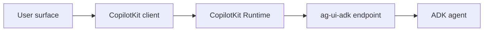

# Frontends

<div class="language-support-tag">
  <span class="lst-supported">Runtime guide</span>
</div>

Use this section when you have an ADK agent and want to put it behind an
application UI. ADK still owns agent execution, sessions, tools, and events. The
frontend layer gives your application a stable client contract for chat,
generative UI, browser tools, mobile surfaces, and messaging platforms.

For a new project, the fastest path is:

```shell
npx copilotkit create -f adk
```

The template creates a full-stack ADK application with a CopilotKit frontend and
runtime bridge. Use the pages below when you are adding the same shape to an
existing ADK project or need to choose the right frontend surface.

## Default architecture

The recommended application path has three parts:

1. Your ADK agent runs in Python.
2. `ag-ui-adk` exposes that agent as an AG-UI endpoint.
3. CopilotKit Runtime registers that endpoint and CopilotKit clients connect to
   the runtime.



Frontend code should call CopilotKit Runtime, usually at `/api/copilotkit`.
It should not hand-roll AG-UI request bodies, SSE parsing, state application, or
tool-call routing unless you are intentionally building your own client.

## Choose a page

| Page | Use it for |
|---|---|
| [AG-UI](ag-ui/index.md) | Exposing an ADK agent through `ag-ui-adk` and registering it with CopilotKit Runtime. |
| [React](ag-ui/react.md) | Adding a browser UI with `@copilotkit/react-core/v2`. |
| [Angular](ag-ui/angular.md) | Adding an Angular UI with `@copilotkit/angular`. |
| [Vue](ag-ui/vue.md) | Adding a Vue 3 UI with `@copilotkit/vue`. |
| [React Native](ag-ui/react-native.md) | Building a native mobile UI with CopilotKit's headless React Native bindings. |
| [Slack](ag-ui/slack.md) | Connecting Slack conversations to the same ADK-backed CopilotKit runtime. |
| [A2UI](a2ui.md) | Rendering structured A2UI surfaces through CopilotKit. |
| [Patterns](patterns/generative-ui/controlled-generative-ui.md) | Adding generative UI, tool rendering, MCP Apps, shared state, in-app actions, and human-in-the-loop flows. |

## Implementation path

1. Build and debug the agent in [ADK Web](../web-interface/index.md).
2. Add the [AG-UI backend and CopilotKit Runtime bridge](ag-ui/index.md).
3. Pick a client page for the user surface you are building.
4. Add [A2UI](a2ui.md) or a [frontend pattern](patterns/generative-ui/controlled-generative-ui.md) only
   when the user experience needs it.

Keep credentials, session lookup, authorization, and tool execution policy on
the backend side of the runtime boundary. Keep rendering, local interaction
state, client tools, and user approval UI in CopilotKit.
