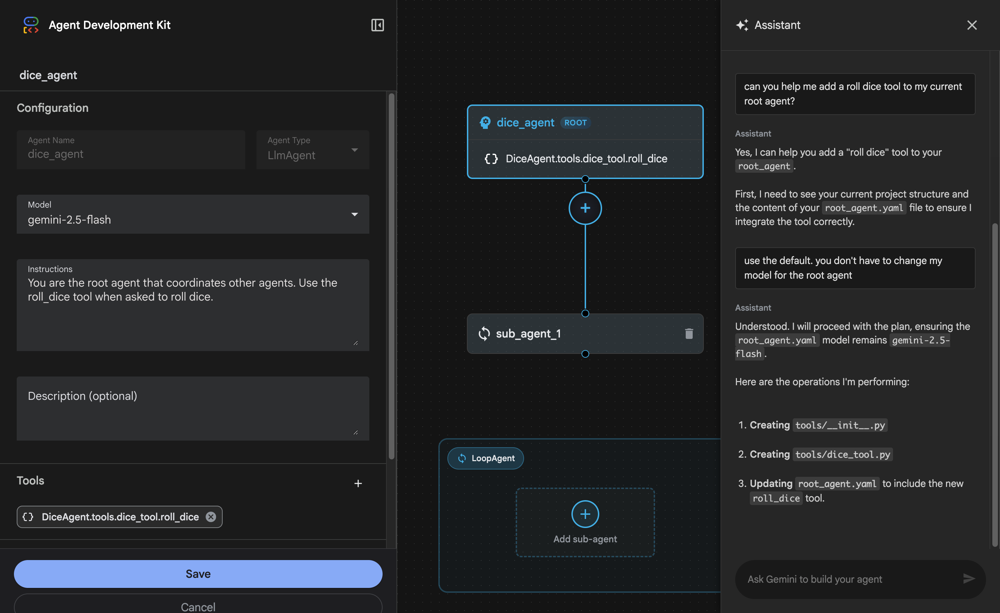
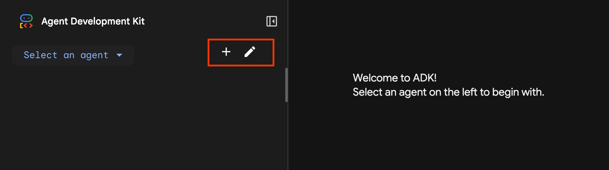

# Use the Web Interface

<div class="language-support-tag">
  <span class="lst-supported">Supported in ADK</span><span class="lst-python">Python v0.1.0</span><span class="lst-typescript">TypeScript v0.2.0</span><span class="lst-go">Go v0.1.0</span><span class="lst-java">Java v0.1.0</span>
</div>

The ADK web interface lets you test your agents directly in the browser. This
tool provides a simple way to interactively develop and debug your agents.


!!! warning "Caution: ADK Web for development only"

    ADK Web is ***not meant for use in production deployments***. You should use
    ADK Web for development and debugging purposes only.

Key features of the ADK web interface include:

- **Chat interface**: Send messages to your agents and view responses in
  real-time
- **Session management**: Create and switch between sessions
- **State inspection**: View and modify session state during development
- **Event history**: Inspect all events generated during agent execution
- **Visual Builder**: Design agents visually with a drag-and-drop workflow
  editor and an AI-powered assistant

## Start the web interface

Use the following command to start the ADK web interface:

=== "Python"

    ```shell
    adk web
    ```

=== "TypeScript"

    ```shell
    npx adk web
    ```

=== "Go"

    ```shell
    go run agent.go web api webui
    ```

=== "Java"

    Make sure to update the port number.
    === "Maven"
        With Maven, compile and run the ADK web server:
        ```console
        mvn compile exec:java \
         -Dexec.args="--adk.agents.source-dir=src/main/java/agents --server.port=8000"
        ```
    === "Gradle"
        With Gradle, the `build.gradle` or `build.gradle.kts` build file should have the following Java plugin in its plugins section:

        ```groovy
        plugins {
            id('java')
            // other plugins
        }
        ```
        Then, elsewhere in the build file, at the top-level, create a new task:

        ```groovy
        tasks.register('runADKWebServer', JavaExec) {
            dependsOn classes
            classpath = sourceSets.main.runtimeClasspath
            mainClass = 'com.google.adk.web.AdkWebServer'
            args '--adk.agents.source-dir=src/main/java/agents', '--server.port=8000'
        }
        ```

        Finally, on the command-line, run the following command:
        ```console
        gradle runADKWebServer
        ```


    In Java, the web interface and the API server are bundled together.

Once started, the server prints the access URL to the console. Open it in your
browser to use the web interface:

```shell
+-----------------------------------------------------------------------------+
| ADK Web Server started                                                      |
|                                                                             |
| For local testing, access at http://localhost:8000.                         |
+-----------------------------------------------------------------------------+
```

## Common options

Here are some commonly used options for the `adk web` command. Run `adk web
--help` to see all available options.

| Option | Description | Default |
|--------|-------------|---------|
| `--port` | Port to run the server on | `8000` |
| `--host` | Host binding address | `127.0.0.1` |
| `--session_service_uri` | Custom session storage URI | In-memory |
| `--artifact_service_uri` | Custom artifact storage URI | Local `.adk/artifacts` |
| `--reload/--no-reload` | Enable auto-reload on code changes | `true` |

For example:

```shell
adk web --port 3000 --session_service_uri "sqlite:///sessions.db"
```

## Visual Builder

<div class="language-support-tag">
  <span class="lst-supported">Supported in ADK</span><span class="lst-python">Python v1.18.0</span><span class="lst-preview">Experimental</span>
</div>

The ADK Visual Builder is a feature of the ADK web interface that provides a
visual workflow design environment for creating and managing agents. The Visual
Builder allows you to design, build, and test agents in a beginner-friendly
graphical interface, and includes an AI-powered assistant to help you build
agents.



!!! example "Experimental"
    The Visual Builder feature is an experimental release. We welcome your
    [feedback](https://github.com/google/adk-python/issues/new?template=feature_request.md)!

### Create an agent

To use the Visual Builder, [start the ADK web
interface](#start-the-web-interface), then follow the steps below to create an
agent.

??? tip "Tip: Run from a code development directory"

    The Visual Builder tool writes project files to new subdirectories located
    in the directory where you run ADK Web. Make sure you run this
    command from a developer directory location where you have write access.


**Figure 1:** ADK Web controls to start the Visual Builder tool.

To create an agent with Visual Builder:

1.  In top left of the page, select the **+** (plus sign), as shown in *Figure 1*, to start creating an agent.
1.  Type a name for your agent application and select **Create**.
1.  Edit your agent by doing any of the following:
    *   In the left panel, edit agent component values.
    *   In the central panel, add new agent components.
    *   In the right panel, use prompts to modify the agent or get help.
1.  In bottom left corner, select **Save** to save your agent.
1.  Interact with your new agent to test it.
1.  In top left of the page, select the pencil icon, as shown in *Figure 1*, to continue editing your agent.

Here are a few things to note when using Visual Builder:

*   **Create agent and save:** When creating an agent, make sure you select
    **Save** before exiting the editing interface, otherwise your new agent may
    not be editable.
*   **Agent editing:** Edit (pencil icon) for agents is *only* available for
    agents created with Visual Builder
*   **Add tools:** When adding existing custom Tools to a Visual Builder
    agent, specify a fully-qualified Python function name.

??? tip "Try this prompt with the Visual Builder assistant"

    ```none
    Help me add a dice roll tool to my current agent.
    Use the default model if you need to configure that.
    ```

### Supported components

The Visual Builder tool provides a drag-and-drop user interface for constructing
agents, as well as an AI-powered development Assistant that can answer questions
and edit your agent workflow. The tool supports all the essential components for
building an ADK agent workflow, including:

*   **Agents**
    *   **Root Agent**: The primary controlling agent for a workflow. All other agents in
        an ADK agent workflow are considered Sub Agents.
    *   [**LLM Agent:**](/agents/llm-agents/)
        An agent powered by a generative AI model.
    *   [**Sequential Agent:**](/agents/workflow-agents/sequential-agents/)
        A workflow agent that executes a series of sub-agents in a sequence.
    *   [**Loop Agent:**](/agents/workflow-agents/loop-agents/)
        A workflow agent that repeatedly executes a sub-agent until a certain condition is met.
    *   [**Parallel Agent:**](/agents/workflow-agents/parallel-agents/)
        A workflow agent that executes multiple sub-agents concurrently.
*   **Tools**
    *   [**Prebuilt tools:**](/integrations/)
        A limited set of ADK-provided tools can be added to agents.
    *   [**Custom tools:**](/tools-custom/)
        You can build and add custom tools to your workflow.
*   **Components**
    *   [**Callbacks**](/callbacks/)
        A flow control component that lets you modify the behavior of agents at the start
        and end of agent workflow events.

Some advanced ADK features are not supported by Visual Builder due to
limitations of the Agent Config feature. For more information, see the Agent
Config [Known limitations](/agents/config/#known-limitations).

### Generated project structure

The Visual Builder tool generates code in the [Agent Config](/agents/config/)
format, using `.yaml` configuration files for agents and Python code for custom
tools. These files are generated in a subfolder of the directory where you ran
the ADK web interface. The following listing shows an example layout for a
DiceAgent project:

```none
DiceAgent/
    root_agent.yaml    # main agent code
    sub_agent_1.yaml   # sub agents (if any)
    tools/             # tools directory
        __init__.py
        dice_tool.py   # tool code
```

!!! note "Editing generated agents"

    You can edit the generated files in your development environment. However,
    some changes may not be compatible with Visual Builder.

For more information on the Agent Config code format used by Visual Builder, see
[Agent Config](/agents/config/) and [Agent Config YAML
schema](/api-reference/agentconfig/).
