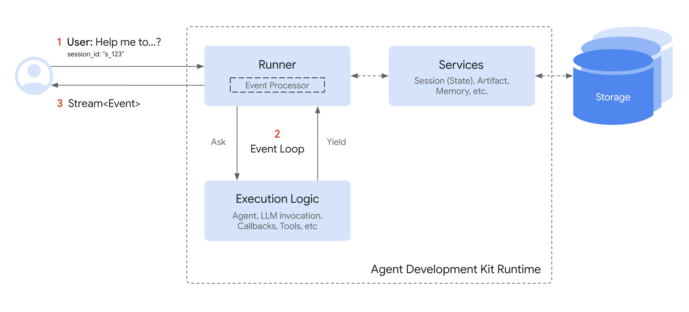

# Session: Tracking individual conversations

<div class="language-support-tag">
  <span class="lst-supported">Supported in ADK</span><span class="lst-python">Python v0.1.0</span><span class="lst-typescript">TypeScript v0.2.0</span><span class="lst-go">Go v0.1.0</span><span class="lst-java">Java v0.1.0</span><span class="lst-kotlin">Kotlin v0.1.0</span>
</div>

A `Session` represents a single conversation thread between a user and your
agent. Just like you wouldn't start every text message from scratch, agents need
context regarding the ongoing interaction. The `Session` object in ADK is
designed specifically to track and manage these individual conversation threads.

## `Session` objects

When a user starts interacting with your agent, the `SessionService` creates a
`Session` object (`google.adk.sessions.Session`). This object acts as the
container holding everything related to that *one specific chat thread*. Here
are its key properties:

* **Identification (`id`, `appName`, `userId`):** Unique labels for the
  conversation.
    * `id`: A unique identifier for *this specific* conversation thread,
      essential for retrieving it later. A SessionService object can handle
      multiple `Session`(s). This field identifies which particular session
      object are we referring to. For example, "test_id_modification".
    * `app_name`: Identifies which agent application this conversation belongs
      to. For example, "id_modifier_workflow".
    * `userId`: Links the conversation to a particular user.
* **History (`events`):** A chronological sequence of all interactions (`Event`
  objects – user messages, agent responses, tool actions) that have occurred
  within this specific thread.
* **Session State (`state`):** A place to store temporary data relevant *only*
  to this specific, ongoing conversation. This acts as a scratchpad for the
  agent during the interaction. We will cover how to use and manage `state` in
  detail in the next section.
* **Activity Tracking (`lastUpdateTime`):** A timestamp indicating the last time
  an event occurred in this conversation thread.

### Example: Examining session properties

The following code example demonstrates how to list various values stored in a
session object:

=== "Python"

    ```py
    --8<-- "examples/inline/python/sessions/session/index/001-example-examining-session-properties.py"
    ```

=== "TypeScript"

    ```typescript
    --8<-- "examples/inline/typescript/sessions/session/index/002-example-examining-session-properties.ts"
    ```

=== "Go"

    ```go
    --8<-- "examples/go/snippets/sessions/session_management_example/session_management_example.go:examine_session"
    ```

=== "Java"

    ```java
    --8<-- "examples/inline/java/sessions/session/index/003-example-examining-session-properties.java"
    ```

=== "Kotlin"

    ```kotlin
    --8<-- "examples/inline/kotlin/sessions/session/index/004-example-examining-session-properties.kt"
    ```

*(**Note:** The state shown above is only the initial state. State updates
happen via events, as discussed in the State section.)*

## Session lifecycle



Here’s a simplified flow of how `Session` and `SessionService` work together
during a conversation turn:

1. **Start or Resume:** Your application needs to use the `SessionService` to
   either `create_session` (for a new chat) or use an existing session id.
2. **Context Provided:** The `Runner` gets the appropriate `Session` object from
   the appropriate service method, providing the agent with access to the
   corresponding Session's `state` and `events`.
3. **Agent Processing:** The user prompts the agent with a query. The agent
   analyzes the query and potentially the session `state` and `events` history
   to determine the response.
4. **Response & State Update:** The agent generates a response (and potentially
   flags data to be updated in the `state`). The `Runner` packages this as an
   `Event`.
5. **Save Interaction:** The `Runner` calls
   `sessionService.append_event(session, event)` with the `session` and the new
   `event` as the arguments. The service adds the `Event` to the history and
   updates the session's `state` in storage based on information within the
   event. The session's `last_update_time` also get updated.
6. **Ready for Next:** The agent's response goes to the user. The updated
   `Session` is now stored by the `SessionService`, ready for the next turn
   (which restarts the cycle at step 1, usually with the continuation of the
   conversation in the current session).
7. **End Conversation:** When the conversation is over, your application calls
   `sessionService.delete_session(...)` to clean up the stored session data if
   it is no longer required.

This cycle highlights how the `SessionService` ensures conversational continuity
by managing the history and state associated with each `Session` object.


## Managing sessions with a `SessionService`

As seen above, you don't typically create or manage `Session` objects directly.
Instead, you use a **`SessionService`**. This service acts as the central
manager responsible for the entire lifecycle of your conversation sessions.

Its core responsibilities include:

* **Starting New Conversations:** Creating fresh `Session` objects when a user
  begins an interaction.
* **Resuming Existing Conversations:** Retrieving a specific `Session` (using
  its ID) so the agent can continue where it left off.
* **Saving Progress:** Appending new interactions (`Event` objects) to a
  session's history. This is also the mechanism through which session `state`
  gets updated (more in the `State` section).
* **Listing Conversations:** Finding the active session threads for a particular
  user and application.
* **Cleaning Up:** Deleting `Session` objects and their associated data when
  conversations are finished or no longer needed.

## `SessionService` implementations

ADK provides different `SessionService` implementations, allowing you to choose
the storage backend that best suits your needs:

### `InMemorySessionService`

* **How it works:** Stores all session data directly in the application's
  memory.
* **Persistence:** None. **All conversation data is lost if the application
  restarts.**
* **Requires:** Nothing extra.
* **Best for:** Quick development, local testing, examples, and scenarios where
  long-term persistence isn't required.

=== "Python"

    ```py
    --8<-- "examples/inline/python/sessions/session/index/005-inmemorysessionservice.py"
    ```

=== "TypeScript"

    ```typescript
    --8<-- "examples/inline/typescript/sessions/session/index/006-inmemorysessionservice.ts"
    ```

=== "Go"

    ```go
    --8<-- "examples/inline/go/sessions/session/index/007-inmemorysessionservice.go.txt"
    ```

=== "Java"

    ```java
    --8<-- "examples/inline/java/sessions/session/index/008-inmemorysessionservice.java"
    ```

=== "Kotlin"

    ```kotlin
    --8<-- "examples/inline/kotlin/sessions/session/index/009-inmemorysessionservice.kt"
    ```

### `VertexAiSessionService`

<div class="language-support-tag">
  <span class="lst-supported">Supported in ADK</span><span class="lst-python">Python v0.1.0</span><span class="lst-go">Go v0.1.0</span><span class="lst-java">Java v0.1.0</span><span class="lst-kotlin">Kotlin v0.7.0</span>
</div>

* **How it works:** Uses Google Cloud Agent Platform infrastructure via API
  calls for session management.
* **Persistence:** Yes. Data is managed reliably and scalably via [Agent
  Runtime](/deploy/agent-runtime/).
* **Requires:**
    * A Google Cloud project.
    * The `gcp` extra, installed with `pip install google-adk[gcp]`.
    * A Google Cloud storage bucket that can be configured by this
      [step](https://cloud.google.com/vertex-ai/docs/pipelines/configure-project#storage).
    * An Agent Runtime resource name/ID that can setup following this
      [tutorial](/deploy/agent-runtime/).
    * If you do not have a Google Cloud project and you want to try the
      VertexAiSessionService, see [Agent Platform Express
      Mode](/integrations/express-mode/).
* **Best for:** Scalable production applications deployed on Google Cloud,
  especially when integrating with other Agent Platform features.

=== "Python"

    ```py
    --8<-- "examples/inline/python/sessions/session/index/010-vertexaisessionservice.py"
    ```

=== "Go"

    ```go
    --8<-- "examples/inline/go/sessions/session/index/011-vertexaisessionservice.go.txt"
    ```

=== "Java"

    ```java
    --8<-- "examples/inline/java/sessions/session/index/012-vertexaisessionservice.java"
    ```

=== "Kotlin"

    `VertexAiSessionService` is JVM-only in ADK Kotlin. It is not available on
    Android; use it from a server-side agent.

    ```kotlin
    --8<-- "examples/inline/kotlin/sessions/session/index/013-vertexaisessionservice.kt"
    ```

For more information on connecting to Google Cloud from ADK agents, see
[Connect to Google Cloud and Agent Platform](/get-started/google-cloud/).

### `DatabaseSessionService`

<div class="language-support-tag">
  <span class="lst-supported">Supported in ADK</span><span class="lst-python">Python v0.1.0</span><span class="lst-go">Go v0.1.0</span>
</div>

* **How it works:** Connects to a relational database (e.g., PostgreSQL, MySQL,
  SQLite) to store session data persistently in tables.
* **Persistence:** Yes. Data survives application restarts.
* **Requires:** A configured database and the `db` extra, installed with
  `pip install google-adk[db]`.
* **Best for:** Applications needing reliable, persistent storage that you
  manage yourself.

```py
--8<-- "examples/inline/python/sessions/session/index/014-databasesessionservice.py"
```

#### Concurrency and locking

The `DatabaseSessionService` ensures data integrity during concurrent operations
through a two-tiered locking architecture:

* **In-Process locking:** The service uses an internal, in-process lock to
  serialize `append_event` calls for the same session. This prevents race
  conditions when multiple requests try to update the same session
  simultaneously within the same process.
* **Row-Level locking:** For PostgreSQL, MySQL, and MariaDB, the service uses
  row-level locking (via `SELECT ... FOR UPDATE`) to prevent race conditions
  when multiple processes or replicas try to update the same session
  simultaneously.

!!! warning "Async driver requirement"

    `DatabaseSessionService` requires an async database driver. When using
    SQLite, you must use `sqlite+aiosqlite` instead of `sqlite` in your
    connection string. For other databases (PostgreSQL, MySQL), ensure you're
    using an async-compatible driver, such as `asyncpg` for PostgreSQL,
    `aiomysql` for MySQL.

!!! note "Session database schema change in ADK Python v1.22.0"

    The schema for the session database changed in ADK Python v1.22.0, which
    requires migration of the Session Database. For more information, see
    [Session database schema migration](/sessions/session/migrate/).

## Troubleshoot session errors

During execution, ADK can raise specific exceptions to help you identify
configuration or state issues.

### `SessionNotFoundError`

Raised when a runner attempts to access or execute a session that does not exist
in the active session store. Inherits from `ValueError` for backward
compatibility.

* **Common causes:** an invalid, expired, or missing `session_id`; running a
  session before it has been created.
* **How to resolve:** ensure the session exists first via `create_session(...)`,
  or construct the `Runner` with `auto_create_session=True`.
