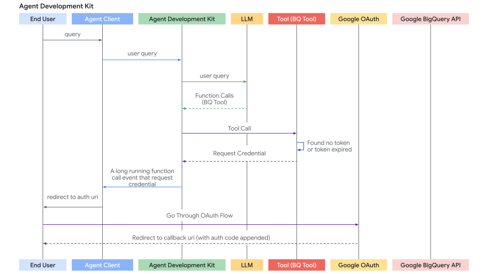
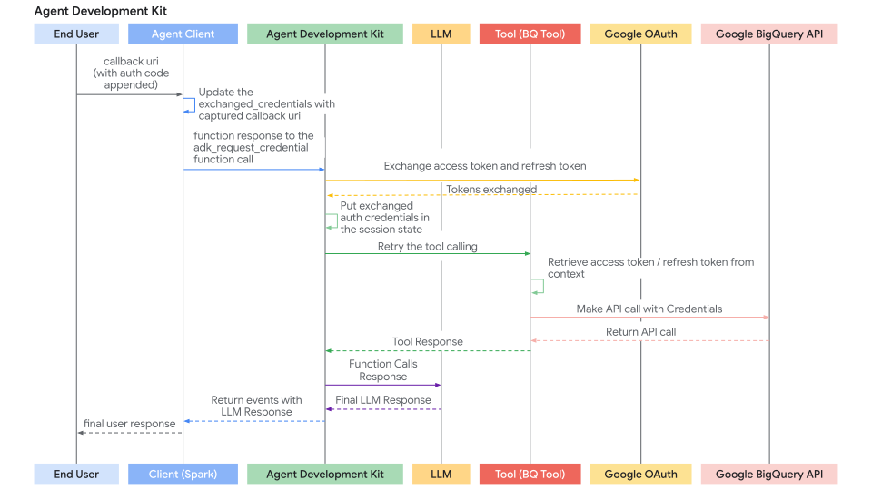

# Authenticating with tools

<div class="language-support-tag">
  <span class="lst-supported">Supported in ADK</span><span class="lst-python">Python v0.1.0</span>
</div>

The tools and services you use within ADK agents may require access to protected
resources, such as user data in email or calendar applications, or sales records
in databases. Getting access to these resources typically requires an
authentication process that includes credentials and access keys which must
be carefully managed and protected. The requirements for managing authentication
data can also change if you are running your agent locally or deploying it
to a hosted service. If multiple users, with potentially different access
permissions, are interacting with the agent, this creates another layer of
authentication management requirements.

!!! danger "WARNING: Credential storage and security risks"

    Storing sensitive credentials such as access tokens and especially refresh
    tokens directly in the session state can pose security risks depending on
    your session storage backend, your ***SessionService*** implementation,
    and overall application security posture. Carefully consider how you manage
    credentials in ADK agents before deploying them for general use.

## Authentication and credential management

There are several ways to manage authentication and credentials in ADK
agents. Each of these methods carries some amount of risk, so you should
carefully consider which approach best serves your application and customers.

### Recommended: Authentication manager services {#authentication-manager}

When deploying agents to production hosted environments, your agent's ability to
properly authenticate to restricted tools and services becomes more challenging
and more important to properly manage. This authentication challenge can become
even more complicated when users of your agent have varying levels of access to
restricted tools and data.

Rather than writing code to handle the authentication process and credential
management for various tools used by your agent, use an *authentication manager*
service that manages *both* for you. This service should handle the storage of
keys and secrets, as well as the acquisition, management, and storage of OAuth
access or refresh tokens. Learn more about 
[Agent Identity integration](/integrations/agent-identity/) with ADK.

### Self-managed authentication

If you decide to manage your own authentication process with ADK helper functions
and your own code, consider these recommendations:

*   **API keys and client secrets:** For any API keys and client secrets used
    inside ADK code, when running on a local compute environment use a local
    `.env` file excluded from version control. When your agent is hosted or
    otherwise in a production environment, use a secrets manager. For more
    details on secrets managers, see the [next section](#secrets-manager).
*   **Interactive authentication:** When using interactive three-legged auth
    (3LO) OAuth or OpenID Connect (OIDC) for authentication to tools, write a
    service on the client application to acquire, manage access, and refresh
    tokens. Make sure to store these tokens against an authenticated user
    identifier in an encrypted database.

### Secrets manager services {#secrets-manager}

For production environments, if you are not using an
[authentication manager](#authentication-manager) service, you should store
credentials in a dedicated secret manager service to protect that data. With
this approach, a secret manager securely stores the credentials for any tools or
services accessed by the agent as needed, and those secrets are not resident in
agent's operating memory. For example, a custom ADK Tool using this method would
have only short-lived access tokens or secure references in session memory, and
retrieve longer-lived refresh tokens from the secrets manager when needed. When
selecting a secrets manager, consider services from well-established providers,
such as
[Google Cloud Secret Manager](https://cloud.google.com/security/products/secret-manager)
or other secret management services.

### Local encrypted secrets storage

For agent applications that are less security sensitive, keeping credentials in
local, encrypted storage can be a viable option. Consider using dedicated local
secrets storage system or encrypting the data in a local database using a robust
encryption library, and then managing the encryption keys securely using a key
management service. Take care to only keep short-lived access tokens in
operating memory and access long-lived credentials and refresh tokens from
encrypted local storage only when needed.

### In-memory secrets

This method *should only be used in the early development* and testing of your
agent. With this approach, credentials are stored in the current
***InMemorySessionService*** instance. The data exists only in session memory
and is not persisted. However, you should carefully consider the risks of using
this method based on how long an agent session may last, who has access to the
agent, and the security of the environment where the agent is running.

## Framework components

Within the ADK framework, the ***AuthScheme*** and ***AuthCredential*** are the
key components for handling authentication methods and managing credential data:

*   ***AuthScheme***: Defines *how* an API expects authentication credentials,
    such as an API Key in a header or an OAuth 2.0 Bearer token. ADK supports
    the same types of authentication schemes as OpenAPI 3.0 and uses specific
    classes for credential types, including ***APIKey***, ***HTTPBearer***,
    ***OAuth2***, and ***OpenIdConnectWithConfig***. For more details on each
    OpenAPI credential type, see
    [OpenAPI doc: Authentication](https://swagger.io/docs/specification/v3_0/authentication/).

*   ***AuthCredential***: Holds the *initial* information needed to *start* the
    authentication process, such as your application's OAuth Client ID or
    Secret, or an API key value. An instance of this class includes an
    **auth_type**, such as `API_KEY`, `OAUTH2`, `SERVICE_ACCOUNT`, specifying
    the credential type.

The general authentication flow involves providing these details when
configuring a tool. ADK then attempts to automatically exchange the initial
credential, such as an access token, before the tool makes an API call. For
flows requiring user interaction, including OAuth consent, ADK triggers a
specific interactive process with your ***Agent Client*** application.

### Supported initial credential types

*   **API\_KEY:** Provides simple key-value authentication, which usually
    requires no authentication exchange.
*   **HTTP:** Provides Basic Auth which is not recommended and may not be
    supported for exchange, or already obtained Bearer tokens. Bearer tokens do
    not require an authentication exchange.
*   **OAUTH2:** Provides standard OAuth 2.0 authentication flows, and requires
    configuration with client ID, secret, and scopes. This method often
    triggers an interactive flow for user consent.
*   **OPEN\_ID\_CONNECT:** Provides authentication based on OpenID Connect.
    Similar to OAuth2, this type often requires configuration and user
    interaction.
*   **SERVICE\_ACCOUNT:** Provides Google Cloud Service Account credentials as a
    JSON key or Application Default Credentials. This type typically exchanges a
    Bearer token.
    
## Tools and integrations quick guide

Here is a quick guide to authentication for key ADK toolsets:

*   [***RestApiTool***](/tools-custom/openapi-tools/):
    Set `auth_scheme` and `auth_credential` during initialization
*   [***OpenAPIToolset***](/tools-custom/openapi-tools/):
    Set `auth_scheme` and `auth_credential` during initialization
*   [***APIHubToolset***](/integrations/apigee-api-hub/):
    Set `auth_scheme` and `auth_credential` during initialization, *if* the API
    requires authentication.
*   [***ApplicationIntegrationToolset***](/integrations/application-integration/):
    Set `auth_scheme` and `auth_credential` during initialization, *if* the API
    requires authentication.
*   [***GoogleApiToolSet***](https://github.com/google/adk-python/blob/main/src/google/adk/tools/google_api_tool/google_api_toolset.py):
    Use this toolset's specific authentication method.

For more authentication details for other pre-built tools and integrations
see the [ADK Integrations](/integrations) catalog.

---

## Build agentic applications with authenticated tools

This section focuses on using pre-existing tools (like those from `RestApiTool/ OpenAPIToolset`, `APIHubToolset`, `GoogleApiToolSet`) that require authentication within your agentic application. Your main responsibility is configuring the tools and handling the client-side part of interactive authentication flows (if required by the tool).

### Configure tools with authentication

When adding an authenticated tool to your agent, you need to provide its required `AuthScheme` and your application's initial `AuthCredential`.

You can configure authentication differently depending on your toolset type, OpenAPI-based or Google API toolsets, and, for services protected by Cloud IAM, whether the service needs an ID token instead of an access token. The following subsections cover each case.

#### Use OpenAPI-based toolsets (`OpenAPIToolset`, `APIHubToolset`, etc.)

Pass the scheme and credential during toolset initialization. The toolset applies them to all generated tools. Here are few ways to create tools with authentication in ADK.

=== "API Key"

      Create a tool requiring an API Key.

      ```py
      --8<-- "examples/inline/python/tools-custom/authentication/001-use-openapi-based-toolsets-openapitoolse.py"
      ```

=== "OAuth2"

      Create a tool requiring OAuth2.

      ```py
      --8<-- "examples/inline/python/tools-custom/authentication/002-use-openapi-based-toolsets-openapitoolse.py"
      ```

=== "Service Account"

      Create a tool requiring Service Account.

      ```py
      --8<-- "examples/inline/python/tools-custom/authentication/003-use-openapi-based-toolsets-openapitoolse.py"
      ```

=== "OpenID connect"

      Create a tool requiring OpenID connect.

      ```py
      --8<-- "examples/inline/python/tools-custom/authentication/004-use-openapi-based-toolsets-openapitoolse.py"
      ```

#### Use Google API toolsets (e.g., `calendar_tool_set`)

These toolsets often have dedicated configuration methods.

Tip: For how to create a Google OAuth Client ID & Secret, see this guide: [Get your Google API Client ID](https://developers.google.com/identity/gsi/web/guides/get-google-api-clientid#get_your_google_api_client_id)

```py
--8<-- "examples/inline/python/tools-custom/authentication/005-use-google-api-toolsets-e-g-calendartool.py"
```

#### Use ID token

If your agent calls a restricted service, for example a private Cloud Run or Cloud Function, the agent needs to prove your identity, not just your permissions. If you are calling a service that is accessed using Cloud IAM, you should use an ID token.

* **Access Token (Default)**: It calls Google APIs (Drive, BigQuery). Think of it as your keycard.
    
* **ID Token**: It calls your own services secured by IAM. Think of it as your passport.

##### Configuration

To implement ID token authentication, configure your ServiceAccount with the following parameters, ensuring you specify the target service's URL as the `audience`.

```python
--8<-- "examples/inline/python/tools-custom/authentication/006-configuration.py"
```

!!! tip "Troubleshooting authentication errors"

    If you receive an authentication error, verify that your service account has the 'Cloud Run Invoker' or equivalent role on the target service.

##### Key takeaways

* **Audience Requirement**: The `audience` is a security feature that binds the token to a specific destination, preventing it from being "replayed" against other services.
  
* **No Auto-Refresh**: Unlike standard OAuth2 access tokens for users, service-account ID tokens are fetched at the time of the request. They do not auto-refresh on a background timer.
  
* **The Flow**: You define the intent and ADK handles the handshake, fetches the token from Google's auth servers, and injects it into your outgoing HTTP headers.

##### ServiceAccount configuration parameters

* `service_account_credential` (Optional): Provide the path or dict for your service account JSON key file. Use this if you are running locally or outside of Google Cloud.
  
* `use_default_credential` (Optional): Set to True to use Application Default Credentials (ADC). Recommended if your agent is already running within Google Cloud, for example on Cloud Run or Cloud Functions, as it avoids the need for local key files.
  
* `use_id_token` (Required for IAM): Set to True to enable ID token-based authentication. This switches the ADK from requesting an Access Token, for Google APIs, to an ID Token, for your own IAM-secured services.
  
* `audience` (Required if use_id_token=True): The URL of the service you are calling, for example, `https://my-service.run.app`. This is a security binding that ensures the token is valid only for that specific destination.
  
* `scopes` (Optional): Use it only when requesting Access Tokens for Google Cloud APIs, like Drive or BigQuery. You do not need to set this if you are using ID tokens for private service authentication.

!!! tip "Pair `use_id_token` with `audience`"

    Always use `use_id_token=True` and `audience` together. If you provide one without the other, the ADK will raise an error to prevent accidental misconfiguration.

#### Use external access tokens

The `external_access_token_key` feature allows your agent to use an existing
access token provided by the runtime environment, such as a token provided by
a frontend application, instead of starting a new authentication flow.
When configured, the credential manager skips standard OAuth flows. Instead, 
retrieves the key in the agent's `tool_context.state` and directly uses the 
token for authentication.
The use of this configuration parameter is mutually exclusive, and cannot
include `credentials`, `client_id`, `client_secret`, or scopes parameters in the same
configuration block.

Follow this example to configure the key:

```python
--8<-- "examples/inline/python/tools-custom/authentication/007-use-external-access-tokens.py"
```

#### Authentication request flow

This diagram visualizes the end-to-end authentication handshake, tracing the path from the initial user query to the point where the ADK captures a credential request,
handles the redirection flow, and retries the tool call once authorized.




### Handle the interactive OAuth/OIDC flow (client-side)

If a tool requires user login/consent (typically OAuth 2.0 or OIDC), the ADK framework pauses execution and signals your ***Agent Client*** application. There are two cases:

* ***Agent Client*** application runs the agent directly (via `runner.run_async`) in the same process. e.g. UI backend, CLI app, or Spark job etc.
* ***Agent Client*** application interacts with ADK's fastapi server via `/run` or `/run_sse` endpoint. While ADK's fastapi server could be setup on the same server or different server as ***Agent Client*** application

The second case is a special case of first case, because `/run` or `/run_sse` endpoint also invokes `runner.run_async`. The only differences are:

* Whether to call a python function to run the agent (first case) or call a service endpoint to run the agent (second case).
* Whether the result events are in-memory objects (first case) or serialized json string in http response (second case).

Below sections focus on the first case and you should be able to map it to the second case very straightforward. We will also describe some differences to handle for the second case if necessary.

Here's the step-by-step process for your client application:

**Step 1: Run Agent & Detect Auth Request**

* Initiate the agent interaction using `runner.run_async`.
* Iterate through the yielded events.
* Look for a specific function call event whose function call has a special name: `adk_request_credential`. This event signals that user interaction is needed. You can use helper functions to identify this event and extract necessary information. (For the second case, the logic is similar. You deserialize the event from the http response).

```python
--8<-- "examples/inline/python/tools-custom/authentication/008-handle-the-interactive-oauth-oidc-flow-c.py"
```

*Helper functions `helpers.py`:*

```py
--8<-- "examples/inline/python/tools-custom/authentication/009-content-types-content-user-s-initial-que.py"
```

**Step 2: Redirect User for Authorization**

* Get the authorization URL (`auth_uri`) from the `auth_config` extracted in the previous step.
* **Crucially, append your application's**  redirect\_uri as a query parameter to this `auth_uri`. This `redirect_uri` must be pre-registered with your OAuth provider (e.g., [Google Cloud Console](https://developers.google.com/identity/protocols/oauth2/web-server#creatingcred), [Okta admin panel](https://developer.okta.com/docs/guides/sign-into-web-app-redirect/spring-boot/main/#create-an-app-integration-in-the-admin-console)).
* Direct the user to this complete URL (e.g., open it in their browser).

```py
--8<-- "examples/inline/python/tools-custom/authentication/010-content-types-content-user-s-initial-que.py"
```

**Step 3. Handle the Redirect Callback (Client):**

* Your application must have a mechanism (e.g., a web server route at the `redirect_uri`) to receive the user after they authorize the application with the provider.
* The provider redirects the user to your `redirect_uri` and appends an `authorization_code` (and potentially `state`, `scope`) as query parameters to the URL.
* Capture the **full callback URL** from this incoming request.
* (This step happens outside the main agent execution loop, in your web server or equivalent callback handler.)

**Step 4. Send Authentication Result Back to ADK (Client):**

* Once you have the full callback URL (containing the authorization code), retrieve the `auth_request_function_call_id` and the `auth_config` object saved in Client Step 1\.
* Set the captured callback URL in the `exchanged_auth_credential.oauth2.auth_response_uri` field. Also ensure `exchanged_auth_credential.oauth2.redirect_uri` contains the redirect URI you used.
* Create a `types.Content` object containing a `types.Part` with a `types.FunctionResponse`.
      * Set `name` to `"adk_request_credential"`. (Note: This is a special name for ADK to proceed with authentication. Do not use other names.)
      * Set `id` to the `auth_request_function_call_id` you saved.
      * Set `response` to the *serialized* (e.g., `.model_dump()`) updated `AuthConfig` object.
* Call `runner.run_async` **again** for the same session, passing this `FunctionResponse` content as the `new_message`.

```py
--8<-- "examples/inline/python/tools-custom/authentication/011-continuing-after-detecting-auth-needed.py"
```

!!! note "Note: Authorization response with Resume feature"

    If your ADK agent workflow is configured with the
    [Resume](/runtime/resume/) feature, you also must include
    the Invocation ID (`invocation_id`) parameter with the authorization
    response. The Invocation ID you provide must be the same invocation
    that generated the authorization request, otherwise the system
    starts a new invocation with the authorization response. If your
    agent uses the Resume feature, consider including the Invocation ID
    as a parameter with your authorization request, so it can be included
    with the authorization response. For more details on using the Resume
    feature, see
    [Resume stopped agents](/runtime/resume/).

**Step 5: ADK Handles Token Exchange & Tool Retry and gets Tool result**

* ADK receives the `FunctionResponse` for `adk_request_credential`.
* It uses the information in the updated `AuthConfig` (including the callback URL containing the code) to perform the OAuth **token exchange** with the provider's token endpoint, obtaining the access token (and possibly refresh token).
* ADK internally makes these tokens available by setting them in the session state.
* ADK **automatically retries** the original tool call (the one that initially failed due to missing auth).
* This time, the tool finds the valid tokens (via `tool_context.get_auth_response()`) and successfully executes the authenticated API call.
* The agent receives the actual result from the tool and generates its final response to the user.

---

The sequence diagram of auth response flow, where the ***Agent Client*** sends back the auth response and ADK retries the tool, is as follows:



## Build custom tools (`FunctionTool`) requiring authentication

This section focuses on implementing the authentication logic *inside* your custom Python function when creating a new ADK Tool. We will implement a `FunctionTool` as an example.

### Prerequisites

Your function signature *must* include [`tool_context: ToolContext`](../tools-custom/index.md#tool-context). ADK automatically injects this object, providing access to state and auth mechanisms.

```py
--8<-- "examples/inline/python/tools-custom/authentication/012-prerequisites.py"
```

### Authentication Logic within the Tool Function

Implement the following steps inside your function:

**Step 1: Check for Cached & Valid Credentials:**

Inside your tool function, first check if valid credentials (e.g., access/refresh tokens) are already stored from a previous run in this session. Credentials for the current sessions should be stored in `tool_context.invocation_context.session.state` (a dictionary of state) Check existence of existing credentials by checking `tool_context.invocation_context.session.state.get(credential_name, None)`.

```py
--8<-- "examples/inline/python/tools-custom/authentication/013-authentication-logic-within-the-tool-fun.py"
```

**Step 2: Check for Auth Response from Client**

* If Step 1 didn't yield valid credentials, check if the client just completed the interactive flow by calling `exchanged_credential = tool_context.get_auth_response()`.
* This returns the updated `exchanged_credential` object sent back by the client (containing the callback URL in `auth_response_uri`).

```py
--8<-- "examples/inline/python/tools-custom/authentication/014-inside-your-tool-function.py"
```

**Step 3: Initiate Authentication Request**

If no valid credentials (Step 1.) and no auth response (Step 2.) are found, the tool needs to start the OAuth flow. Define the AuthScheme and initial AuthCredential and call `tool_context.request_credential()`. Return a response indicating authorization is needed.

```py
--8<-- "examples/inline/python/tools-custom/authentication/015-adk-exchanged-the-access-token-already-f.py"
```

**Step 4: Exchange Authorization Code for Tokens**

ADK automatically generates oauth authorization URL and presents it to your ***Agent Client*** application. your ***Agent Client*** application should follow the same way described in [Build agentic applications with authenticated tools](#build-agentic-applications-with-authenticated-tools) to redirect the user to the authorization URL (with `redirect_uri` appended). Once a user completes the login flow, ADK extracts the authentication callback url from ***Agent Client*** applications, automatically parses the auth code, and generates auth token. At the next Tool call, `tool_context.get_auth_response` in step 2 will contain a valid credential to use in subsequent API calls.

**Step 5: Cache Obtained Credentials**

After successfully obtaining the token from ADK (Step 2) or if the token is still valid (Step 1), **immediately store** the new `Credentials` object in `tool_context.state` (serialized, e.g., as JSON) using your cache key.

```py
--8<-- "examples/inline/python/tools-custom/authentication/016-by-setting-requestcredential-adk-detects.py"
```

**Step 6: Make Authenticated API Call**

* Once you have a valid `Credentials` object (`creds` from Step 1 or Step 4), use it to make the actual call to the protected API using the appropriate client library (e.g., `googleapiclient`, `requests`). Pass the `credentials=creds` argument.
* Include error handling, especially for `HttpError` 401/403, which might mean the token expired or was revoked between calls. If you get such an error, consider clearing the cached token (`tool_context.state.pop(...)`) and potentially returning the `auth_required` status again to force re-authentication.

```py
--8<-- "examples/inline/python/tools-custom/authentication/017-proceed-to-step-6-make-api-call.py"
```

**Step 7: Return Tool Result**

* After a successful API call, process the result into a dictionary format that is useful for the LLM.
* **Crucially, include a**  along with the data.

```py
--8<-- "examples/inline/python/tools-custom/authentication/018-handle-api-errors-e-g-check-for-401-403.py"
```

??? "Full Code"

    === "Tools and Agent"

         ```py title="tools_and_agent.py"
         --8<-- "examples/python/snippets/tools/auth/tools_and_agent.py"
         ```
    === "Agent CLI"

         ```py title="agent_cli.py"
         --8<-- "examples/python/snippets/tools/auth/agent_cli.py"
         ```
    === "Helper"

         ```py title="helpers.py"
         --8<-- "examples/python/snippets/tools/auth/helpers.py"
         ```
    === "Spec"

         ```yaml
         openapi: 3.0.1
         info:
         title: Okta User Info API
         version: 1.0.0
         description: |-
            API to retrieve user profile information based on a valid Okta OIDC Access Token.
            Authentication is handled via OpenID Connect with Okta.
         contact:
            name: API Support
            email: support@example.com # Replace with actual contact if available
         servers:
         - url: <substitute with your server name>
            description: Production Environment
         paths:
         /okta-jwt-user-api:
            get:
               summary: Get Authenticated User Info
               description: |-
               Fetches profile details for the user
               operationId: getUserInfo
               tags:
               - User Profile
               security:
               - okta_oidc:
                     - openid
                     - email
                     - profile
               responses:
               '200':
                  description: Successfully retrieved user information.
                  content:
                     application/json:
                     schema:
                        type: object
                        properties:
                           sub:
                           type: string
                           description: Subject identifier for the user.
                           example: "abcdefg"
                           name:
                           type: string
                           description: Full name of the user.
                           example: "Example LastName"
                           locale:
                           type: string
                           description: User's locale, e.g., en-US or en_US.
                           example: "en_US"
                           email:
                           type: string
                           format: email
                           description: User's primary email address.
                           example: "username@example.com"
                           preferred_username:
                           type: string
                           description: Preferred username of the user (often the email).
                           example: "username@example.com"
                           given_name:
                           type: string
                           description: Given name (first name) of the user.
                           example: "Example"
                           family_name:
                           type: string
                           description: Family name (last name) of the user.
                           example: "LastName"
                           zoneinfo:
                           type: string
                           description: User's timezone, e.g., America/Los_Angeles.
                           example: "America/Los_Angeles"
                           updated_at:
                           type: integer
                           format: int64 # Using int64 for Unix timestamp
                           description: Timestamp when the user's profile was last updated (Unix epoch time).
                           example: 1743617719
                           email_verified:
                           type: boolean
                           description: Indicates if the user's email address has been verified.
                           example: true
                        required:
                           - sub
                           - name
                           - locale
                           - email
                           - preferred_username
                           - given_name
                           - family_name
                           - zoneinfo
                           - updated_at
                           - email_verified
               '401':
                  description: Unauthorized. The provided Bearer token is missing, invalid, or expired.
                  content:
                     application/json:
                     schema:
                        $ref: '#/components/schemas/Error'
               '403':
                  description: Forbidden. The provided token does not have the required scopes or permissions to access this resource.
                  content:
                     application/json:
                     schema:
                        $ref: '#/components/schemas/Error'
         components:
         securitySchemes:
            okta_oidc:
               type: openIdConnect
               description: Authentication via Okta using OpenID Connect. Requires a Bearer Access Token.
               openIdConnectUrl: https://your-endpoint.okta.com/.well-known/openid-configuration
         schemas:
            Error:
               type: object
               properties:
               code:
                  type: string
                  description: An error code.
               message:
                  type: string
                  description: A human-readable error message.
               required:
                  - code
                  - message
         ```
