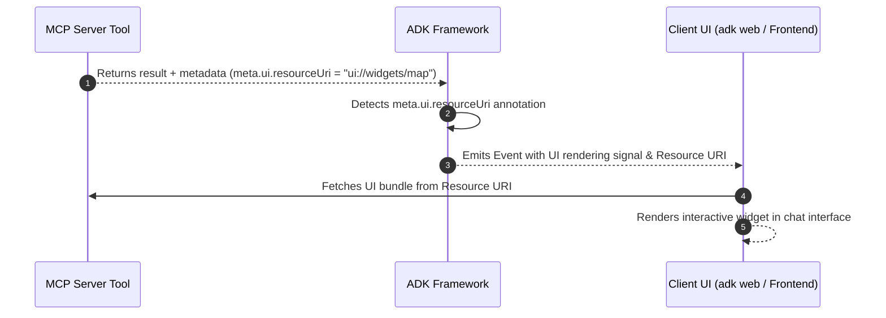

# Advanced MCP configurations and production guide

<div class="language-support-tag">
  <span class="lst-supported">Supported in ADK</span><span class="lst-python">Python v0.1.0</span>
</div>

This guide covers advanced integration patterns for the Model Context Protocol (MCP) in ADK. It provides production patterns for dynamic per-user authentication, human-in-the-loop approvals, long-running progress tracking, custom runtime execution, and enterprise cloud deployments.

---

## Select a configuration pattern for your use case

Use the matrix below to select the right configuration mechanism for your production workload:

| Developer Requirement | Recommended Mechanism | Primary API / Parameter | Typical Scenario |
| :--- | :--- | :--- | :--- |
| **Inject per-user credentials or dynamic session tokens** | Dynamic Header Provider | `header_provider=...` | Multi-tenant apps, per-user JWTs/OAuth tokens |
| **Require approval before dangerous tool calls** | Tool Confirmation | `require_confirmation=...` | Database mutations, destructive shell/file ops |
| **Stream real-time progress for long operations** | Progress Callback & Factory | `progress_callback=...` | Heavy SQL queries, web scraping, data indexing |
| **Run agents in FastAPI / backend services without `adk web`** | Programmatic Runner Lifecycle | `Runner` + `await toolset.close()` | Custom microservices, CLI tools, worker queues |
| **Resolve tool naming collisions across servers** | Tool Namespacing & Filtering | `tool_name_prefix`, `tool_filter` | Aggregating multiple MCP servers (DB + GitHub) |
| **Handle server-requested sampling or auth challenges** | Bi-directional Protocol Callbacks | `sampling_callback`, `elicitation_callback` | Server-initiated LLM generation & auth prompts |
| **Inspect raw STDERR diagnostic streams** | Diagnostic Stream Logging | `errlog=sys.stderr` | Troubleshooting MCP subprocess crashes |
| **Render rich, interactive visual widgets in chat** | Experimental UI Rendering | `meta.ui.resourceUri` | Maps, charts, weather cards, or custom forms |

---

## Dynamic authentication and per-user headers (`header_provider`)

In multi-tenant or user-facing systems, hardcoding credentials into connection parameters is insecure. `McpToolset` supports `header_provider`, an asynchronous or synchronous callable that receives the active `ReadonlyContext` to dynamically construct authentication headers on every tool invocation.

```python
from google.adk.agents import LlmAgent
from google.adk.agents.readonly_context import ReadonlyContext
from google.adk.tools.mcp_tool import McpToolset, StreamableHTTPConnectionParams

async def extract_per_user_headers(context: ReadonlyContext) -> dict[str, str]:
    """Dynamically extracts session state or per-user token on every turn."""
    user_token = context.state.get("user_access_token", "ANONYMOUS_TOKEN")
    return {
        "Authorization": f"Bearer {user_token}",
        "X-User-ID": context.user_id,
        "X-Session-ID": context.session.id,  # Fixed: access session.id
    }

toolset = McpToolset(
    connection_params=StreamableHTTPConnectionParams(
        url="https://mcp-server.example.com/mcp",
        timeout=5,
        sse_read_timeout=300,
    ),
    header_provider=extract_per_user_headers,
)
```

---

## Human-in-the-loop and tool confirmations (`require_confirmation`)

MCP servers can expose high-impact capabilities, for example: database schema modifications or record deletions. You can enforce confirmation globally across all tools in the toolset or conditionally via a predicate function that inspects tool arguments.

```python
from typing import Any
from google.adk.agents import LlmAgent
from google.adk.tools.mcp_tool import McpToolset
from google.adk.tools.mcp_tool.mcp_session_manager import StdioConnectionParams
from mcp import StdioServerParameters

def should_require_approval(query: str = "", **kwargs) -> bool:
    query_str = str(query).lower()
    destructive_keywords = ["drop", "delete", "truncate", "alter", "update"]
    return any(keyword in query_str for keyword in destructive_keywords)

toolset = McpToolset(
    connection_params=StdioConnectionParams(
        server_params=StdioServerParameters(
            command="npx",
            args=["-y", "@modelcontextprotocol/server-postgres", "postgresql://localhost/db"],
        ),
        timeout=5,
    ),
    require_confirmation=should_require_approval,  # Can also be a boolean (True)
)

root_agent = LlmAgent(
    model="gemini-flash-latest",
    name="db_administrator",
    instruction="Execute database queries safely with explicit approval for mutations.",
    tools=[toolset],
)
```

---

## Real-time progress tracking (`progress_callback`)

Long-running MCP operations, such as scraping large websites or training jobs, send intermediate progress notifications over the `notifications/progress` channel.

### Option A: Global callback function
Assign a shared callback for simple logging or progress reporting:

```python
async def on_mcp_progress(progress: float, total: float | None, message: str | None) -> None:
    percentage = (progress / total * 100) if total else progress
    print(f"[MCP Progress] {percentage:.1f}% complete: {message or 'Working...'}")

toolset = McpToolset(
    connection_params=...,
    progress_callback=on_mcp_progress,
)
```

### Option B: Per-tool callback factory (Session-Aware)
Use `ProgressCallbackFactory` to inject tool-specific callbacks with write access to `ToolContext.state`:

```python
from google.adk.tools.tool_context import ToolContext

def create_tool_progress_tracker(tool_name: str, callback_context: ToolContext, **kwargs):
    """Generates custom progress handlers and updates active agent session state."""
    async def progress_handler(progress: float, total: float | None, message: str | None):
        callback_context.state[f"{tool_name}_status"] = message
        callback_context.state[f"{tool_name}_progress"] = progress
    return progress_handler

toolset = McpToolset(
    connection_params=...,
    progress_callback=create_tool_progress_tracker,
)
```

---

## Standalone runner execution (Outside `adk web`)

When embedding ADK agents into custom FastAPI applications, background workers, or standalone CLI scripts, instantiate `Runner` and manage lifecycle teardown explicitly via `await toolset.close()`.

```python
import asyncio
import os
from google.genai import types
from google.adk.agents import LlmAgent
from google.adk.runners import Runner
from google.adk.sessions import InMemorySessionService
from google.adk.tools.mcp_tool import McpToolset
from google.adk.tools.mcp_tool.mcp_session_manager import StdioConnectionParams
from mcp import StdioServerParameters

async def run_standalone_mcp_agent():
    # 1. Define McpToolset and Agent synchronously
    toolset = McpToolset(
        connection_params=StdioConnectionParams(
            server_params=StdioServerParameters(
                command="npx",
                args=["-y", "@modelcontextprotocol/server-filesystem", os.path.abspath("./data")],
            ),
            timeout=5,
        ),
        tool_filter=["list_directory", "read_file"],
    )

    agent = LlmAgent(
        model="gemini-flash-latest",
        name="filesystem_assistant",
        instruction="Assist users with file management.",
        tools=[toolset],
    )

    # 2. Setup Session and Runner
    session_service = InMemorySessionService()
    session = await session_service.create_session(
        app_name="standalone_mcp_app",
        user_id="user_001",
    )

    runner = Runner(
        app_name="standalone_mcp_app",
        agent=agent,
        session_service=session_service,
    )

    try:
        # 3. Stream agent execution
        user_message = types.Content(
            role="user",
            parts=[types.Part(text="List the files available in the directory.")],
        )

        async for event in runner.run_async(
            session_id=session.id,
            user_id=session.user_id,
            new_message=user_message,
        ):
            if event.content and event.content.parts:
                for part in event.content.parts:
                    if part.text:
                        print(part.text, end="", flush=True)
    finally:
        # 4. Gracefully terminate subprocesses and network connections
        print("\nTerminating MCP connection...")
        await toolset.close()

if __name__ == "__main__":
    asyncio.run(run_standalone_mcp_agent())
```

---

## Name collisions and tool namespacing (`tool_name_prefix`)

When you connect to multiple MCP servers, tool names such as `query` or `search` can conflict. Use `tool_name_prefix` to automatically namespace discovered tools:

```python
from google.adk.tools.mcp_tool import McpToolset
from google.adk.tools.mcp_tool.mcp_session_manager import StdioConnectionParams
from mcp import StdioServerParameters

postgres_toolset = McpToolset(
    connection_params=StdioConnectionParams(
        server_params=StdioServerParameters(
            command="npx",
            args=["-y", "@modelcontextprotocol/server-postgres", "postgresql://localhost/db"],
        )
    ),
    tool_name_prefix="pg_",  # Generates pg_query, pg_list_tables
)

github_toolset = McpToolset(
    connection_params=StdioConnectionParams(
        server_params=StdioServerParameters(
            command="npx",
            args=["-y", "@modelcontextprotocol/server-github"],
        )
    ),
    tool_name_prefix="gh_",  # Generates gh_search_repositories, gh_create_issue
)
```

---

## Bi-directional protocol hooks: sampling and elicitation

The Model Context Protocol supports bi-directional interaction where servers can request actions from clients:
- **Sampling (`sampling_callback`)**: Allows the MCP server to ask the ADK host to generate an LLM completion.
- **Elicitation (`elicitation_callback`)**: Allows the MCP server to request out-of-band user interactions or authentication flows.

```python
from mcp import SamplingCapability
from google.adk.tools.mcp_tool import McpToolset

async def handle_server_sampling(params):
    """Processes server-initiated LLM generation requests."""
    return {
        "role": "assistant",
        "content": {"type": "text", "text": "Generated response from ADK"},
    }

async def handle_server_elicitation(params):
    """Handles authentication or interactive challenges from the server."""
    print(f"Elicitation requested: {params}")
    return {"action": "approved"}

toolset = McpToolset(
    connection_params=...,
    sampling_callback=handle_server_sampling,
    sampling_capabilities=SamplingCapability(),
    elicitation_callback=handle_server_elicitation,
)
```

---

## Diagnostic logging and error streams (`errlog`)

By default, MCP subprocess errors are logged to standard error. You can redirect STDERR streams to an external file or diagnostic buffer for root-cause debugging:

```python
import sys
from google.adk.tools.mcp_tool import McpToolset

error_file = open("mcp_server_errors.log", "a")
try:
    toolset = McpToolset(connection_params=..., errlog=error_file)
    # Run agent...
finally:
    await toolset.close()
    error_file.close()
```

## Render interactive UI widgets

Standard MCP tools return plain text or JSON output. This feature enables MCP tools to return rich, interactive visual widgets, such as maps, charts, or forms, directly inside the chat interface.



### How it works

1. **Tool Registration**: The MCP tool declares a UI resource link in its schema definition metadata during `tools/list`: `meta.ui.resourceUri = "ui://widgets/weather-card"`.
2. **ADK Detection**: ADK reads the schema definition to detect `meta.ui.resourceUri` and knows this tool supports an interactive UI.
3. **Client Display**: Upon tool execution, ADK signals the web UI (`adk web` or custom frontend) to fetch the UI resource and render an interactive widget instead of plain text.


```python
from mcp import types as mcp_types
from mcp.server.lowlevel import Server

app = Server("weather-mcp-server")


@app.list_tools()
async def list_mcp_tools() -> list[mcp_types.Tool]:
  """Declares the tool and attaches UI rendering metadata."""
  return [
      mcp_types.Tool(
          name="get_weather",
          description="Get weather forecast for a city.",
          inputSchema={
              "type": "object",
              "properties": {"city": {"type": "string"}},
              "required": ["city"],
          },
          meta={"ui": {"resourceUri": "ui://widgets/weather-card"}},
      )
  ]


@app.call_tool()
async def call_mcp_tool(name: str, arguments: dict) -> list[mcp_types.Content]:
  """Executes the tool and returns standard text/data content."""
  if name == "get_weather":
    city = arguments.get("city", "Unknown")
    return [
        mcp_types.TextContent(
            type="text", text=f"Weather in {city}: 72°F Sunny"
        )
    ]
  return [
      mcp_types.TextContent(type="text", text=f"Unknown tool: '{name}'")
  ]

``` 

---

## Next Steps

* Return to the [Model Context Protocol Overview](./mcp-tools.md) for basic setup.
* Explore [Custom Function Tools](./function-tools.md) for in-process Python tools.
* Read the [ADK Deployment Guide](../deploy/index.md) for full cloud configuration options.
