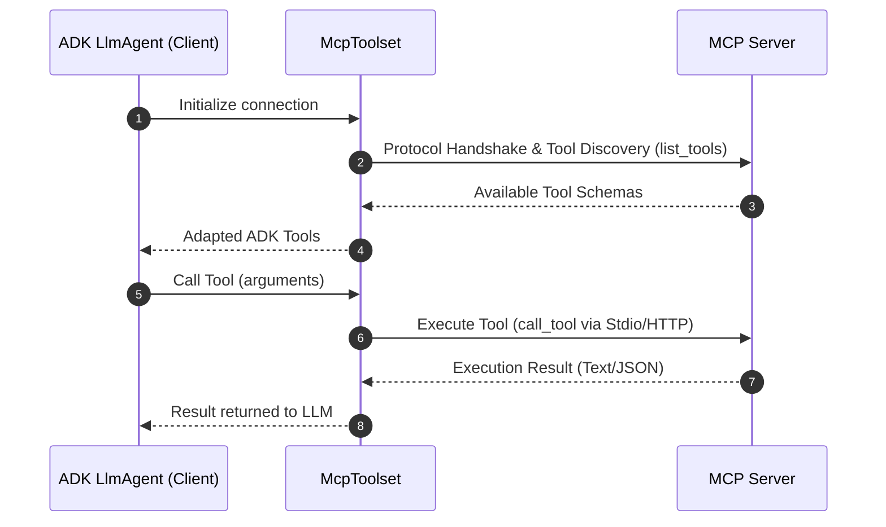
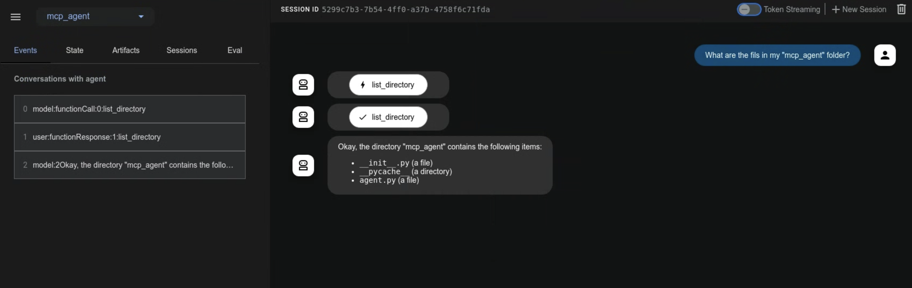
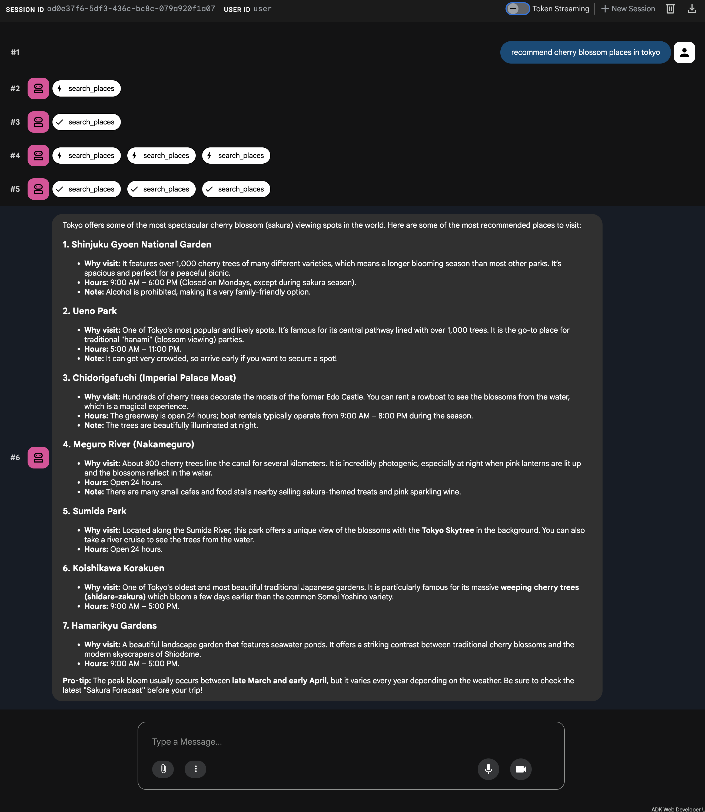

# Model Context Protocol Tools

<div class="language-support-tag">
  <span class="lst-supported">Supported in ADK</span><span class="lst-python">Python v0.1.0</span><span class="lst-typescript">Typescript v0.2.0</span><span class="lst-go">Go v0.1.0</span><span class="lst-java">Java v0.1.0</span>
</div>

The **Model Context Protocol (MCP)** is an open standard for connecting generative AI models to external data sources, tools, and systems. Think of it as a universal connection mechanism that simplifies how LLMs obtain context, execute actions, and interact with various systems.

---

## Core architecture and concepts

MCP follows a client-server architecture, defining how data or resources, interactive templates or prompts, and actionable functions or tools are exposed by an MCP server and consumed by an MCP client, which could be an LLM host application or an AI agent. In ADK, you use the McpToolset class as an interface between MCP Servers and ADK agents. It is also possible to configure an ADK server as an MCP server for use by other client systems.



## Prerequisites and setup rules

Before you begin, ensure you have the following set up:

- **ADK Installed**: Complete standard ADK setup in your project environment.
- **Runtime Requirements**: Python 3.10+ or Java 17+.
- **Node.js & `npx`** *(Python/TS only)*: Required to run npm-packaged community MCP servers.
- **Verify installations**: Confirm `adk` and `npx` are in your PATH in the activated virtual environment:

=== "MacOS / Linux"

    ```bash
    # Both commands should print the path to the executables.
    which adk
    which npx
    ```
    
=== "Windows PowerShell"

    ```powershell
    # Both commands should print the path to the executables.
    Get-Command adk
    Get-Command npx
    ```
    
!!! warning "Deployment rule"

    Agents deployed to production **must define `McpToolset` synchronously** in `agent.py`. Dynamic asynchronous agent initialization is only supported for local debugging or custom standalone runners.

---

## MCP Implementation options

 When you start building with the Model Context Protocol (MCP) and ADK, these key architectural differences will help you design more stable and efficient agents. The following table works as a comparative guide to help you construct those agents.

| Dimension | [**Direct MCP Tool Integration** (`McpToolset`)](#direct-mcp-tool-integration-mcptoolset) | [**Agent-Exposed MCP Server** (`to_mcp_server`)](/docs/tools-custom/agent-as-mcp-server.md) | [**Specialized Sub-Agent Delegation** (`AgentTool`)](/docs/tools-custom/agent-managed-mcp.md) |
| :--- | :--- | :--- | :--- |
| **Architecture** | External server process or remote service providing deterministic endpoints adapted into the primary `LlmAgent` tool list. | An autonomous ADK agent compiled into an MCP server, callable by external clients (Claude Code, IDEs, external hosts). | In-process, hierarchical agent encapsulation where a parent agent invokes a child `LlmAgent` as a callable tool. |
| **Context Window Impact** | **High Context Bloat**: Every tool definition and raw output, for example: database rows or file blobs, enters the primary agent's history. | **Isolated**: The external caller only receives the final aggregated response text/blocks. | **Zero Context Bloat**: Intermediate exploratory reasoning, failed tool calls, and large raw outputs remain isolated in the sub-agent loop. |
| **AI Model Load and Tiering** | Single model must understand all tool schemas, validation constraints, and workflow state simultaneously. | Independent model reasoning dedicated solely to the wrapped task. | Enables **model tiering**, for example: `gemini-2.5-pro` for orchestrator, and `gemini-2.5-flash` for sub-agent tool execution with dedicated system instructions. |
| **Latency & Token Cost** | **Lower Cost & Predictable Latency**: 1 LLM turn + 1 deterministic tool invocation + 1 response generation turn. | Client-driven; latency depends on internal agent execution depth. | **Higher Cost & Variable Latency**: Multiple LLM calls, sub-agent reasoning turns before returning to parent. |
| **Ideal Use Cases** | <ul><li>Deterministic API integrations: Postgres, BigQuery, GitHub, Google Maps.</li><li>File system operations & static resource reading.</li><li>Reusing standard pre-built community MCP servers.</li></ul> | <ul><li>Exposing complex ADK multi-agent capabilities to external MCP-compliant ecosystems.</li><li>Integrating ADK agents into IDEs, editors, or A2A pipelines.</li></ul> | <ul><li>Multi-step autonomous workflows requiring trial-and-error. For example: code debugging or research synthesis.</li><li>Tasks needing isolated personas or specialized instructions.</li><li>Scenarios with >20 tools where schema overload harms accuracy.</li></ul> |

!!! note "State restoration"

    While ADK agents preserve session state during lifecycle events, they do not automatically re-establish active MCP connections upon restoration. Agents re-initialize connections as needed.

## Understand uses and integrations

There are three main integration patterns. The direct integration is covered in this page and
the other implementations are covered in their specific pages.

1. **Direct MCP Tool Integration**: When an ADK agent acts as an MCP client using `McpToolset`.
2. **Agent-Exposed MCP Server**: When you build an MCP server that wraps ADK Tools using `to_mcp_server`.
3. **Specialized Sub-Agent Delegation**: When an agent delegates to a sub-agent using `AgentTool`.
   

### Direct MCP Tool Integration (McpToolset)

The `McpToolset` class can be directly added to your agent's tools list; this class enables seamless connection to an MCP server, discovery of its tools, and making them available for your agent to use. On initialization, `McpToolset` establishes and manages the connection to the MCP server. It also handles graceful connection shutdown when the agent or process terminates.
Use `McpToolset` to import tools from an external MCP server into your ADK `LlmAgent`.

#### Example: Local Stdio Transport (FileSystem MCP)

This example sets up an ADK agent that connects to a local MCP file system server; it instantiates the McpToolset directly within the agent's tools list to enable file management capabilities.

**Step 1**. Define your agent with `McpToolset`:

=== "Python"

    ```python
    import os
    from google.adk.agents import LlmAgent
    from google.adk.tools.mcp_tool import McpToolset
    from google.adk.tools.mcp_tool.mcp_session_manager import StdioConnectionParams
    from mcp import StdioServerParameters

    TARGET_FOLDER = os.path.abspath("./accessible_files")

    root_agent = LlmAgent(
        model="gemini-flash-latest",
        name="filesystem_assistant",
        instruction="Help users manage local files.",
        tools=[
            McpToolset(
                connection_params=StdioConnectionParams(
                    server_params=StdioServerParameters(
                        command="npx",
                        args=["-y", "@modelcontextprotocol/server-filesystem", TARGET_FOLDER],
                    ),
                ),
                # Optional: Select specific tools exposed to the agent
                tool_filter=["list_directory", "read_file"],
            )
        ],
    )
    ```
    
    **Step 2**: Package and Run your Agent to make your agent discoverable to ADK and start interacting with it, follow this workflow:
    
      - Initiate your package: Create an `__init__.py` file in the same directory as your agent.py. This step is required for ADK to recognize your agent.
      - Launch the Web Interface:

        ```bash
        cd ./adk_agent_samples 
        adk web
        ```
    
    - Interact with the Agent: select `filesystem_assistant` from the drop-down menu and prompt the Agent with commands: *List files in the current directory* or *What is the content of another_file.md?*

    

=== "TypeScript"

    ```typescript
    import { LlmAgent, MCPToolset } from "@google/adk";
    import path from "path";

    const TARGET_FOLDER = path.resolve("./accessible_files");

    export const rootAgent = new LlmAgent({
        model: "gemini-flash-latest",
        name: "filesystem_assistant",
        instruction: "Help users manage local files.",
        tools: [
            new MCPToolset({
                type: "StdioConnectionParams",
                serverParams: {
                    command: "npx",
                    args: ["-y", "@modelcontextprotocol/server-filesystem", TARGET_FOLDER],
                },
            }, ["list_directory", "read_file"]) // Optional tool filter array
        ],
    });
    ```

=== "Java"

    ```java
    package agents;

    import com.google.adk.agents.LlmAgent;
    import com.google.adk.tools.mcp.McpToolset;
    import com.google.adk.tools.mcp.StdioServerParameters;
    import java.util.List;

    public class FileSystemAgentCreator {
        public static void main(String[] args) throws Exception {
            StdioServerParameters serverParams = StdioServerParameters.builder()
                    .command("npx")
                    .args(List.of("-y", "@modelcontextprotocol/server-filesystem", "/absolute/path/to/folder"))
                    .build();

            try (McpToolset toolset = new McpToolset(serverParams.toServerParameters())) {
                LlmAgent agent = LlmAgent.builder()
                        .model("gemini-flash-latest")
                        .name("filesystem_assistant")
                        .instruction("Help users access their file systems.")
                        .tools(toolset)
                        .build();
                
                System.out.println("Agent initialized: " + agent.name());
            }
        }
    }
    ```

---

#### Example: Remote HTTP / SSE Transport (Google Maps Grounding Lite)

Before starting, follow the instructions for [Google Maps Grounding Lite](https://developers.google.com/maps/ai/grounding-lite) to enable the service on your Google Cloud project and generate your Maps Platform API Key.
Unlike the previous local process example, this pattern connects your agent to a remote, cloud-hosted MCP server using Server-Sent Events (SSE). It uses the Google Maps Grounding Lite service to demonstrate how to pass authentication headers, such as an API key, to a scalable endpoint.

**Step 1**: Define your agent with `McpToolset`.

=== "Python"

    ```python
    import os
    from google.adk.agents import LlmAgent
    from google.adk.tools.mcp_tool import McpToolset
    from google.adk.tools.mcp_tool.mcp_session_manager import StreamableHTTPConnectionParams
    
    API_KEY = os.getenv("GOOGLE_MAPS_API_KEY")
    
    root_agent = LlmAgent(
        model="gemini-flash-latest",
        name="travel_planner",
        instruction="Plan travel routes and search locations using Google Maps.",
        tools=[
            McpToolset(
                connection_params=StreamableHTTPConnectionParams(
                    url="https://mapstools.googleapis.com/mcp",
                    headers={
                        "X-Goog-Api-Key": API_KEY,
                        "Content-Type": "application/json",
                        "Accept": "application/json, text/event-stream",
                    },
                    timeout=5,
                    sse_read_timeout=300
                )
            )
        ],
    )
    ```
    **Step 2**: Set environment variable before running `adk web`, set you Google API key in your terminal
      
      ```bash
      export GOOGLE_MAPS_API_KEY="YOUR_ACTUAL_GOOGLE_MAPS_API_KEY"
      ```
      
     **Step 3**: Run `adk web`: Navigate to the parent directory of `mcp_agent` and launch the web Interface.
     **Step 4**: Interact with the UI:
       - Select `travel_planner` from the drop-down.
       - Try prompts such as: *I will be in San Francisco tomorrow. What's the weather like* or *Find coffee shops near Golden Gate Park*
       
     

=== "TypeScript"

    ```typescript
    import { LlmAgent, MCPToolset } from "@google/adk";
    
    export const rootAgent = new LlmAgent({
        model: "gemini-flash-latest",
        name: "travel_planner",
        instruction: "Plan travel routes and search locations using Google Maps.",
        tools: [
            new MCPToolset({
                type: "SseConnectionParams",
                url: "https://mapstools.googleapis.com/mcp",
                headers: {
                    "X-Goog-Api-Key": process.env.GOOGLE_MAPS_API_KEY!,
                    "Content-Type": "application/json",
                    "Accept": "application/json, text/event-stream",
                },
                timeout: 5,
                sseReadTimeout: 300
            }),
        ],
    });
    ```
    
---

## Remote MCP Authentication and resource access

This section shows you how to connect to remote MCP servers using authentication and how to read data **Resources** exposed by an MCP server. When an MCP server requires authentication, such as over Server-Sent Events `SseConnectionParams` or Streamable HTTP, `McpToolset` handles credential injection and token management automatically.

### Key authentication parameters

| Parameter | Type | Description |
| :--- | :--- | :--- |
| `auth_scheme` | `AuthScheme` | The authentication strategy (e.g., `Bearer`, `Basic`, `APIKey`, `OAuth2`). |
| `auth_credential` | `AuthCredential` | The secret credential payload, for example, API token, OAuth access token, username/password. |

ADK automatically constructs the required `Authorization` HTTP headers and manages OAuth 2.0 token refreshes during client requests.

### Configure authentication

When an MCP server requires authentication, `McpToolset` handles credential injection and token management automatically. Use the native `auth_scheme` and `auth_credential` parameters rather than manually injecting HTTP headers.

*For general ADK authentication patterns, see our [Custom Tools Authentication Guide](./authentication.md)*

=== "Python"

```python
import os
from google.adk.tools.mcp_tool import McpToolset
from google.adk.tools.mcp_tool.mcp_session_manager import SseConnectionParams

# Configure Bearer Token Authentication via headers
toolset = McpToolset(
    connection_params=SseConnectionParams(
        url="https://mcp-server.example.com/sse",
        headers={"Authorization": f"Bearer {os.getenv('MCP_AUTH_TOKEN')}"},
        timeout=5,
    )
)
```

=== "TypeScript"

```typescript
import { MCPToolset } from "@google/adk";

// Configure Bearer Token Authentication via headers
const toolset = new MCPToolset({
    type: "SseConnectionParams",
    url: "https://mcp-server.example.com/sse",
    headers: {
        "Authorization": `Bearer ${process.env.MCP_AUTH_TOKEN}`,
    },
    timeout: 5,
});
```

---

## Accessing MCP Resources

In addition to executable **Tools**, MCP servers can expose **Resources** data files, database records, or API context blobs.

`McpToolset` provides two core methods to discover and read these data resources:

### Core Methods

* **`list_resources()`**: Returns a list of all available data resources exposed by the MCP server.
* **`read_resource(name)`**: Retrieves the raw content blocks, text or binary data, for a specific resource by its name or URI.

### Try it out

=== "Python"

  ```python
    import asyncio

    async def fetch_mcp_data(toolset):
        # 1. Discover available resources on the server
        resources = await toolset.list_resources()
        print("Available Resources:", resources)

        # 2. Read content from a specific resource
        if resources:
            resource_name = resources[0]
            content_blocks = await toolset.read_resource(name=resource_name)
            print(f"Content of {resource_name}:", content_blocks)
  ```

=== "TypeScript"

  ```typescript
    async function fetchMcpData(toolset: any) {
        // 1. Discover available resources
        const resources = await toolset.listResources();
        console.log("Available Resources:", resources);

        // 2. Read a specific resource
        if (resources.length > 0) {
            const content = await toolset.readResource(resources[0]);
            console.log(`Content of ${resources[0]}:`, content);
        }
    }
  ```

---

## Troubleshooting & Best Practices Checklist

* **Security & Scoping**: Always supply `tool_filter=[...]` in `McpToolset` to expose only necessary actions to your LLM.
* **Timeouts**: Configure explicit timeouts on `StdioConnectionParams(timeout=5)` to prevent hanging subprocesses.
* **Lifecycle Cleanup**: In non-`adk web` runners, invoke `await toolset.close()` or use async context managers to gracefully shutdown subprocesses.
* **Environment Detection**: Dynamically pick connection types based on environment variables, for example: `K_SERVICE` for Cloud Run vs Stdio for local dev.

### Configure the environment-aware connection

```python
import os
from google.adk.tools.mcp_tool import McpToolset
from google.adk.tools.mcp_tool.mcp_session_manager import (
    StdioConnectionParams,
    StreamableHTTPConnectionParams,
)
from mcp import StdioServerParameters

if os.getenv("K_SERVICE"):
  # Running in Production (Cloud Run)
  # Uses Streamable HTTP for stateless scalability and bearer auth headers
  mcp_toolset = McpToolset(
      connection_params=StreamableHTTPConnectionParams(
          url=os.getenv("REMOTE_MCP_URL"),
          headers={"Authorization": f"Bearer {os.getenv('MCP_AUTH_TOKEN')}"},
          timeout=5,
          sse_read_timeout=300,
      )
  )
else:
  # Running in Local Development
  # Uses Stdio Subprocess IPC for zero-network latency testing
  mcp_toolset = McpToolset(
      connection_params=StdioConnectionParams(
          server_params=StdioServerParameters(
              command="npx",
              args=["-y", "@modelcontextprotocol/server-filesystem", "/tmp"],
          ),
          timeout=5,
      )
  )

```

## Further resources

Once you understand the basics, explore [Advanced use cases](/mcp-tools-advanced) for complex implementations and custom integrations.
