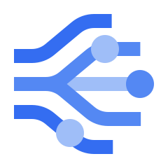
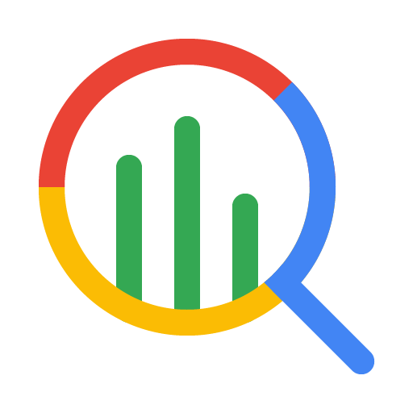
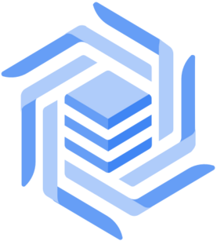
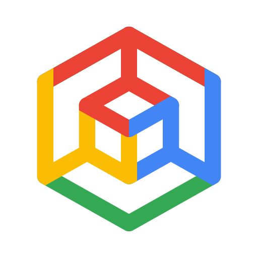
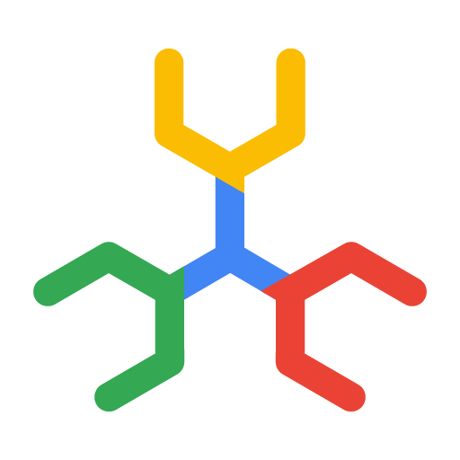

---
hide:
  - toc
---

# Tools for Agents

Check out the following pre-built tools that you can use with ADK agents:

### Gemini tools

  <a href="/adk-docs/tools/built-in-tools/#google-search" class="tool-card">
    

      
    

    

      <h3>Google Search</h3>
      
Perform web searches using Google Search with Gemini

    

  </a>

  <a href="/adk-docs/tools/built-in-tools/#code-execution" class="tool-card">
    

      
    

    

      <h3>Code Execution</h3>
      
Execute code using Gemini models

    

  </a>

### Google Cloud tools

  <a href="/adk-docs/tools/google-cloud-tools/#apigee-api-hub-tools" class="tool-card">
    

      
    

    

      <h3>Apigee API Hub</h3>
      
Turn any documented API from Apigee API hub into a tool

    

  </a>

  <a href="/adk-docs/tools/google-cloud/api-registry/" class="tool-card">
    

      
    

    

      <h3>API Registry</h3>
      
Dynamically connect with Google Cloud services as MCP tools

    

  </a>

  <a href="/adk-docs/tools/google-cloud-tools/#application-integration-tools" class="tool-card">
    

      
    

    

      <h3>Application Integration</h3>
      
Link your agents to enterprise apps using Integration Connectors

    

  </a>

  <a href="/adk-docs/tools/google-cloud/bigquery-agent-analytics/" class="tool-card">
    

      
    

    

      <h3>BigQuery Agent Analytics</h3>
      
Analyze and debug agent behavior at scale.

    

  </a>

  <a href="/adk-docs/tools/built-in-tools/#bigquery" class="tool-card">
    

      
    

    

      <h3>BigQuery Tools</h3>
      
Connect with BigQuery to retrieve data and perform analysis

    

  </a>

  <a href="/adk-docs/tools/built-in-tools/#bigtable" class="tool-card">
    

      
    

    

      <h3>Bigtable Tools</h3>
      
Interact with Bigtable to retrieve data and execute SQL

    

  </a>

  <a href="/adk-docs/tools/built-in-tools/#gke-code-executor" class="tool-card">
    

      
    

    

      <h3>GKE Code Executor</h3>
      
Run AI-generated code in a secure and scalable GKE environment

    

  </a>

  <a href="/adk-docs/tools/built-in-tools/#spanner" class="tool-card">
    

      
    

    

      <h3>Spanner Tools</h3>
      
Interact with Spanner to retrieve data, search, and execute SQL

    

  </a>

  <a href="/adk-docs/tools/google-cloud/mcp-toolbox-for-databases/" class="tool-card">
    

      
    

    

      <h3>MCP Toolbox for Databases</h3>
      
Connect over 30 different data sources to your agents

    

  </a>

  <a href="/adk-docs/tools/built-in-tools/#vertex-ai-rag-engine" class="tool-card">
    

      
    

    

      <h3>Vertex AI RAG Engine</h3>
      
Perform private data retrieval using Vertex AI RAG Engine

    

  </a>

  <a href="/adk-docs/tools/built-in-tools/#vertex-ai-search" class="tool-card">
    

      
    

    

      <h3>Vertex AI Search</h3>
      
Search across your private, configured data stores in Vertex AI Search

    

  </a>

### Third-party tools

  <a href="/adk-docs/tools/third-party/atlassian/" class="tool-card">
    

      
    

    

      <h3>Atlassian</h3>
      
Manage issues, search pages, and update team content

    

  </a>

  <a href="/adk-docs/tools/third-party/github/" class="tool-card">
    

      
    

    

      <h3>GitHub</h3>
      
Analyze code, manage issues and PRs, and automate workflows

    

  </a>

  <a href="/adk-docs/tools/third-party/gitlab/" class="tool-card">
    

      
    

    

      <h3>GitLab</h3>
      
Perform semantic code search, inspect pipelines, manage merge requests

    

  </a>

  <a href="/adk-docs/tools/third-party/hugging-face/" class="tool-card">
    

      
    

    

      <h3>Hugging Face</h3>
      
Access models, datasets, research papers, and AI tools

    

  </a>

  <a href="/adk-docs/tools/third-party/linear/" class="tool-card">
    

      
    

    

      <h3>Linear</h3>
      
Manage issues, track projects, and streamline development

    

  </a>

  <a href="/adk-docs/tools/third-party/n8n/" class="tool-card">
    

      
    

    

      <h3>n8n</h3>
      
Trigger automated workflows, connect apps, and process data

    

  </a>

  <a href="/adk-docs/tools/third-party/notion/" class="tool-card">
    

      
    

    

      <h3>Notion</h3>
      
Search workspaces, create pages, and manage tasks and databases

    

  </a>

  <a href="/adk-docs/tools/third-party/paypal/" class="tool-card">
    

      
    

    

      <h3>Paypal</h3>
      
Manage payments, send invoices, and handle subscriptions

    

  </a>

  <a href="/adk-docs/tools/third-party/qdrant/" class="tool-card">
    

      
    

    

      <h3>Qdrant</h3>
      
Store and retrieve information using semantic vector search

    

  </a>

## Build your tools

If the above tools don't meet your needs, you can build tools for your ADK
workflows using the following guides:

*   **[Function Tools](/adk-docs/tools-custom/function-tools/)**: Build custom tools for
    your specific ADK agent needs.
*   **[MCP Tools](/adk-docs/tools/mcp-tools/)**: Connect MCP servers as tools
    for your ADK agents.
*   **[OpenAPI Integration](/adk-docs/tools-custom/openapi-tools/)**:
    Generate callable tools directly from an OpenAPI Specification.

!!! warning "Deploying tools to Agent Engine"
    When deploying agents with custom toolsets to Vertex AI Agent Engine, be aware of environment variable timing considerations. Toolsets that read configuration at import time will use deployment environment values instead of runtime values.

    For toolsets that need environment-specific configuration (API endpoints, database URLs, credentials), use the LazyToolsetWrapper pattern to defer initialisation until runtime. See [Advanced deployment considerations](/adk-docs/deploy/agent-engine/#advanced-deployment-considerations) in the Agent Engine guide for the complete solution.
