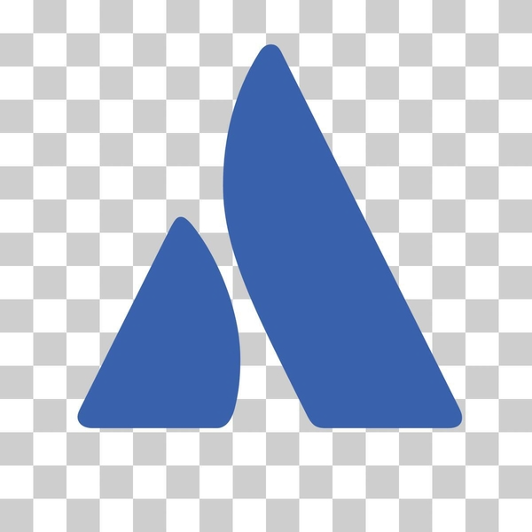

---
hide:
  - toc
---

# Third-Party Tools

Check out the following third-party tools that you can use with ADK agents:

  <a href="/adk-docs/tools/third-party/atlassian/" class="tool-card">
    

      
    

    

      <h3>Atlassian</h3>
      
Manage issues, search pages, and update team content

    

  </a>

  <a href="/adk-docs/tools/third-party/github/" class="tool-card">
    

      
    

    

      <h3>GitHub</h3>
      
Analyze code, manage issues and PRs, and automate workflows

    

  </a>

  <a href="/adk-docs/tools/third-party/gitlab/" class="tool-card">
    

      
    

    

      <h3>GitLab</h3>
      
Perform semantic code search, inspect pipelines, manage merge requests

    

  </a>

  <a href="/adk-docs/tools/third-party/hugging-face/" class="tool-card">
    

      
    

    

      <h3>Hugging Face</h3>
      
Access models, datasets, research papers, and AI tools

    

  </a>

  <a href="/adk-docs/tools/third-party/linear/" class="tool-card">
    

      
    

    

      <h3>Linear</h3>
      
Manage issues, track projects, and streamline development

    

  </a>

  <a href="/adk-docs/tools/third-party/n8n/" class="tool-card">
    

      
    

    

      <h3>n8n</h3>
      
Trigger automated workflows, connect apps, and process data

    

  </a>

  <a href="/adk-docs/tools/third-party/notion/" class="tool-card">
    

      
    

    

      <h3>Notion</h3>
      
Search workspaces, create pages, and manage tasks and databases

    

  </a>

  <a href="/adk-docs/tools/third-party/paypal/" class="tool-card">
    

      
    

    

      <h3>Paypal</h3>
      
Manage payments, send invoices, and handle subscriptions

    

  </a>

  <a href="/adk-docs/tools/third-party/qdrant/" class="tool-card">
    

      
    

    

      <h3>Qdrant</h3>
      
Store and retrieve information using semantic vector search

    

  </a>

